# Pregătire Examen Dezvoltarea Carierei

# Curs 1 - Noțiuni introductive

## Noțiuni generale
### CARIERA 

- Cariera – succesiune de profesii, îndeletniciri şi poziții pe care le are o persoană în decursul perioadei active de viață, inclusiv funcțiile pre-vocaţionale (cum sunt cele de elevi şi studenți, care se pregătesc pentru viața activă) şi post-vocaţionale (pensionarii care pot avea rol de colaboratori, mentori etc.). ( Butnaru, D., 1999).
- Cariera – orice succesiune de funcții în viața unei persoane, fie mobilitatea verticală, fie cea laterală. (Super, 1978)
- Cariera profesională – reprezintă o succesiune evolutivă de activități profesionale şi poziții ocupate într-o organizație, pe care le atinge o persoană, ca şi aptitudinile, cunoștințele, abilitățile şi competențele dezvoltate de-a lungul timpului. (Silvaș, A., 2009)

Cariera influențează mai multe aspecte ale vieții unei persoane (Marinescu P., 2003):
- nivelul de trai;
- calitatea vieții;
- beneficiile avute în urma slujbei;
- organizația în care va lucra;
- calitatea networking-ului;
- tipul muncii prestate;
- responsabilitățile avute;
- lucrurile pe care le va învăța;
- abilități necesare;
- interesele/idealurile personale care îşi vor găsi expresia în muncă.

Cariera este influențată mai multe aspecte:

1. **Factori personali**: interese și pasiuni, tipul de personalitate, abilități și puncte forte, valorile personale, cum ar fi echilibrul între viața personală și profesională, siguranța locului de muncă, impactul social;
2. **Influențe familiale și sociale**: expectanțe, tradiții, statut social; **Grupul de prieteni și colegii**: aspirații profesionale, încurajare, dezvoltarea de interese comune sau competiția; Influența mentorilor/profesorilor - experiențele pozitive cu mentori dintr-un anumit domeniu pot influența către alegerea unei cariere în acel domeniu;
3. **Factori de mediu și economici**: tendințele pieței muncii - disponibilitatea locurilor de muncă, nivelul salarial și tendințele de dezvoltare ale unei industrii. **Condițiile economice**: recesiunea sau creșterea economică pot ghida alegerile către domenii mai sigure. **Avansul tehnologic**: oferă noi oportunități, în timp ce altele pot deveni învechite, neatractive.
4. **Context educațional**: nivelul de educație, cât și domeniul de studiu, precum și prestigiul instituțional - renume și networking-ul cu alumni.
5. **Factori culturali și societali**: norme culturale - anumite profesii pot fi văzute ca mai prestigioase sau
acceptabile pentru anumite genuri; dar și localizarea geografică – oferă acces la anumite industrii sau oportunități mai bune de muncă.
6. **Factori psihologici**: motivația intrinsecă și extrinsecă, dorința de creștere personală, recunoașterea sau recompensele financiare, pot influența traseul profesional. Totodată, încrederea în capacitatea de a reuși într-un anumit domeniu pot influența deciziile de carieră. Persoanele care se simt încrezătoare în abilitățile lor sunt mai predispuse să urmeze cariere provocatoare ori neconvenționale.

Cariera, pe lângă evoluția persoanei, poate fi privită şi sub aspect economic, sociologic sau psihologic. (Silvaș, A., 2009):
- Din punct de vedere **economic**, cariera face referire la o succesiune a pozițiilor profesionale ocupate de o persoană.
- Din punct de vedere **sociologic**, cariera reprezintă o multitudine de roluri jucate de individ, în sensul că fiecare rol este temelia celui ce va urma.
- Din punct de vedere **psihologic**, alegerea de roluri şi succesul în exercitarea lor depind de aptitudinile, interesele, valorile, trebuinţele, experienţa anterioară şi aspiraţiile persoanei în cauză. (Jigău, M., 2003, apud Fman, 1998)

#### Cariera obiectivă - cariera subiectivă (Balmuș - Andone, M., 2019)
- **Cariera obiectivă** are la bază dezvoltarea personalului prin sporirea competențelor profesionale, a cunoștințelor şi abilităților, care îi sporesc șansele de promovare şi plasare în interiorul sau exteriorul organizației.
- **Cariera subiectivă** se referă la perceperea de sine, recompensele obținute ca urmare a muncii depuse, relația cu superiorii şi rolul muncii lor în viață. Acestea sunt compuse din: talente şi abilități; valori de bază; motive şi nevoi de carieră.
- **Ambele perspective**:
    - sunt centrate pe individ,
    - presupun ca oamenii să aibă un nivel de control asupra destinelor lor şi să știe să exploateze oportunitățile pentru a maximiza succesul şi satisfacția derivată de la cariera lor.

#### CARIERA INDIVIDUALĂ

- O carieră nu reprezintă, în mod strict, limitativ, un succes sau un eșec profesional, o avansare accelerată ori o stagnare profesională în cadrul unei organizații.
- Doar individul este cel care poate să facă aprecieri cu privire la propria carieră, dacă este sau nu un succes în plan profesional, dacă acest rezultat se poate raporta concordant sau nu cu obiectivele stabilite, dacă există o evoluție în plan profesional și o ocupare a unei poziții într-o anumită ierarhie, dacă toate aceste elemente manifestă corespondențe în planul vieții personale şi dacă acestea sunt în acord sau nu cu nevoile şi așteptările individuale.

**Exemple de variabile individuale asupra carierei** (Grigore A.M. și Cojocaru C., 2013):
- Unele persoane preferă muncile foarte complexe şi stimulatoare.
- Alte persoane dau rezultate bune în munci simple, de rutină.
- Mulți oameni își satisfac nevoile de ordin superior în afara profesiei, iar munca este doar un lucru pe care ei trebuie să-l facă pentru a-şi achita facturile.
- Alți oameni obțin satisfacție şi dintr-o muncă bine făcută sau utilă comunității - ceea ce contribuie la înlăturarea mitului conform căruia toată lumea urmărește să ajungă în vârf.
- Unii oameni se feresc chiar de tracasarea şi nesiguranța ce apar odată cu responsabilitățile în plus.
- Prin urmare, cariera înseamnă altceva pentru fiecare.

#### CARIERA PROFESIONALĂ

- Cariera profesională se referă la dezvoltarea în plan profesional a unui individ pe parcursul întregii sale vieți active.
- În cadrul aceleiași profesii, pe parcursul carierei unei persoane se pot întâlni formări, specializări, perfecționări, promovări profesionale.
- Evoluția profesională a unui individ nu trebuie analizată ținând seama doar de calitatea de angajat într-o organizație, ci și de contextul general al vieții și evoluției de ansamblu a respectivei persoane.

#### CARIERA INDIVIDUALĂ - CARIERA PROFESIONALĂ

- Cariera organizațională reprezintă un proces cu o continuă dezvoltare, în care relația dintre organizație și individ este interactivă şi interdependentă.
- Interdependența dintre cariera individuală și cariera organizațională se manifestă prin existența contractului între individ și organizație, ca și prin relația de natură psihologică dintre individ și organizație.
- Motivele, nevoile, valorile și atitudinile fiecărei părți devin elemente comune în planul dezvoltării carierelor individuale și organizaționale.

# Curs 2 - Teorii privind cariera

## 1. Interesele ocupaţionale și teoriile privind procesul alegerii carierei (Boiangiu C.C., 2018)

### Interesele ocupaţionale
- În procesul planificării carierei, o componentă esențială, este cea reprezentată de autocunoaștere. Cele mai relevante informații despre sine, în ceea ce privește planificarea carierei sunt: interesele, valorile, aptitudinile şi personalitatea.
- Interesele constituie un element important de decizie în carieră.
- Interesele pot fi definite ca "preferințele cristalizate ale unei persoane pentru anumite domenii de cunoaștere sau de activitate" (Lemeni G.,2001 și Lemeni G., Negru O., 2010)
- Interesele sunt determinate de factori genetici (potențialul aptitudinilor) şi de oportunitățile de învățare (activitățile şi jocurile în care copiii sunt angrenaţi, instrumentele și mijloacele materiale de care dispun copiii, etc.).

Oportunitățile de învățare se pot referi la:
- recompensarea de către părinți/cadre didactice pentru unele activități realizate de elev; pot determina pentru activitatea respectivă conturarea unei preferinţe;
- ușurința realizării unei activități determină alegerea acesteia în defavoarea activității care solicită efort;
- familiaritatea cu unele materiale şi instrumente determină preferința pentru folosirea acestora.

Astfel:
- preferința pentru unele instrumente şi activități și frecvența de implicare în activități ce corespund preferinței pentru ele, vor conduce la dezvoltarea abilităților specifice;
- abilitățile determină stabilizarea preferințelor, dar şi cristalizarea interesului pentru respectivul domeniu;
- interesul poate facilita atenția, concentrarea și suportul energetic necesar procesului de învățare.

Modelul hexagonal al intereselor (**RIASEC**) – dezvoltat de John Holland:
1) **Interesele realiste** (**R**) se manifestă prin tendința de a se îndrepta spre activități care presupun manipularea obiectelor, mașinilor şi instrumentelor;
2) **Interesele investigative** (**I**) presupun o atracție pentru cercetare, investigare sub diverse forme şi în cele mai diverse domenii (biologic, fizic, social, cultural, etc.);
3) **Interesele artistice** (**A**) se manifestă prin atracție spre activitățile mai puțin structurate, care presupun o rezolvare creativă şi oferă posibilitatea de autoexpresie (poezie, pictură, muzică, design);
4) **Interesele sociale** (**S**) implică orientarea spre activități care necesită relaționare interpersonală (preferința pentru predarea sau pentru a ajuta oamenii să-şi rezolve diverse probleme);
5) **Interesele antreprenoriale** (**E** = inițiala de la engl. entrepreneurial) se manifestă prin preferința pentru activități care permit inițiativă şi posibilitate de coordonare a propriei activități sau a activității unui grup;
6) **Interesele de tip convențional** (**C**) presupun preferința pentru activități care necesită manipularea sistematică și ordonată a unor date sau obiecte într-un cadru bine organizat şi definit.

## 2. Teorii privind alegerea carierei

### 1. Teoria alegerii profesiei dezvoltată de John L Holland
- J. Holland afirmă că alegerile în planul profesional constituie expresia personalității fiecărui individ, ce găsește calea de afirmare prin interesele şi valorile sale.
- Sistemul de interese, din structura personalității unui individ, direcționează orientarea profesională, cariera individului.
- În funcție de nivelul exprimat al intereselor şi modul particular de ierarhizare al acestora, identifică şase tipare distincte de orientare în carieră: 
    - convențional
    - artistic
    - realist
    - social
    - întreprinzător
    - investigativ
- Comportamentul uman şi cariera sunt rezultatul interacțiunii permanente dintre persoană şi mediu - oamenii preferă acele medii care oferă posibilitatea manifestării comportamentelor ce exprimă interesele și aspirațiile lor, ce pun în valoare calitățile și valorile personale.
- Indivizii prezintă combinații diferite de trăsături individuale specifice. Cei mai mulți dispun de o categorie, din cele șase, ca dominantă și, în mică măsură, unele caracteristici dintre celelalte categorii. Existența unui tip de personalitate ca predominant ține de mediul particular de viață, dezvoltare, de învățare ale individului.
- Oamenii au anumite trăsături relativ stabilizate după perioada adolescenței (cercetările afirmă că procesul constituirii pattern-urilor de interese ale indivizilor se stabilizează până la 25 de ani).

#### Teoria alegerii profesiei dezvoltată de John L Holland - Modurile de orientare profesională (sursa: Silvaș, A., 2009)
Sunt identificate șase tipuri de personalitate caracterizate de preferințele profesionale. Holland afirmă că şi mediile de muncă pot fi clasificate după aceleași criterii.
1. **Modul realist** (**R**) – orientare spre activități fizice, care solicită îndemânare, deprinderi manuale şi îndeplinirea de sarcini concrete; persoane cărora le place lucrul cu instrumente, maşini şi rezolvarea problemelor concrete; persoane cu abilităţi fizice şi o bună dexteritate şi coordonare manuală. 
<ins>Calităţile pozitive sunt</ins>: spontaneitate, stabilitate, simţ practic. 
<ins>Punctele mai puţin tari</ins>: timiditate, conformism, lipsa de intuiție.
2. **Modul investigativ / intelectual** (**I**) – orientare spre activități predominant intelectuale, care presupun rezolvarea de probleme şi situații teoretice, explicarea cauzelor şi naturii fenomenelor, persoane care preferă să se ocupe de aspectele abstracte în lumea lor profesională, preferă căutarea adevărului, sarcinile mai puţin concrete; acestea au aptitudini pentru domeniul matematic şi ştiinţific. 
<ins>Calităţile pozitive sunt</ins>: originalitatea şi independenţa. 
<ins>Punctele mai puţin tari</ins>: dezordinea, lipsa simțului practic, impulsivitatea.
3. **Modul artistic** (**A**) – orientare spre activități de relaționare mijlocită cu alții prin intermediul produselor
artistice; persoane care preferă sarcini creative şi dezvoltarea de idei şi cărora le dau o notă personală; aceştia au talente în domenii precum pictura, scrisul, teatrul, muzica, dansul. Sunt persoane: imaginative, intuitive, independente. 
<ins>Punctele mai puţin tari</ins>: dezordinea, emotivitate, lipsa spiritului practic.
4. **Modul social** (**S**) – orientare spre profesii legate de mediul social, de comunicare şi sprijinul celorlalţi; persoane care sunt înclinate să îi ajute pe alţii, să-i înveţe, informeze, sprijine. 
<ins>Calităţile pozitive sunt</ins>: sociabiltate, amabilitate, diplomație. 
<ins>Punctele mai puțin tari</ins>: lipsa sistematizării și a regulilor rigide.
5. **Modul antreprenorial / întreprinzător** (**E**) – orientare spre activități care presupun iniţiativă personală, dezvoltarea propriei afaceri, coordonarea; persoane cărora le place să muncească pentru a obţine beneficii materiale; ştiu să-i motiveze, orienteze pe alţii; au aptitudini pentru conducere, relaţii interpersonale sau activităţi persuasive. 
<ins>Calităţile pozitive sunt</ins>: încredere în sine, ambiţie, energie. 
<ins>Punctele mai puțin tari</ins>: dorința de dominare și putere, impulsivitate.
6. **Modul convențional** (**C**) – orientare spre activități de execuție; persoane mai conformiste, care preferă să lucreze cu date pe care le ordonează şi categorisesc; se raliază opiniilor altora, nu sunt deranjați de o poziţie de subordonare şi preferă un loc de muncă unde sunt sarcini precise şi structurate; au aptitudini pentru munci administrative, de birou, în domeniul financiar. 
<ins>Calitățile pozitive sunt</ins>: conformismul, preferă ordinea, sunt eficiente şi practice. 
<ins>Punctele mai puţin tari</ins>: lipsa de imaginație, inhibiția, inflexibilitatea.

#### Teoria alegerii profesiei (John L. Holland) - Inventarul trăsăturilor (sursa: Jigău)
Pentru a avea o imagine sintetică asupra caracteristicilor tipurilor de personalitate definite de Holland este utilă consultarea următoarelor liste de trăsături specifice categoriilor cu care operează aceste inventare - RIASEC (utile şi ca un instrument de autoevaluare):

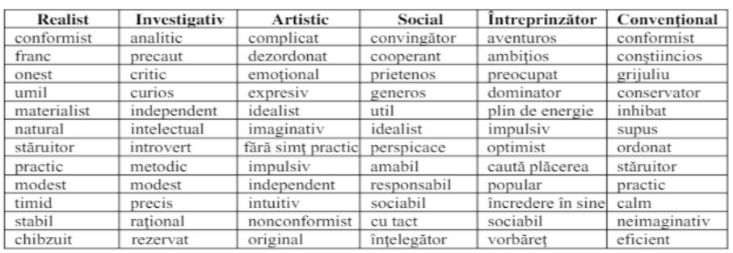

Dispunerea tipurilor de personalitate pe laturile unui hexagon, conduc la identificarea celor învecinate şi compatibile (utile în caz de reorientare profesională) sau a celor puțin recomandate (situate în colțurile opuse ale figurii geometrice) – sursa Jigău, 2007:

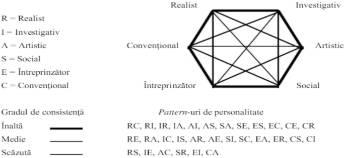

### 2. Teoria dezvoltării a lui Donald Super
- opțiunile unui individ sunt influențate de imaginea de sine a acestuia şi de informațiile pe care le are despre profesii;
- opțiunea unui individ pentru o anumită ocupație reprezintă un proces şi o succesiune de alegeri şi decizii intermediare făcute treptat pe parcursul vieții, în corelație cu diferitele etape de creștere, dezvoltare, învățare şi exersare ale aptitudinilor, abilităților şi deprinderilor în diferite situații de activitate sau muncă;
- competențele și preferințele vocaționale, dar mai ales imaginea de sine evoluează și cuprinde mai multe stadii de dezvoltare;
- reușita în confruntarea cu mediul ocupațional pentru fiecare stadiu, depinde de gradul de maturizare, respectiv gradul de adecvare la toate cerințele mediului ocupațional;
- maturitatea profesională este legată de acele aptitudini deja existente, dar și de posibilitatea persoanelor de a dezvolta interese şi aptitudini;
- persoanele caută, pentru fiecare stadiu de viață/carieră, o configurație de activități în funcție de posibilitățile fizice, aptitudinale, emoționale ale sale, ce pot să-i ofere satisfacție;
- interesele au rol important, reprezentând produsul interacțiunii factorilor înnăscuți (aptitudini, factori cognitivi-inteligență, concentrare, capacitate de memorare etc), dar și a oportunităților și a evaluării socială.

#### Elementele de bază ale teoriei dezvoltării profesionale propuse de Super (Jigău, M., 2001 apud Super, D., 1953)
- oamenii sunt diferiți prin aptitudinile, deprinderile, abilitățile şi trăsăturile lor de personalitate;
- indivizii au anumite caracteristici şi configurații psihologice personale care îi fac compatibili cu anumite ocupații;
- exercitarea oricărei ocupații necesită anumite deprinderi, aptitudini, abilități, motivații, trăsături de personalitate (dar cu grade largi de toleranță);
- imaginea de sine, ca produs al învățării sociale, se schimbă în timp, pe măsură ce experiența personală crește;
- modificarea permanentă a preferințelor profesionale, a imaginii de sine, sporirea competențelor profesionale şi a contextelor particulare de viață şi de muncă fac din alegerea carierei un proces continuu;
- alegerea profesiei și a locului de muncă reflectă imaginea de sine a persoanei - cei care au o imagine bună despre sine tind să urmeze școli mai bune și să aleagă profesii cu un nivel al cerințelor educaționale mai ridicat şi să exploreze mai multe posibilități de carieră.
- mediile socio-cultural şi educațional îşi pun amprenta asupra orientării în carieră a persoanei, iar reușita profesională contribuie la îmbunătățirea imaginii de sine şi la creşterea stimei de sine.
- procesul dezvoltării și maturizării pentru alegerea profesională poate fi sprijinit, stimulat şi orientat;
- procesul dezvoltării carierei este un compromis și o mediere între factorii constitutivi ai personalității şi societate, între imaginea de sine particular conturată şi realitate;
- modul specific de relaționare al individului cu lumea muncii este în relație directă cu anumite stadii ale vieții sale (creștere, explorare, stabilizare şi declin);
- mediul socio-economic şi cultural de proveniență își pune amprenta pe direcția și tipul de abordare al carierei;
- atingerea anumitor niveluri de carieră, succesiunea unor ocupații şi stabilitatea pe post sunt determinate de aptitudinile intelectuale, originea socio-culturală şi economică, trăsăturile specifice de personalitate şi şansele persoanei pe parcursul vieţii sale.

Super identifică șapte etape în cristalizarea imaginii de sine şi orientarea stabilă spre un anumit
domeniu profesional (sursa: Silvaș. A., 2009):
1. **începutul concepției despre sine** – începe în copilărie şi continuă până la vârsta adultă;
2. **stadiul exploratoriu** – căutarea realizării de sine în diferite domenii: tehnică, literatură, construcții, sculptură, muzică, sport, activități comerciale, etc.;
3. **autodiferenţierea de ceilalți** – identificarea punctelor comune cu alți indivizi și ale celor specifice individului;
4. **identificarea şi stimularea, jucarea rolului persoanei cu care se identifică** – apropierea psihologică de imaginea persoanei agreate, de profesia, activitățile şi maniera acesteia de a fi;
5. **testarea, încercarea lumii reale** – experimentarea rolului ocupațional pentru care tinde să opteze;
6. **testarea imaginii de sine** în rolul ocupațional pentru care a optat ferm;
7. **punerea în practică, validarea prin activitate a imaginii de sine** – integrarea în muncă, asumarea de responsabilităţi profesionale, etc;

### 3. Teoria învățării sociale (John D. Krumboltz)
- **Învățarea socială reprezintă o achiziție a cunoștințelor şi a deprinderilor care rezultă din observarea directă sau indirectă a comportamentului semenilor.**
- Termenul “social” caracterizează natura procesului de învățare, achiziția se efectuează sub efectul mediului înconjurător, mai degrabă social, decât fizic.
- "Oamenii îşi formează preferințele pentru diferite activități printr-o multitudine de experiențe de învățare. Ei conferă semnificație activităților prin prisma ideilor care le-au fost transmise...îşi formează credințe despre ei şi despre lumea în care trăiesc, prin experiențe educaționale directe şi indirecte. Apoi, trec la acțiune pe baza credințelor lor, utilizând abilitățile pe care şi le-au dezvoltat de-a lungul timpului." (sursa Boiangiu, apud Krumboltz, 1994).
- În carieră, oamenii se orientează ținând cont de cele învățate și copiate de la ceilalți.
- În decizia privind cariera sunt prezente două forme de învățare: **învățarea prin asociere** și **învățarea instrumentală** (prin recompensă și pedeapsă).
- În copilărie, din filme, reclame sau din poveștile adulților, individul își formează, în plan mintal, cuvinte și imagini atractive, ce le asociază unor ocupații, dar se pot asocia ocupații și cu imagini negative. Implicarea copilului în diferite tipuri de activități, îl determină pe acesta să-și formeze preferințe pentru anumite activități, sau domenii ce includ activitățile respective.
- Activitățile în care are reușită sau e recompensat vor deveni preferate, pierzând interesul pentru cele în care nu are reușită sau primește pedeapsă.
- Pentru Krumboltz, evoluția intereselor se extinde pe durata întregii vieți, iar învățarea implică interese, atitudini, emoții, deprinderi, credințe și, implicit, influențează comportamente.

### 4. Teoria privind alegerea profesiei și satisfacția în muncă (Anne Roe, 1956)
- Este o teorie psihologică, axată pe nevoile individuale și pe influențele din mediul familial, respectiv pe legătura dintre experiențele din copilărie și influența lor în orientarea profesională ulterioară. În unele cazuri, anumite nerealizări și insatisfacții, frustrări din perioada copilăriei pot fi compensate prin munca pe care o desfășurăm, alegând tocmai acele profesii şi ocupații care să satisfacă anumite nevoi de prestigiu, respect, acceptare socială încurajare/laudă de care nu am beneficiat în copilărie;
- Anne Roe identifică 3 tipuri de atitudini parentale:
    1. **Emoțional susținător** - copilul simte că părinții îi oferă dragoste și sprijin. Acești copii pot dezvolta un interes pentru profesii care implică lucrul cu oamenii, deoarece au învățat să se simtă confortabil în interacțiuni sociale.
    2. **Supraprotectiv** - părinții foarte protectori tind să intervină excesiv în viața copilului, iar acesta poate dezvolta nevoi nesatisfăcute legate de autonomie. În consecință, acești indivizi pot alege profesii care să le permită să demonstreze competență și independență.
    3. **Emoțional respingător/ mediu familial rejectiv**: Părinții care nu oferă sprijin emoțional adecvat pot determina copilul să devină mai închis și să se orienteze către profesii mai analitice, care nu necesită multe interacțiuni sociale.

- **Nevoile de bază și satisfacția în muncă**: Roe susține că nevoile emoționale de bază, care sunt formate în copilărie, joacă un rol crucial în alegerea profesiei. Astfel, oamenii tind să aleagă cariere care le permit să își satisfacă nevoile neîmplinite. Spre exemplu, un copil care nu a primit suficientă atenție ar putea alege o profesie în care să fie în centrul atenției.
- Roe a dezvoltat o clasificare a ocupațiilor bazată pe două dimensiuni principale:
    - **Orientarea către persoane**: Aceasta include profesii care implică interacțiuni directe cu oamenii, precum cele din domeniile educației, medicinei sau asistenței sociale.
    - **Orientarea către obiecte**: Aceasta se referă la profesii care implică lucrul cu date, lucruri sau idei, precum ingineria, științele sau meșteșugurile.
- dezvoltarea vocațională începe atunci când devenim pentru prima dată conștienți că o anumită profesie/ocupație ne va satisface nevoile;
- informațiile despre noi înșine (autocunoaşterea) ne influențează opțiunea profesională;
- informațiile despre profesii influențează alegerea, ajutându-ne să descoperim acele profesii şi ocupații care ne-ar putea satisface nevoile; gradul de satisfacție este determinat de concordanța dintre ceea ce avem şi ceea ce dorim (aspirații, idealuri);
- alegerea ocupaţiilor este un proces dinamic, ne schimbăm ocupația atunci când o alta ne satisface mai bine trebuințele.

**Sinteza teoriei**:
1. Experiența de viață din perioada copilăriei afectează dezvoltarea matricelor, dar și intensitatea nevoilor. Intensitatea nevoii, timpul de la apariție și până la satisfacerea acesteia sunt influențate de factori ce depind de mediul în care trăiește individul.
2. Factorii și condițiile specifice ale ambianței de creștere și dezvoltare vor influența motivațiile în privința alegerilor profesionale ulterioare. Se pot enumera dintre factorii de referință: atitudinile parentale față de muncă; condițiile de viaţă atât socio-economice, cât şi culturale ale familiei; tipul, calitatea şi durata educației şi formării profesionale; influențele grupului de cunoștințe şi de prieteni; întâmplările neprevăzute din viața copilului;
3. Alegerea unei ocupații este influențată de factorii genetici și nevoile ierarhizate într-un mod anume, care constituie apoi efect în matricea vieții lor.

### 5. Teoria ancorelor carierei a lui Edgar Schein (1993)
- Reprezintă un model care explică modul în care indivizii își aleg și dezvoltă carierele, în funcție de valori, aptitudini și nevoi personale profunde, denumite „ancore de carieră”.
- Ancorele de carieră sunt acele seturi de motivații, nevoi și valori care stau la baza deciziilor de carieră ale unei persoane.
- Ancorele devin stabile de-a lungul timpului și ghidează alegerile de carieră ale unei persoane.
- Schein a identificat cinci tipare distincte de talente, scopuri, nevoi şi valori în percepția proprie, care apar în urma primelor experiențe profesionale:
    - competența tehnică/funcțională
    - competența managerială
    - siguranța
    - autonomia
    - creativitatea

Ancorele pot fi explicate astfel (sursa: Marinescu, P., 2003):
- Persoanele ce au dezvoltat o competență tehnică/funcțională sunt orientate spre carieră în funcție de conținutul efectiv al muncii și nu se pot transfera într-un domeniu care se îndepărtează de domeniul de bază. Construirea acestei ancore este corelată cu un traseu școlar și de formare profesională în care s-a pus un accent crescut pe specializare. Persoanele cu această ancoră se simt realizate atunci când își pot perfecționa abilitățile într-un anumit domeniu de expertiză. Ele preferă rolurile care le permit să devină experți în domeniul lor și să aplice cunoștințele tehnice (inginerii, cercetătorii sau specialiștii IT).
- Persoana care a dezvoltat o competență managerială este orientată să ajungă în poziții care îi oferă responsabilități pe măsură. Importantă este perspectiva pe care o oferă poziția ocupată, nu conținutul activității. Contează oportunitatea de a dezvolta abilități analitice, competențe interpersonale, și alte experiențe utile unui viitor manager. Apreciază mai mult informația generalistă, integralistă şi multidisciplinară decât cea superspecializată. Aceste persoane au o nevoie de a-i conduce pe ceilalți, preferă să se ocupe de gestionarea resurselor și asumarea
responsabilității pentru rezultate.
- **Siguranța** este o ancoră care acționează prin orientarea spre o poziție stabilă, sigură din toate punctele de vedere. Evoluția viitoare este clar stabilită profesional, cât și salarial. Persoanele cu această ancoră sunt preocupate, în principal, de un mediu de muncă previzibil și de încredere, tendință ce provine fie din nesiguranța din mediul de viață, fie ca rezultat al educației primite. De ex., persoanele care preferă locurile de muncă în instituții publice sau în organizații mari și stabile.
- Cei ce au dezvoltat **autonomia** ca și ancoră nu vor rămâne mult timp într-un domeniu specializat, nu vor ține să rămână nici într-un loc în care lucrurile sunt clare și planificate pe termen lung, în care schema de avansare este stabilită și inflexibilă. Acest tip de persoană are nevoie de libertate şi de un mediu fără constrângeri. Independența şi libertatea sunt mai importante decât avansarea. De ex., freelanceri, consultanți independenți sau antreprenori.
- **Creativitatea** este specifică persoanelor preocupate de actul creației: cu dorință să creeze produse, servicii, chiar organizații. Creativitatea se manifestă ca şi ancora prin aceea că indivizii de acest tip sunt axați pe a crea ceva care să reprezinte realizarea lor exclusivă; sentimentul de satisfacţie vine numai din posibilitatea de a construi, a inventa ceva nou, inedit.
- **Pură aventură** - ancora aceasta este specifică celor care văd viața, inclusiv cariera, ca pe o aventură, în care descoperă, se descoperă pe sine, se confruntă cu obstacole, câștigă ori pierd, dar niciodată nu stau pe loc. Se plictisesc ușor în roluri stabile și repetitive. Aceste persoane doresc un post dinamic, activități extrem de variate, sunt motivate de rezolvarea problemelor complexe, deoarece au nevoie crescută de stimulări diverse pentru a menține motivația la cote înalte. De ex., joburi în domeniul consultanței.
- **Servicii, dedicare** - persoanele acestea își aleg cariere prin care se pot dedica binelui celorlalți. În termeni psihologici, au dezvoltat o structură de ”salvatori”, pe care au integrat-o ulterior în domeniul profesional. Persoanele simt nevoia de a se simți utile organizației, au nevoie de recunoașterea celor din jur, de a-i învăța pe cei mai neexperimentați (sunt buni mentori), se implică în activități de voluntariat ori în joburi de tipul: lucrători sociali, educatori, medici sau activiști.
- **Integrarea stilului de viață** se întâlnește la persoanele care își doresc să păstreze un echilibru între
viață profesională-viață personală, astfel încât nici una dintre acestea să nu fie sacrificate în favoarea celeilalte. Persoanele acordă importanță mare timpului petrecut alături de familie/prieteni, timp dedicat pasiunilor, percep cariera ca pe un mijloc, mai degrabă decât ca pe un scop în sine. În
general, caută locuri de muncă cu un program flexibil.

### 6. Teoriile economice
#### 1. Teoriile clasice - profitul este factorul determinant în alegerea carierei.
- Distribuția profesiilor este influențată de cerere și ofertă, iar ea se reflectă în diferențele de venituri dintre diferitele profesii;
- Pentru profesiile unde este nevoie de forță de muncă, veniturile vor fi mai mari, iar pentru cele în care există surplus de forță de muncă, veniturile vor fi mai mici;
- teoria economică clasică susține că individul are o libertate totală de alegere.
#### 2. Teoriile neoclasice - economiștii neoclasici susțin că teoria clasică își găsește un sprijin foarte mic în zilele noastre deoarece:
- individul nu-și poate alege liber profesia pentru că el nu are datele necesare în legătură cu alternativele între care poate opta. Altfel spus, alegerea lui este determinată nu numai de cerere și ofertă, ci și de ceea ce știe individul despre profesie;
- costul pregătirii și al educației.
#### 3. Teoriile economice mai actuale – susțin că alegerea unei cariere depinde de un număr de variabile.
L.G. Thomas (1956) explică alegerea carierei ca pe o decizie economică rațională, bazată pe analiza costurilor și beneficiilor formării profesionale. Ea a deschis calea conceptului modern de "capital uman", dezvoltat ulterior de Gary Becker și Theodore Schultz.

# Curs 3 - Planificarea carierei
## Managementul carierei
### Definire
- Managementul carierei este procesul de proiectare şi implementare al scopurilor, strategiilor şi planurilor care să permită organizaţiei să-şi satisfacă necesităţile de resurse umane, iar indivizilor să-şi îndeplinească scopurile carierei lor (L.A. Klatt, R.G. Murdick, F.E. Schuster).
- Managementul carierei vizează planificarea şi modelarea progresului angajaţilor în cadrul organizaţiei în raport de evaluările nevoilor organizaţiei, dar şi în raport cu performanţele potenţialului şi cu preferinţele individuale ale angajaţilor (Balmuș - Andone, M., 2019 op. cit.Vlăsceanu, M., 2003).
- Managementul carierei are în vedere atât procesul de planificare al carierei, care vizează modul de avansare al angajaţilor în cadrul organizaţiei conform necesităţilor acesteia, performanţele angajaţilor, potenţialul acestora şi preferinţele lor, cât şi asigurarea succesiunii manageriale cu scopul de a asigura pe cât posibil organizaţia că va dispune de persoanele de care are nevoie pentru a-şi atinge obiectivele. (Balmuș - Andone, M., 2019)

### Scop 
- asigurarea satisfacerii necesităților organizației în ceea ce privește succesiunea managerială;
- oferirea programelor de instruire şi a contextelor de dezvoltare ale experienței practice a angajaților cu potențial astfel încât să-i pregătească pentru nivelul de responsabilitate pe care ar putea să-l atingă;
- oferirea îndrumării şi încurajării de care au nevoie angajaților cu potențial pentru a şi-l fructifica şi pentru a face o carieră de succes în cadrul organizației în concordanță cu talentul avut şi aspirațiile proprii.

### Managementul carierei – managementul resurselor umane
Managementul carierei este în strânsă relație cu activitățile din sfera managementului resurselor umane, printre care:
- planificarea carierei ca parte integrantă a planificării resurselor umane, iar evaluarea performanței este una din condițiile necesare pentru dezvoltarea carierei profesionale;
- planificarea resurselor umane are în vedere nu atât previziunea posturilor vacante, cât identificarea potențialului, condițiilor și a calificării necesare acestora pentru ocuparea posturilor respective, iar evaluarea performanțelor se realizează nu atât pentru fundamentarea deciziilor privind remunerarea, cât și pentru identificarea necesităților de dezvoltare ale angajaților;
- motivarea angajaților și creșterea gradului de satisfacție;
- atragerea și reținerea angajaților în organizații;

Managementul carierei reprezintă un model care implică multiple interdependențe funcționale dintre planificarea carierei individuale, planificarea carierei organizaționale și dezvoltarea carierei.

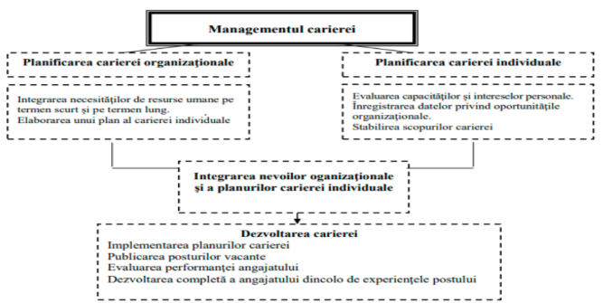

### Planificarea carierei
Proiectarea carierei este un proces permanent, încadrat în limitele de viață conștientă ale persoanei, ansamblul de acțiuni subordonate unor finalități clar definite, orientate spre identificarea posibilităților de maximă valorificare a potențialului individual (Dandara O., 2011)
- Implică două niveluri: **individual și organizațional**.
- Planificarea carierei individuale presupune:
    - evaluarea constantă a intereselor și a abilităților
    - aprecierea asupra oportunităților
    - stabilirea scopurilor și obiectivelor carierei
    - proiectarea activităților de dezvoltare.

Planificarea carierei individuale. Etape:
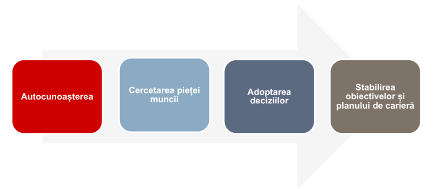

#### Etapele planificării carierei (nivel individual)
1. **Autocunoașterea/autoevaluarea** – presupune cunoașterea abilităților şi competențelor personale, a intereselor, preocupărilor şi valorilor proprii, a activităților ocupaționale preferate. Fiecare individ trebuie să se cunoască cu obiectivitate atunci când se orientează în carieră.
Autocunoașterea presupune identificarea:
    - intereselor proprii
    - aptitudinilor și a deprinderilor
    - valorilor și trăsăturilor de personalitate
    - educației și formării profesioanale deținute și cum pot fi acestea utile pentru carieră
    - abilităților și competențelor necesare pentru cariera dorită
    - abilităților și competențelor avute pentru cariera dorită
2. **Cercetarea pieței forței de muncă şi analiza opțiunilor privind cariera**
Cercetarea pieței se realizează prin intermediul informațiilor găsite în presa de specialitate, site-urile companiilor din domeniul de interes, rapoarte ale autorităților publice și ale organizațiilor private, participarea la evenimente din domeniu sau contactarea unor persoane care lucrează în domeniul de interes, înscrierea în grupuri profesionale formale și informale.
În urma acestor acțiuni, pot fi strânse date despre:
    - cererea de forță de muncă
    - cerințele de instruire/nevoia de calificare şi specializare pentru fiecare dintre ele
    - condițiile de muncă
    - tendințele de dezvoltare ale carierei în domeniul ales
    - beneficii, etc.
3. **Adoptarea deciziilor (inițiativa)** implică:
    - identificarea şi evaluarea alternativelor (avantajele și dezavantajele fiecărei opțiuni, limitele, potrivirea din punct de vedere al abilităților, intereselor și valorilor)
    - selectarea celor mai bune alternative
    - demararea acțiunii (fixarea unor obiective pe termen scurt/mediu/lung transpuse în acțiuni concrete)

În această etapă, pentru reducerea opțiunilor și pentru conturarea unei imagini a acțiunilor care vor trebui întreprinse pentru îndeplinirea obiectivelor, se poate folosi analiza SWOT. Analiza punctelor tari și slabe se va realiza din perspectiva internă, a individului, iar analiza oportunităților și vulnerabilităților va implica mediul extern.

#### Adoptarea deciziilor - Analiza SWOT:

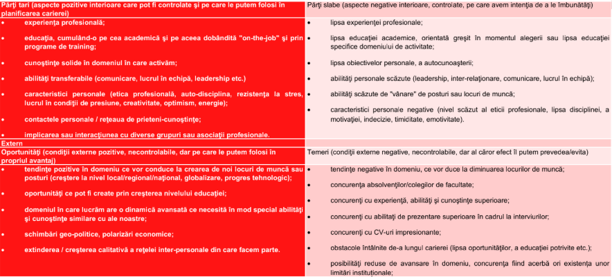

- **Strategia ofensivă (PT + O)** – este adoptată când în mediul intern predomină ca pondere și importanță punctele tari, iar în mediul extern predomină ca pondere și importanță oportunitățile. În acest sens, obiectivele se formulează plecând de la punctele tari, pentru a valorifica oportunitățile existente în mediul extern; Ex.: să-mi valorific competențele avansate de limba engleză pentru a mă dezvolta profesional în domeniul comunicării, în schimburi de experiență realizate pe programele Erasmus+;
- **Strategie orientată spre dezvoltare (PS + O)** – este adoptată când în mediul intern predomină ca pondere și importanță punctele slabe, iar in mediul extern predomină ca pondere și importanță oportunitățile. În acest sens, obiectivele se formulează plecând de la punctele slabe, pentru a le transforma în puncte tari prin valorificarea oportunităților existente în mediul extern; Ex.: Să-mi dezvolt competențele de comunicare într-o limbă străină, participând la schimburi de experiență organizate de școală în programele Erasmus +;
- **Strategie diversificată (PT + A)** – este adoptată când în mediul intern predomină ca pondere și importanță punctele tari, iar in mediul extern predomină ca pondere și importanță amenințările sau vulnerabilitățile. În acest sens, obiectivele se formulează plecând de la punctele tari, pentru a transforma amenințările în oportunități; Ex.: Să-mi valorific competențele avansate de limbă engleză pentru a urma o universitate din străinătate, care are o calitate bună a învățământului și ai cărei absolvenți își găsesc locuri de muncă în procent mare;
- **Strategie defensivă (PS + A)** – este adoptată când în mediul intern predomină ca pondere și importanță punctele slabe, iar in mediul extern predomină ca pondere și importanță amenințările. În acest sens, obiectivele se formulează plecând de la punctele slabe pentru a le transforma în puncte tari; când se schimbă ponderea, se trece la strategie diversificată. Se are în vedere permanent pericolul amenințărilor.

Infomațiile reieșite din analiza SWOT pot fi folosite pentru alegerea strategiei de planificare a carierei personale și profesionale (sursa Deac,V., 2019):

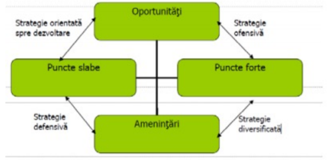

4. **Stabilirea unui plan de carieră şi comunicarea preferințelor organizației** (dacă individul este angajat sau când se va angaja) constă în:
    - Stabilirea scopurilor individuale ale carierei (destinația unde vrea să ajungă fiecare).
    - Planificarea modalităților de atingere ale obiectivelor stabilite.
    - Planificarea unor acțiuni care vor conduce la îndeplinirea scopurilor stabilite. Planificarea presupune:
        - alegerea itinerarului de parcurs până la destinația respectivă, selectând din mai multe "rute"
        posibile;
        - instruirea permanentă
        - menținerea abilităților curente şi dezvoltarea unora noi, necesare pentru atingerea obiectivelor individuale specifice;
        - dezvoltarea unor competențe solide în domeniu pentru a putea fi considerat expert, însă şi dezvoltarea unor competențe într-o arie mai largă pentru a căpăta flexibilitate;
        - participarea la diferite proiecte importante sau prezentări publice.

#### Planificarea carierei organizaţionale (sursa: Balmuș - Andone, M., 2019)
- Planificarea carierei organizaționale reprezintă o activitate privită din perspectiva organizației.
- Planificarea carierei organizaționale se concentrează asupra posturilor şi necesităților pe termen scurt şi lung ale organizației.
- Acțiunile principale privind planificarea carierei organizaționale se referă la:
    - **evaluarea abilităților, competenţelor şi performanţelor angajaţilor**. În acest sens, pentru toţi angajaţii se detaliază listele cu abilităţi şi talentele, nivelurile de performanţă atinse, capacităţile potenţiale, nevoile de evoluţie ale carierelor şi etapele care trebuie parcurse;
    - **monitorizarea sistemului de planificare şi dezvoltare al carierei**. În rezultatul comparării cerinţelor organizaţiei exprimate prin descrierile posturilor şi necesarul cantitativ şi calitativ oferit de resursele umane din interiorul organizaţiei, se elaborează planuri specifice de dezvoltare şi recrutare.

### Identificarea angajaţilor
- Organizația evaluează, identifică și ierarhizează angajații în funcție de potențial, valoarea pe care o au sau de contribuția adusă la desfășurarea activității - pot fi identificate patru categorii de angajați: **profesioniștii**, **specialiștii în formare**, **oamenii de bază**, **personalul depreciat** (performanțe slabe, lipsa viziunii de dezvoltare, implicare redusă/inexistentă).

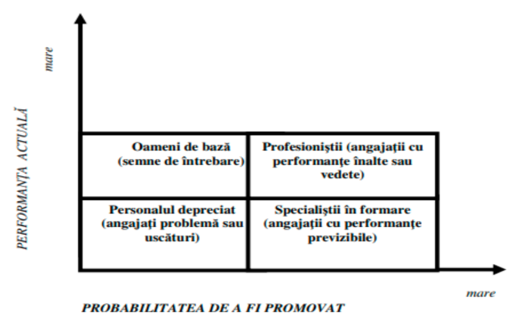

- **Profesioniștii (angajații cu performanțe înalte/ vedete)** - realizează performanțe la un nivel ridicat, au șanse mari de promovare, ceea ce le conferă posibilitatea de a avea un traseu profesional rapid (își ating obiectivele în domeniul carierei într-un interval de timp foarte scurt). Nivelul ridicat de performanță realizat de către profesioniști are la bază potențialul mare de dezvoltare şi performanță al acestora, care este posibil să se mențină la același nivel o perioadă îndelungată de timp.
- **Specialiștii în formare (angajații cu performanțe previzibile)** - au o probabilitate foarte mare de promovare în viitor. Performanța actuală nu este foarte înaltă, iar pentru a atinge nivelul dorit din organizație, aceștia trebuie incluși în programe speciale de perfecționare. Organizațiile aleg să investească în această categorie de angajați, datorită potențialului de performanță şi dezvoltare al acestora.
- **Oameni de bază (semne de întrebare)** - caracterizați de un nivel actual de performanță mare, dar pentru care șansele de promovare sunt reduse. Explicația constă în faptul că, deși reprezintă cea mai mare parte a personalului angajat al unei firme, oamenii de bază, prezintă un potenţial de performanţă şi dezvoltare diminuat, fie că sunt insuficient descoperite abilitățile și competențele lor, fie că nu reușesc să transmită o viziune mai largă a ceea ce ar putea dezvolta în viitor.
- **Personalul depreciat (angajații problemă)** constituie o categorie restrânsă de angajaţi, care înregistrează un nivel foarte redus de performanță, motiv pentru care șansele lor de a fi promovați în viitor sunt minime. Lipsa motivării oamenilor de bază, prin nestimularea potențialului de performanță şi dezvoltare a acestora, poate constitui una dintre cauzele care generează migrarea acestora către categoria angajaţilor problemă.

### Stabilirea căilor carierei (sursa: Balmuș - Andone, M., 2019)
- Stabilirea căilor carierei presupune progresul logic al oamenilor pe posturi în cadrul organizației.
- Căile carierei reflectă oportunitățile oferite de organizaţie pentru realizarea unei cariere.
- Căile carierei oferă informații importante pentru planificarea resurselor umane, deoarece această activitate are în vedere trecerea planificată a angajaților printr-o succesiune de posturi, pe care aceștia doresc să le dețină pentru realizarea scopurilor personale şi ale carierei.
- Deşi proiectarea căilor carierei nu poate realiza o armonizare deplină a nevoilor organizaționale şi individuale, planificarea sistematică a carierei permite realizarea unei concordanţe corespunzătoare între acestea.

### Stabilirea responsabilităţilor (sursa: Balmuș - Andone, M., 2019)
- Pentru stabilirea responsabilităţilor, managementul carierei constituie o funcţie a departamenului resurse umane, care se ocupă de elaborarea şi implementarea planurilor de carieră profesională.
- În afară de aceasta, angajaţii trebuie să-şi elaboreze propriile obiective privind dezvoltarea carierei lor.
- Prin urmare, responsabilităţile pentru dezvoltarea unui management eficient al carierei profesionale revin atât organizaţiei, cât şi angajaţilor acesteia.
- Principalele responsabilități cuprind acțiunile menționate în rezumatul din tabelul următor.

### Responsabilități privind cariera
Responsabilitățile privind cariera se regăsesc atât în sfera organizației, cât și a individului. (Balmuș - Andone, M., 2019 op. cit. Armstrong, M., 2003):

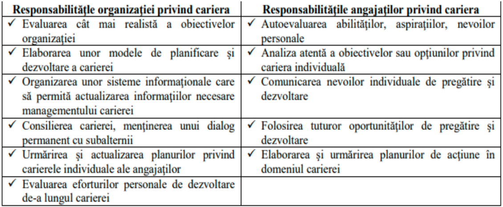

## Strategii de carieră
Au scopul de a anticipa problemele şi planificarea pe termen lung. În conținutul acestor strategii se regăsesc (adaptare după Clenciu, A.D., 2016):
- **Autocunoașterea** – se bazează pe o analiză atentă a orientării carierei, a punctelor slabe/tari, a locului în companie.
- **Cunoașterea mediului profesional** – printr-o bună atenție asupra semnalelor din domeniul de activitate, a problemelor economice, a potențialului, a companiilor competitoare, se pot anticipa atât evenimentele neplăcute cât şi ocaziile;
- **Grija pentru reputația profesională** - implică evidențierea abilităților şi realizărilor, a acelor aspecte care îl fac pe individ unic, a ceea ce îi demonstrează calități speciale.
- **Capacitatea de adaptare și evoluție profesională** – presupune permanenta corespondență între competenţele personale şi cele căutate pe piaţa forţei de muncă, a celor ușor transferabile.
- **Capacitatea de a putea fi atât specialist, cât şi generalist** – trebuie dezvoltat un domeniu de expertiză, de specialitate, dar trebuie păstrată o anume flexibilitate.
- **Identificarea și evidențierea reușitelor proprii** – reprezintă dovada a ceea ce o persoană a realizat, rezultatele şi realizările identificabile sunt mai valoroase în piața forţei de muncă.
- **Păstrarea unui confort și a unui echilibru în plan psihic și material** - presupune încredere de sine și existența unei imagini asupra carierei, eventual existența unui plan B.
- **Consolidarea comunicării și a relațiilor interpersonale** – atât în organizație, cât și în comunitatea de profesioniști.

# Curs 4 - Managementul carierei
## Interesele ocupaţionale și teoriile privind procesul alegerii carierei

## I. Stadiile carierei - Teoria stadiilor de dezvoltare ale carierei (Donald Super)
Teoria lui Super se sprijină şi pe următoarele postulate (Jigău, 2007):
- Luarea în considerare a diferențelor individuale în ceea ce priveşte abilităţile, interesele şi personalitatea.
- În fiecare dintre persoane există un multi-potenţial care permite calificarea pentru mai multe profesii sau ocupaţii.
- Depistarea lor se poate face printr-un inventar de interese şi aptitudini.
- Preferințele profesionale şi competențele se schimbă cu timpul, fapt ce face din alegerea carierei un proces continuu.
- Dezvoltarea carierei este un proces de viață în care individul își descoperă treptat interesele, valorile, aptitudinile și își formează o identitate profesională.
Cariera este, așadar, parte din dezvoltarea personală, nu doar o alegere punctuală a unui loc de muncă.
Stadiile de dezvoltare ale carierei au fost reprezentate inițial ca un proces liniar al dezvoltării carierei, ulterior, Super a admis că mișcarea în cadrul stadiilor de carieră are loc cu frecvență de-a lungul
vieții unei persoane, sugerând astfel un proces care ar putea fi liniar ca natură, însă după toate probabilităţile, nu este aşa pentru majoritatea oamenilor.

Potrivit lui Donald Super, procesul dezvoltării carierei parcurge cinci stadii aflate într-o succesiune cronologică:

1. **Stadiul de creștere (până la 14 ani)** 
    - se conturează imaginea de sine ca rezultat al identificării cu persoane semnificative pentru copil, observă modele de rol (părinți, profesori, eroi din povești sau filme), crește numărul prilejurilor de interacțiune socială şi are loc un proces de constituire şi direcționare al intereselor, cât și o dezvoltare şi exersare ale abilităților şi aptitudinilor.
    - copiii avansează prin substadiile fanteziei, interesului şi capacității.
    - progresul printre aceste substadii se realizează prin folosirea simțului înnăscut al curiozității, mai întâi pentru a se angaja în fantezii ocupaționale, iar mai apoi prin explorarea mediului lor înconjurător (de ex. casa, școala, mediul parental şi relațiile între colegi).
    - Procese cheie:
        - Dezvoltarea intereselor și valorilor personale (ce îi place să facă, ce consideră important).
        - Formarea imaginii de sine ("Sunt bun la...", "Îmi place să...").
        - Jocurile de rol ("de-a doctorul", "de-a polițistul") care reflectă curiozitatea față de profesii.
2. **Stadiul exploratoriu (15-24 ani)** – este caracterizat prin autocunoaştere şi experimentare a diferite roluri. Se diferențiază următoarele etape:
    - **cea a tentativelor (15 - 17 ani)** – de alegere a unei ocupații;
    - **cea de tranziție (18 - 20 ani)** – se realizează primele experiențe de muncă, își descoperă abilitățile, încearcă joburi temporare sau studii în domenii variate;
    - **încercarea, probarea activităților de muncă şi acceptarea acestora ca o ocupație permanentă**;
- Cristalizarea unei preferințe ocupaționale necesită clarificarea tipului de muncă pe care l-ar agrea.
- Procesul de cristalizare se construiește pe cunoștințele ocupaţionale şi cunoştinţele despre sine dobândite în timpul stadiului de creștere. Utilizând această informaţie, oamenii se concentrează pe dobândirea de cunoștințe ocupaționale mai profunde pentru a explora gradul în care anumite ocupații specifice pot permite implementarea conceptului despre sine.
- Procese cheie:
    - Explorarea opțiunilor prin școală, stagii, voluntariat sau joburi temporare.
    - Evaluarea realistă a abilităților personale comparativ cu cerințele unei profesii.

3. **Stadiul de stabilizare (25 - 44 ani)** 
    - are ca elemente specifice, în cadrul slujbei dorite, păstrarea respectivei poziții sau, dacă aceasta nu corespunde aspiraților, schimbarea ei și reîntoarcerea la stadiul de explorare;
    - dacă corespunde aspirațiilor sale, pe măsură ce persoana devine mai stabilizată într-o ocupaţie, începe să se concentreze pe a deveni un producător/furnizor demn de încredere şi pe dezvoltarea unei reputaţii pozitive în cadrul ocupaţiei (cu alte cuvinte consolidarea).
    - concentrarea axată pe devenirea de furnizor demn de încredere duce deseori la oportunitatea de a avansa pe o poziţie cu salariu şi responsabilităţi mai mari. În acest stadiu este obţinută reputaţia pentru performanţa de succes pe care persoana a căutat să o dezvolte.
    - Procese cheie:
        - Intrarea efectivă în profesie.
        - Specializarea prin formare continuă sau experiență.
        - Afirmarea profesională – nevoie de apreciere, promovare, de a atinge succesul.
        - Posibilitatea de schimbare de carieră dacă alegerea inițială nu corespunde valorilor sau așteptărilor.

4. **Stadiul de menţinere (45 – 64 ani)** 
    - persoana angajată caută să-şi menţină stabilă şi sigură poziţia în lumea muncii.
    - în acest stadiu, persoanele întâmpină sarcinile de păstrare, actualizare şi inovare. Multe persoane se confruntă fie cu alegerea de a ţine pasul cu progresele din domeniu pentru a-şi menţine sau îmbunătăţi nivelul lor de performanță, fie cu a opta pentru o schimbare a domeniului ocupaţional (reluând stadiile de explorare şi stabilizare).
    - în primul caz (adică păstrarea), lucrătorii îşi îndreaptă atenţia către actualizarea competenţelor şi aplicarea de noi competențe în moduri inovatoare în cadrul ocupaţiilor lor curente.
    - cei care decid să îşi păstreze ocupația prezentă, dar nu să îşi şi actualizeze competenţele, au deseori performanțe slabe şi stagnează în ceea ce priveşte munca lor (adică devin "blocaţi" în stadiul de păstrare). În aceste cazuri sunt necesare intervenţii în carieră care necesită reînnoirea carierei.
    - persoanele care actualizează şi inovează devin deseori mentori pentru angajații mai puţin experimentaţi.
    - Procese cheie:
        - Perfecționarea și actualizarea competențelor, dar și gestionarea stresului profesional și a echilibrului viață-muncă.
        - Mentoratul – ajutarea celor aflați la început de carieră.

5. **Stadiul dezangajării (peste 65 ani)** 
    - persoana îşi asumă alte roluri, îndepărtându-se treptat de lumea muncii.
    - pe măsură ce capacităţile fizice încep să între în declin, interesul pentru activităţi legate de muncă începe să descrească.
    - persoanele devin mai preocupate cu planificarea pentru viaţa din timpul tranziției și a perioadei de pensionare.
    - aceste preocupări implică considerente de ordin fizic, spiritual şi financiar.
    - individul își redefinește identitatea, concentrându-se pe familie, timp liber, pasiuni sau voluntariat.
    - Procese cheie:
        - Reducerea activității profesionale.
        - Transmiterea experienței și cunoștințelor generațiilor mai tinere.
        - Reevaluarea scopurilor personale și căutarea echilibrulu emoțional.

### Stadiile carierei după L.A. Klatt şi colab.

- Potrivit autorilor Klatt Murdick și Schuster, există patru stadii principale: **explorare**, **stabilizare**, **mijlocul carierei** și **eliberare**.

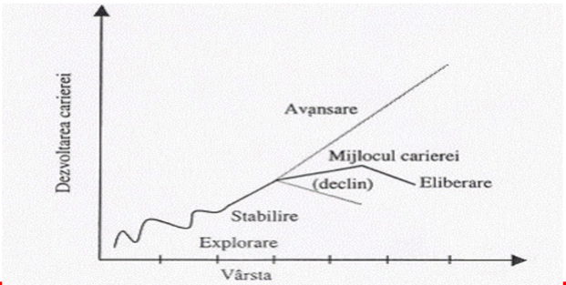

1. **Stadiul explorării** - pentru majoritatea oamenilor acest stadiu durează până în jurul vârstei de 25 de sau chiar 30-35 de ani.
    - individul îşi descoperă identitatea, îşi completează educația, îşi dezvoltă sistemul de valori şi ia decizii educaționale bazate pe informații cât mai realiste privind alternativele ocupaționale;
    - printre principalele probleme întâlnite în acest stadiu sunt:
        - lipsa concordanței dintre posibilitățile, valorile şi stilul de viață şi de muncă dorit de individ şi cerințele, avantajele unui nivel ocupațional sau ale unui post.
        - existența așteptărilor nerealiste pe care le au noii angajați şi realitatea sau situația cu care aceștia se confruntă în primul lor loc de muncă. Consecința poate consta în apariția sentimentului de insatisfacție până când angajații respectivi își refac așteptările şi se adaugă elemente mai atrăgătoare rolului lor în organizație.
        - nesiguranța în legătură cu abilitățile şi capacitățile sale încă nepuse la încercare, precum şi lipsa conștiinței de sine sau a înțelegerii de sine care nu permit angajatului respectiv să-şi identifice propriile interese, preferințe sau capacități.
    - pentru crea o viziune cât mai armonizată între individ-post-organizaţie, specialiștii recomandă utilizarea unor liste de control ca instrument de prioritizare a alegerilor, un exemplu al unei astfel de liste poate cuprinde:

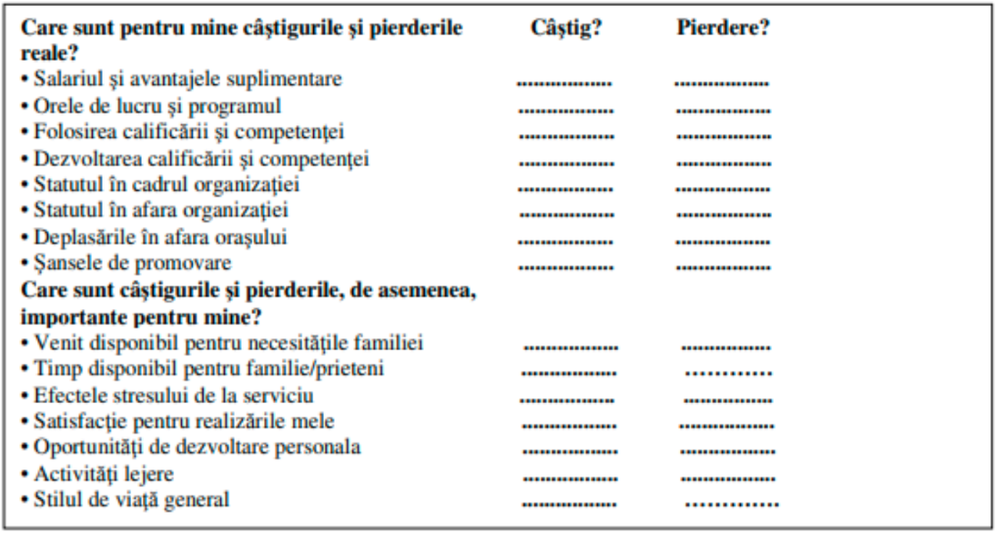

2. **Stadiul stabilizării** – reprezintă o importantă perioadă a vieții active şi poate fi încadrat, după unii specialiști în domeniu, între 25-45 de ani sau între 30-45 de ani.
    - își găsesc un post, învață ce au de făcut şi încep să arate semnele unui viitor succes sau eșec;
    - este caracterizată de creșterea performanțelor şi de "învățare din greșeli";
    - presupune focalizarea pe obiective cheie, realiste ale carierei;
    - angajații dobândesc experiențe noi în muncă, iar celor cu un potențial corespunzător li se asigură oportunități de promovare;
    - angajatul trece de la relația de dependență caracteristică stadiului de explorare la o activitate independentă;
    - în această perioadă se testează în continuare capacitățile şi aptitudinile pentru a se constata în ce măsură acestea corespund alegerii ocupaționale inițiale sau sunt necesare unele schimbări - insuccesele sau eșecurile unor angajați, în această etapă, sunt cauzate fie de lipsa aptitudinilor necesare pentru a-şi realiza independent munca, fie de lipsa încrederii în sine pentru a face acel lucru.

3. **Stadiul mijlocului carierei** - pentru majoritatea oamenilor acest stadiu se desfășoară în jurul vârstei de 35 (45) – 60 de ani caracterizându-se, de cele mai multe ori, de menținerea la același nivel al productivității;
    - reprezintă o etapă în care indivizii pot înregistra creștere, menținere (se mai numește și "platoul" carierei, fiind o perioadă fără o creștere semnificativă a performanțelor) sau declin;
    - se pot face evaluări ale succeselor sau realizărilor obținute - este o perioadă când pentru mulți oameni se impune o reevaluare a succeselor sau realizărilor și o schimbare a obiectivelor sau
    chiar a stilului de viață şi de muncă;
    - pentru cei cu creștere sau menținere se pot folosi programe de lărgirea posturilor, dezvoltarea indivizilor respectivi ca mentori pentru alții, pregătirea continuă și folosirea unui sistem flexibil de recompense;
    - pentru cei ale căror performanțe tind să scadă, se pot folosi strategii de adaptare ale planurilor de carieră sau schimbări de posturi.
    - poate reprezenta și etapa în care indivizii conștientizează limitele lor, începutul declinului, ceea ce impune o reevaluare a succeselor sau realizărilor și o schimbare a obiectivelor, sau chiar a stilului de viață şi de muncă. Uneori, în acest stadiu al carierei poate avea loc dezvoltarea unor interese în afara muncii sau planificarea unei a doua cariere.
    - în urma reevaluării carierei, unele persoane se pot întoarce chiar la stadiul de explorare făcând schimbări importante în carierele lor, în timp ce alte cariere pot continua sau se pot dezvolta cu noi experiențe sau responsabilități din ce în ce mai importante.

4. **Etapa de declin/eliberare**
    - eliberarea (ieșirea din carieră sau retragerea) se caracterizează prin reducerea interesului față de muncă, diminuarea performanțelor personale şi pregătirea pentru pensionare;
    - pot fi încredințate şi acceptate roluri mult mai reduse, cu o mai mică responsabilitate;
    - persoanele în prag de pensionare își pierd interesul față de dezvoltarea personală, dar pot deveni foarte buni "sfătuitori" şi multe organizații utilizează experiența acumulată de acestea pentru a-i ajuta pe angajații lor tineri să se dezvolte;
    - în acest stadiu al carierei se impune introducerea unor modele flexibile de muncă şi a standardelor de performanță, o pregătire permanentă a angajaților respectivi şi, bineînțeles, evitarea discriminărilor legate de vârstă.

### Relația carieră - nevoi
- Evoluția carierei și a nevoilor (sursa: : B. Martory, D. Crozet):

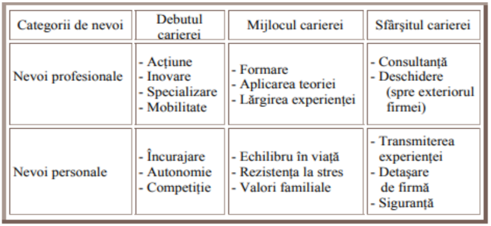

### Stadiile carierei - concluzii
- Nevoile şi carierele ca şi viețile sunt dinamice, prin urmare și stadiile dezvoltării carierei evoluează şi se schimbă.
- Durata stadiilor carierei variază de la individ la individ, însă majoritatea oamenilor trec în general prin aceleași stadii.
- Cu toate acestea, planificarea carierei şi stadiile acesteia necesită o tratare distinctă, deoarece diferitele stadii ale carierei oferă oportunități și constrângeri diferite care influențează performanța în muncă, iar problemele care se cer rezolvate în cadrul fiecărui stadiu sunt diferite pentru fiecare individ.
- Un concept tot mai folosit este cel de “carieră elastică” - se referă la permanenta preocupare a individului pentru cariera sa, pentru cunoașterea cât mai bună a competențelor sale, a schimbărilor din industrie, a oportunităților pe care le-ar putea avea astfel încât să poată beneficia de ele și să evolueze şi continuu din punct de vedere profesional.

### Teoria carierei proteice (en. Protean Career Theory) – dezvoltată de Douglas T. Hall (1976, 20004)
- Se află la baza conceptului de carieră elastică;
- Termenul "proteic" provine de la zeul grec Proteus, care avea capacitatea de a se transforma în diferite forme pentru a se adapta situațiilor;
- Omul modern trebuie să fie capabil să se schimbe, să se adapteze și să-și reconstruiască drumul profesional de mai multe ori în viață.
- În accepțiunea acestei teorii: "cariera se bazează pe valorile, interesele și scopurile personale, fiind condusă de individ, nu de organizație."
- Cele două dimensiuni principale ale carierei proteice (după Hall, 2004):
    - **Auto-dirijarea (Self-Direction)** - capacitatea de a-și construi și gestiona cariera independent, luând decizii bazate pe obiective personale, nu pe așteptările organizației.
    - **Orientarea spre valori (Values-Driven)** - alegerea carierei și a locului de muncă în funcție de principiile și valorile proprii (de ex. creativitate, echilibru), nu doar pe recompense externe.
- Limitări ale carierei proteice:
    - necesită auto-disciplină și motivație internă – fără un angajator care să ofere direcție
    - poate genera nesiguranță și instabilitate financiară
    - necesită o bună gestionare a echilibrului viață–muncă

## II. Modelele de planificare ale carierei
Potrivit Robert Mathias (Mathias et all, 1997), modelele de planificare ale carierei în care poate fi cuprins întregul personal al unei organizații sunt următoarele:
- modelul "șansă și noroc";
- modelul "organizația știe cel mai bine";
- modelul auto-orientat.

1. **Modelul "şansă și noroc"** - este specific celor care se bazează pe o serie de factori externi, necontrolabili, cum ar fi șansa şi norocul - pentru a utiliza acest model, individul în cauză trebuie să fie perseverent şi să nu piardă niciun prilej pentru a fi în locul potrivit şi la momentul potrivit (de pildă, dacă astăzi găsește o firmă care să îl angajeze, va rămâne o perioadă și apoi va mai vedea)
2. **Modelul "organizația știe cel mai bine"** - angajatul este mutat de pe o poziție pe alta sau de pe un post pe altul, în funcție de nevoile organizației.
    - modelul presupune o dependență față de organizație; individul are un rol pasiv.
    - este frecvent întâlnit la angajații tineri, care încă nu au experiență sau autonomie.
    - pentru un adult, însă, efectele sunt în general negative şi au repercusiuni pe plan psihic din cauza percepției faptului că organizația abuzează de angajat.
    - cea mai bună strategie pe care utilizatorii acestui model o pot adopta constă în obținerea unui câștig cât mai substanțial din recunoașterea propriilor calități şi performanțe, urmând să-şi
    îndeplinească cu conștiinciozitate propriile responsabilități şi sarcini de serviciu.
    - dacă angajatul așteaptă ca organizația să-l găsească sau să-l identifice şi să-l numească, el trebuie să cunoască orientarea strategică a acesteia şi să se deplaseze în această direcție.
3. **Modelul auto-orientat**:
    - este situația în care o persoană îşi stabilește propriile obiective de carieră şi identifică o serie de agenți care îl pot ajuta în atingerea acestor obiective (coaching, mentoring, obținerea unor
    calificări suplimentare, dezvoltarea rețelei relaționale etc.)
    - conduce adeseori la performanță şi mulțumire
    - angajații îşi stabilesc singuri cursul de dezvoltare al carierei proprii, utilizând asistența furnizată de organizație
    - angajații sunt principalii responsabili pentru implementarea, controlul şi evaluarea carierei lor, accentul este pus pe auto-dirijare, pe adaptabilitate și pe alinierea carierei la valorile şi obiectivele personale.

Aceste modele servesc ca un cadru conceptual pentru practica de management al carierei în organizații.
Organizațiile pot evalua ce model predomină în cultura lor şi pot ajusta practicile de resurse umane în consecință (ex. programe de dezvoltare, consiliere de carieră, mobilitate internă).
Pentru individ, recunoașterea modelului sub care operează îi poate oferi claritate asupra rolului său în carieră şi asupra nivelului de control pe care îl are.

# Curs 5 - Metode de dezvoltare ale carierei profesionale

## Dezvoltarea carierei (sursa: Balmuș - Andone, M., 2019)
- Din perspectiva **individului**, dezvoltarea carierei este procesul pe termen lung care acoperă întreaga carieră a unui individ şi care cuprinde programele şi activităţile necesare îndeplinirii planului carierei individuale.
- Din perspectiva **organizaţiei**, dezvoltarea carierei este un efort continuu şi formalizat depus de către organizaţie, care se concentrează pe dezvoltarea şi îmbogăţirea resurselor umane din punctul de vedere al ambelor necesităţi – ale angajaţilor şi ale organizaţiei.
- Mobilitatea crescută a angajaţilor şi factorii legaţi de mediu au făcut dezvoltarea carierei extrem de importantă pentru firmele actuale.
- Cele mai importante componente în dezvoltarea carierei sunt:
    - Stabilirea scopului şi a acordului de pregătire
    - Sarcinile critice ale postului
    - Pregătirea şi alte experienţe dobândite
    - Evaluarea periodică, feedback-ul pe baza scopului şi a acordului de pregătire
    - Progresul continuu în carieră

### Componentele dezvoltării carierei (sursa Janeta Sîrbu, op cit. Lawrence A. Klatt)
1. **stabilirea scopului şi acordului de pregătire**:
    - cunoaşterea cât mai precisă a poziţiei individului în cadrul dezvoltării organizaționale și a drumului parcurs
    - a condiţiilor sau cerinţelor şi cunoştinţelor suplimentare.
2. **sarcinile critice ale postului**:
    - stabilirea scopurilor carierei
    - a acordurilor de pregătire
    - evaluarea periodică şi feedback-ul necesar

3. **pregătirea şi alte experienţe dobândite**:
    - programe de dezvoltare ale carierei
    - armonizarea permanentă a nevoilor individuale şi a oportunităţilor organizaţionale în continuă schimbare
4. **evaluarea periodică, feedback-ul, pe baza scopului şi acordului de pregătire**:
    - legătura între dezvoltarea carierei şi planificarea resurselor umane
    - dezvoltarea carierei asigură o ofertă a capacităţilor şi abilităţilor oamenilor, iar planificarea resurselor umane previzionează cererea de capacităţi şi abilităţi

- Instrumentele dezvoltării carierei se referă la abilități, educație, experiență, modificări comportamentale care – abil gestionate de manageri – permit salariaților să muncească mai bine și mai performant.
- Schematic, procesul dezvoltării carierei se poate reprezenta astfel:

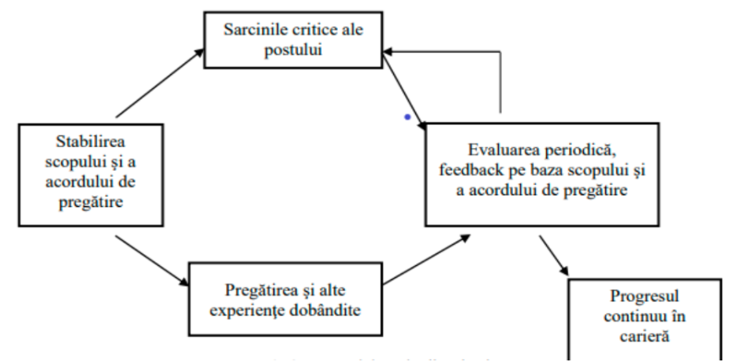

### Dezvoltarea carierei (sursa: Silvaș, A., 2009)
Direcţiile principale prin care organizaţiile pot să conducă şi să dezvolte carierele angajaţilor astfel încât să contribuie la eficienţa şi eficacitatea organizaţională sunt:
- Evaluarea periodică a performanţelor angajaţilor
- Dezvoltarea capitalului uman prin facilitarea calificării, lărgirii şi îmbogăţirii cunoştinţelor angajaţilor (cursuri de instruire, rotaţie, lărgire şi îmbogăţirea posturilor)
- Identificarea nevoilor organizaţionale viitoare de personal
- Identificarea la fiecare angajat a cunoştinţelor, abilităţilor şi intereselor personale
- Implementarea unor planuri de carieră; aceste planuri trebuie să integreze preferinţele şi punctele forte ale individului cu alternative viabile în carieră
- Oferirea de informaţii legate de posturile libere ce apar în organizaţie şi perspectivele de avansare
- Crearea unui climat organizaţional care să faciliteze comunicarea deschisă cu angajaţii
- Dezvoltarea capitalului uman pe termen lung, anticiparea viitoarelor tranziţii profesionale prin care va trece angajatul, pentru a conduce la succesul individual şi organizaţional

Actorii implicați în realizarea programelor de dezvoltare ale carierei sunt:
- **conducerea** abilitată să ia decizia de a susține programul și de a aloca resursele necesare
- **specialiștii departamentului de resurse umane** – oferă informația necesară, asigură instrumentele de lucru și orientarea salariaților
- **șefii de departamente** sunt responsabili cu furnizarea suportului logistic și înregistrarea feedback-ului
- **angajații** în calitate de responsabili ai dezvoltării carierei lor.

### Metode de dezvoltare și planificare ale carierei
Există numeroase metode de planificare și dezvoltare a carierei. Unele sunt utilizate independent, altele combinat. Dintre acestea pot fi amintite:
- **discuțiile de cunoaștere ale angajaților** – metodă formală ce presupune discuții între subordonați și superiori sau reprezentanți ai departamentului de resurse umane cu scopul stabilirii celor mai bune tipuri de activități de planificare și dezvoltare ale carierei
- **materialele de sprijin (ghiduri)** – anumite firme furnizează materiale specifice, concepute să-i ajute pe angajați în planificarea și dezvoltarea carierei. Acestea sunt realizate astfel încât să se coreleze cu nevoile specifice ale organizației
- **sistemul evaluării performanțelor** se referă la aprecierea performanței și la evaluarea punctelor tari și punctelor slabe ale angajaților
- **atelierele de lucru** – anumite companii organizează workshop-uri cu scopul de a-i ajuta pe angajați să-și planifice și să-și dezvolte cariera în interiorul companiei
- **planurile de dezvoltare individuală** – angajații sunt încurajați să conceapă propriul lor plan de dezvoltare al carierei, care va constitui un nucleu de pornire.

## Dezvoltarea capitalului uman în organizație
- Constă în asigurarea pentru angajaţi a oportunităţilor de:
    - învăţare, instruire
    - creşterea abilităţilor şi a potenţialului lor
- Scop:
    - îmbunătăţirea performanţelor individuale, de echipă şi organizaţionale
    - însușirea cunoștintelor atât pentru activitatea prezentă, cât și în perspectivă
    - menţinerea competitivităţii organizației și a performanței sale prin sporirea productivității muncii

- Se poate realiza prin activități de:
    - pregătire profesională: formare sau perfecționare
    - managementul talentelor - creșterea experienței, a cunoștințelor teoretice şi practice necesare pentru posturile superioare ori de conducere
    - coaching, mentoring și managementul carierei
    - dezvoltarea unor structuri de management și leadership, inclusiv a unei culturi organizaționale axată pe dezvoltare, învățare și împărtășire de know-how

### Pregătirea profesională
- se realizează prin: formare (dezvoltarea unor cunoștințe și competențe noi) sau perfecționare (îmbunătățirea celor existente)
- trebuie să răspundă nevoilor specifice de pregătire, să se desfășoare pe baza unui plan (program), să pornească de la o selecție corectă a cursanților în funcție de nivelul de cunoaștere și să se evalueze continuu eficiența sa

#### Analiza nevoilor specifice de pregătire profesională
Se poate desfăşura pe trei niveluri:
1. **nivelul organizaţional** - corelarea nevoilor de pregătire, a resurselor ce pot fi asociate cu obiectivele firmei
2. **nivelul departamental** - analiză strâns legată de cea de la nivelul firmei, corelată cu nevoile şi obiectivele specifice ale departamentului
3. **nivelul individual** - presupune identificarea persoanelor care au nevoie de pregătire, precum şi a metodelor ce trebuie utilizate, pentru fiecare individ în parte. În această situație, evaluarea performanțelor şi a potențialului individului reprezintă punctul de pornire în stabilirea nevoii de pregătire.

### Metode folosite în pregătirea profesională
- Se aleg în funcţie de obiectivele şi conţinutul programelor, de participanţi (număr, nivel de pregătire, preferinţe), timp şi resurse disponibile
- Sunt clasificate în:
    1. **metode de pregătire la locul de muncă** (sau pe post sau instruire "on the job")
        - cunoştinţele teoretice sunt transferate mai rapid în activitatea practică, mediul de învățare fiind aceleaşi cu mediul de lucru
        - nu presupun reducerea timpului efectiv de lucru sau scoaterea din activitatea productivă a cursantului
        - sunt mai puţin costisitoare
    2. **metode de pregătire tip "sală de clasă"** (sau în afara locului de muncă) - învăţarea are loc departe de presiunea muncii de zi cu zi

##### Metode de pregătire la locul de muncă, instruire "on the job"
1. **instruirea la locul de muncă** - pregătirea angajatului de către un instructor, poate lua forma uceniciei
2. **rotaţia pe posturi** - trecerea cursantului pe mai multe posturi, la același nivel ierarhic, permite o bună evaluare a potențialului angajatului
3. **shadowing** – lucrează alături de un specialist senior, observând și replicând procesele de lucru
4. **mentoring** - instruirea cu ajutorul unui mentor, presupune sprijinirea colegului mai tânăr, de către un mentor, în înțelegerea activității organizaţiei și a postului şi în demonstrarea propriilor calităţi
5. **coaching** - reprezintă o metodă de îmbunătățire a performanței pe post, prin încurajarea angajatului să-şi asume responsabilitatea pentru propriile decizii şi performanțe; în timpul acestei activități, angajatul este tratat, de către şeful ierarhic, ca un partener în atingerea obiectivelor specifice.
6. **implicarea în proiecte pilot** – implicarea în proiecte de complexitate redusă pentru a dobândi experiență practică

În plus, în IT, angajații se pot implica în: proiecte interne de dezvoltare software; echipe agile de tip scrum sau kanban; hackathoane și code challenges organizate de companie;

##### Metode de pregătire tip „sală de clasă”
1. **prelegerile sau trainigurile** - transfer de informaţii către cursant, având conţinut şi durată determinate
2. **participarea la conferinţe şi seminarii** - în care experţii şi cursanţii discută diverse probleme şi schimbă idei (ex. conferințe: DevTalks, Web Summit; ex. workshop-uri: Innovation Days, TechLabs)
3. **învăţarea programată** - prin care cursanţii primesc informaţii în mod progresiv; se trece la o altă secvenţă numai după învăţarea celei anterioare
4. **platforme de e-learning** (Coursera, Udemy, Pluralsight, edX) oferite de angajator
5. **metoda studiilor de caz** - se aplică individual sau în grup, pentru dezvoltarea capacităţii de analiză a problemelor
6. **joc de rol** - asumarea de către cursant a unui rol, într-o situaţie dată; metoda este folosită pentru dezvoltarea aptitudinilor necesare în posturi ce presupun relaţii interpersonale
7. **simularea** - combină studiile de caz cu jocul de rol, pentru a obţine situații cât mai apropiate de realitate
8. **exerciţiile de grup** - folosite pentru observarea comportamentului de grup şi individual în cadrul grupului, a modului de luare a deciziilor.

### Coaching și mentoring
- Coaching-ul și mentoring-ul reprezintă modalități prin care managerii își ajută angajații să lucreze mai bine.
- Coaching-ul este o activitate prin care:
    - managerii lucrează cu subordonaţii la dezvoltarea aptitudinilor lor
    - împărtăşesc cunoștințe de specialitate
    - induc valori şi tipuri de comportamente care îi ajută pe angajaţi să atingă scopurile organizaționale, să deblocheze aspectele ce conduc la lipsa performanței şi îi pregătesc pentru sarcini mai importante, provocatoare.

#### Coaching – definirea conceptului
- "Coaching-ul reprezintă deblocarea potenţialului unei persoane pentru a maximiza propria sa performanţă. Înseamnă a ajuta pe cineva să înveţe mai mult decât a-i preda sau a-l învăţa în sensul tradiţional al termenului". (Sir John Whitmore)
- spre deosebire de metodele educative tradiţionale, standard, coachingul oferă modalităţi personalizate, independente de învăţare. Ţine cont de stilul propriu al individului, de agenda acestuia şi de nevoia lui de control. (Perry Zeus, Suzanne Skiffington – “Coaching în organizaţii:
instrumente şi tehnici”, Editura CODECS, Bucureşti, 2008)
- coachingul poate fi și o tehnică de realizare a obiectivelor stabilite, pe termen scurt, mediu sau lung. Antrenorul ajută prin dialog, de la egal la egal, să își stabilească corect un obiectiv, să găsească cea mai bună modalitate de a atinge obiectivul și să dezvăluie potențialul interior al persoanei.
- antrenorul nu divulgă clientului cum să obțină rezultatul, ci pune întrebări care să-l ghideze, astfel încât persoana antrenată să găsească soluția propriilor sarcini, fiindu-i alături pe tot parcursul procesului, încurajându-l și motivându-l.

##### Beneficii ale organizaţiei - coaching
- Aduce o îmbunătăţire a marjei finale de profit datorită costurilor mai scăzute de producție
- Atrage pe cei care caută locuri de muncă de înaltă calitate pentru că oamenii doresc să lucreze pentru organizații care îşi dezvoltă angajații
- Dezvoltă talentul brut cu o nouă abilitate specifică și/sau dezvoltă profesionistul experimentat cu o abilitate nouă sau reîmprospătată
- Ajută persoanele care nu îndeplinesc așteptările sau obiectivele
- Asistă liderii să facă față schimbărilor la scară largă
- Pregătește profesioniștii pentru avansarea în organizație potrivit planurilor sale de carieră
- Ajută la crearea unui mod de gândire orientat spre soluții, pliat pe diverse situații specifice și la creșterea gradului de adaptabilitate personală
- Fluctuație mai redusă de personal

#### Mentoring
- îndrumarea unui angajat nou de către unul dintre angajații cu experienţă, într-o relaţie de tip mentor – discipol
- este, la fel ca şi coaching-ul, o modalitate de dezvoltare a resursei umane, dar pune accentul pe orientarea oamenilor în eforturile lor de creștere valorică generală cu ajutorul învăţării
- este centrat pe transferul de experiență de la mentor către cel mentorat
- se lucrează pe exemple și situații din trecut ale mentorului și din prezent ale celui mentorat, din care se extrag anumite învățături și se creează moduri noi de operare și rezolvare
- mentorul acționează ca un ghid de încredere, oferă consultanţă când îi este solicitată şi facilitează oportunităţile de instruire/formare când este posibil

##### Mentoring – definirea conceptului
- Richard Luecke (2004): "oferirea de sfaturi înțelepte şi consistente, de informaţii şi de îndrumare de către o persoană cu experienţă, aptitudini şi expertiză utile pentru dezvoltarea profesională şi personală a unui alt individ."
- Deține o dublă funcție:
    1. **Funcţii (legate) de carieră** – consolidează/îmbunătățesc învăţarea regulilor de bază ale locului de muncă şi pregătesc pentru avansarea în ierarhiile organizaţiei respective
    2. **Funcţii psihosociale** – îmbunătăţesc sentimentul competenţei, al clarităţii propriei identităţi, al eficacităţii rolului profesional asumat, ajutând fiecare persoană să-şi construiască un respect de sine mai înalt atât în cadrul organizaţiei, cât şi în afara ei.

#### Coaching versus mentorat în organizații
**Coaching**
- Se desfășoară printr-un program bine organizat
- Antrenorii sunt angajați pentru expertiza lor într-o anumită zonă, în care este nevoie de îmbunătățire. Exemple: abilități de prezentare, leadership, vânzări etc
- Utilizează întrebări care să ajute persoana antrenată să ia decizii importante, să recunoască schimbările de comportament și să acționeze
- Utilizată în cazul persoanelor cu experiență
- Ajută la o cunoaștere mai bună a propriei persoane prin accesarea de noi perspective și schimbarea comportamentelor adânc înrădăcinate care nu mai folosesc

**Mentorat**
- Se desfășoară în funcție de necesitățile persoanei mentorate
- Persoana mentorată învață de la experiența mentorului și este inspirat de el
- Persoana mentorată este cea care pune mai multe întrebări pentru a folosi expertiza mentorului
- Se desfășoară, în special, pentru cei aflați la începutul carierei sau preluării de noi responsabilități
- Mentorarea ajută abilității și include transferul de experiență de la mentor.

### Managementul talentului ca metodă de dezvoltare
#### Definirea "talentului" în organizație
- **"Talentul"** este angajatul care va crea valoare în organizația în care munceste și ale cărui competențe sunt indispensabile succesului acelei companii.
- Talentul poate însemna:
    - abilități, aptitudini, capacități înnăscute
    - abilitatea naturală, peste medie, de a face un anumit lucru mai bine decât ceilalți
    - o persoană cu una sau mai multe competențe excepționale

#### Managementul talentelor
**Talent = Performanță + Potențial**
- **PERFORMANȚA** înglobează comportamentul angajaților și evaluarea acestuia în concordanță cu valorile/standardele organizației, plus istoria evoluției profesionale (reușitele și rezultatele, amploarea proiectelor gestionate atât în cadrul organizației, cât și în afara ei).
- Performanța este evaluată, gestionată în cadrul procesului de management al performanței.
- **POTENȚIALUL** se referă la "ambiția", tradus ca dorință a angajatului pentru ocuparea unor poziții superioare, dovada determinării pentru autodezvoltare și evoluție în carieră, disponibilitatea în preluarea unor noi provocări.
- Flexibilitatea presupune analiza abilităților angajaților necesare pentru a tinde spre reușite mai mari, mai complexe, spre poziții de senior în cadrul organizației.

#### Atragerea și reținerea talentului în organizație
Crearea unui mediu ideal pentru dezvoltarea personală a talentelor se bazează pe:
- **respectarea promisiunilor** - necesară pentru construirea unei relații profesionale de durată
- **recunoașterea meritelor** - aprecierea, motivarea și recompensele la momentul potrivit vor încuraja performanța
- **asigurarea unui context al învățării continue**
- **crearea unui mediu de lucru pozitiv** - talentele au nevoie de condițiile ideale pentru dezvoltarea potențialului lor
- **oportunități de creștere** – crearea unui loc în care se pot exprima și în care pot experimenta
- **actvități recreaționale**: teambuilding-uri, zile libere, asigurarea unui spațiu recreațional în companie

#### Managementul talentelor - scop
- Scopul managementului talentelor este acela de a genera în organizaţie comportamentele excepţionale pentru a atinge obiectivele strategice ale organizaţiei.
- Se bazează pe recunoaşterea faptului că un angajat nu aduce valoare unei organizaţii doar prin performanţa lui directă în sarcină, ci potenţialul necesar pentru a prelua alte poziţii din organizaţie, adeseori poziţii mai înalte.
- Managementul talentelor potenţează motivaţia intrinsecă a actualelor şi potenţialelor talente din organizaţie.
- Discrepanțele între cele mai solicitate competențe și abilitățile disponibile pe piață vor fi tot mai reduse în cadrul companiilor.
- Implementarea unui program de management al talentelor poate spori eficiența organizațională și reduce rata demisiilor.

#### Managementul talentelor – definiție
- Managementul talentelor se referă la anticiparea capitalului uman necesar unei organizaţii şi la stabilirea unui plan de a satisface aceste nevoi - "The war for talent" (2001)
- Managementul talentelor reprezintă un proces de atragere, integrare, dezvoltare și păstrare a salariaţilor cu înaltă calificare.
- Managementul talentelor ajută oamenii să îşi atingă potenţialul maxim prin diverse proiecte de dezvoltare. Acest tip de dezvoltare este asigurat de către angajatori, conform raţionamentului că investiţiile companiei în resursele umane vor fi recompensate prin loialitate şi productivitate.
- Managementul talentelor reprezintă o necesitate având în vedere mobilitatea în creştere a angajaţilor talentaţi la nivel global, mai ales în rândul ţărilor în curs de dezvoltare.

# Curs 6/7 - Motivație – satisfacție și performanța în carieră
## Satisfacția (sursa: Micle, M.I., 2009)
- Satisfacția muncii este unul din factorii atât ai eficienței personale, cât şi ai eficienței organizaționale.
- Satisfacția este o stare interioară de bine, o trăire emoțională pozitivă, rezultatul evaluării muncii depuse, al sincronizării expectațiilor angajatului cu pachetul de compensații primite (economice, recunoaștere, statut etc.).
- Din perspectivă psihosociologică - satisfacția este pusă într-o relație matematică cu ceea ce estimează individul că ar trebui să obțină (așteptări, obiective proiectate) şi ceea ce obține în mod obiectiv în activitatea de muncă (obiective realizate). Dacă nivelul de realizare al obiectivelor coincide cu cel proiectat, așteptat, se instalează o stare de satisfacție.

### Factori determinanți ai satisfacției în muncă (sursa: Micle, M.I., 2009)
- Potrivit lui Vroom (1964) factorii determinanți ai satisfacției se regăsesc în: realizarea idealurilor, obținerea unor retribuții bănești în schimbul muncii prestate, dezvoltarea trăsăturilor de personalitate, aportul angajatului la producția de bunuri şi servicii, realizarea unor relații umane benefice şi conturarea statului social. Factorii depind, în primul rând, de relația dintre așteptările, capacitățile şi obiectivele persoanei, dar şi de condițiile existente la locul de muncă.
- Alți autori indică ca factori: rolul relațiilor interpersonale (Lickert Rensis, 1967), al prestigiului locului de muncă (King, 1960), al obiectivității aprecierii muncii, implicării în activitatea de muncă, al stilului de conducere şi al considerației acordate de șef subalternului (Ripon, 1987) în formarea, dezvoltarea, susținerea motivațională şi în producerea stării de satisfacție a muncii.
- Studiile unor autori ca Schreiber (1952, apud Weintraub, 1973, p. 296) au identificat ca principale surse de satisfacție profesională următoarele dimensiuni: conținutul muncii, tipul de supraveghere directă, atitudinea conducerii, relațiile dintre colegi la locul de muncă, salariul şi ocaziile de promovare.

### Insatisfacția (sursa: Micle, M.I., 2009)
- Atunci când realizările sunt sub nivelul aşteptărilor, individul trăieşte o stare de insatisfacţie ce provoacă la nivelul angajatului o dezorganizare în plan psihic şi atitudinal.
- Dintre efectele insatisfacţiei în muncă, cu impact asupra bunei funcţionări atât a individului, cât şi a organizaţiei din care face parte se evidenţiază:
    - sănătatea mentală şi satisfacţia în afara muncii. Unii autori susţin că angajaţii mai satisfăcuţi sunt mai sănătoşi psihic, atitudinile pozitive faţă de munca desfășurată corelează pozitiv cu cele manifestate faţă de viaţă, în general (Judge şi Watanabe, 1993). Dacă angajații trăiesc un sentiment de realizare şi stimă, munca prestată le oferă satisfacție. Lipsa satisfacției poate afecta sănătatea mentală.
    - absenteismul. Cercetările relevă, în cele mai multe cazuri, o corelație relativ slabă între satisfacția, muncă şi absenteism. Conținutul muncii reprezintă cel mai bun predictor al absenteismului în relaţia sa cu satisfacția. Satisfacția în muncă corelează mai mult cu "frecvența" absenteismului (cât de des absentează salariații), decât cu timpul pierdut – câte zile.
    - fluctuaţia de personal. Fluctuația vizează demisia persoanelor dintr-o organizație. Între satisfacția muncii şi fluctuație există o corelaţie moderată (Steel şi Ovalle 1984).

### Relația motivație – satisfacție în muncă (sursa: Micle, M.I., 2009)
- Starea de satisfacție sau insatisfacție este un indicator al modului eficient sau ineficient de funcționare al motivației;
- Motivația şi satisfacția apar într-o dublă calitate, atât de cauză, cât şi de efect. Motivația este o cauză, iar satisfacția o stare finală. Sunt însă şi cazuri când satisfacția trăită intens, durabil se poate transforma într-o sursă motivațională
- Motivația – satisfacția se raportează împreună la performanță pe care o pot influența pozitiv sau negativ.
- Relația performanță – satisfacție variază în funcție de condițiile particulare organizației şi fiecărui post de muncă.
- În principiu, relația motivație satisfacție este legată de tehnicile de stimulare ale angajaților şi de modul de organizare al activității de muncă.

### Forme ale motivației (sursa: Dănăiță I., 2012)
- **Motivaţia intrinsecă** (motivație directă) este generată de relaţia dintre angajat şi sarcinile de muncă pe care acesta le are de îndeplinit şi este autoaplicată. Este reprezentată de sentimentele de realizare, împlinire, competenţă etc., pe care le simte angajatul în urma realizării sarcinilor care îi revin. Caracteristic acestei forme de motivaţie este obţinerea satisfacţiei prin realizarea unei acţiuni adecvate (ex.: un student lucrează la un anumit proiect pentru că tema acestuia îl interesează, nu pentru că este obligat, citește sau învață din dorinţa de a şti si nu pentru a promova examenul etc.).
- **Motivaţia extrinsecă** (motivaţie indirectă) este generată de mediul de muncă extern sarcinii şi este aplicată de altcineva. Este reprezentată de salariul, sporuri diverse, promovări etc. pe care un angajat le poate primi. Exemple de motivaţie extrinsecă sunt: un student lucrează la un anumit proiect pentru a obţine o notă mare, citeşte sau învaţă din dorinţa de a promova examenul şi nu de a învăţa ceva, o persoană merge la teatru pentru a-şi crea imaginea unei persoane cultivate etc.

#### Relația motivație şi performanţă (sursa: Micle, M.I., 2009)
Relaţia dintre motivație şi performanţă are în vedere:
1) **Motivaţia intrinsecă** conduce la performanţe mai ridicate şi mai stabile în timp decât motivaţiile extrinseci. Motivaţia intrinsecă centrată pe performanţă mobilizează individul să îmbunătăţească condiţiile de muncă necesare creşterii performanţei, asigură rezistenţa la influenţa unor factori nefavorizanţi, are permanenţă în timp, nu solicită gratificaţii imediate pentru a fi întărită, se autogenerează şi are resurse proprii de menţinere şi întărire etc.
2) **Motivaţia extrinsecă** se auto-erodează, se menţine atâta timp cât se întăreşte, existând cazuri când nicio intervenţie din afară nu mai menţine efectul unui motiv extrinsec, performanţele sunt evaluate cantitativ, nu calitativ etc. Se centrează exclusiv pe interese. Motivaţia extrinsecă pozitivă este mai eficientă, mai productivă şi mai mare decât cea extrinsecă negativă. Pe termen scurt, ambele tipuri de motivaţii pot conduce la performanţă. În timp, poate apărea o plafonare a performanţei, datorită limitelor inevitabile de creştere ale gratificaţiilor sau pedepselor şi de generalizare exhaustivă a lor. Se recomandă ca motivaţia extrinsecă negativă să fie aplicată unor cazuri de excepţie, pe termen scurt şi pentru performanţe implicate de tip cantitativ. Motivaţia extrinsecă pozitivă poate lua diferite forme: creşteri de câştiguri financiare, posibilitatea de creştere a poziţiei şi statutului social, facilităţi sociale şi familiare etc. O motivaţie înaltă nu va conduce la performanţă înaltă dacă angajaţilor le lipsesc aptitudini şi deprinderi de bază, nu-şi înţeleg posturile sau întâlnesc obstacole de neevitat asupra cărora nu au niciun control.
3) **Motivaţia pozitivă** presupune stimularea personalului prin generarea de satisfacţii personale în strictă legătură cu rezultatele obţinute sau comportamentul promovat. Datorită structurii psiho-intelectuale deosebit de diferită de la un individ la altul, satisfacţia este percepută diferit de către diferiţi angajaţi, de aceea managerii trebuie să identifice, la nivelul fiecărui angajat tipul de satisfacţii la care este acesta sensibil. Ca metode de motivare pozitivă, se pot include: câştigurile băneşti sau de altă natură, alte beneficii materiale sau nonmateriale, lauda, evidenţierea meritelor, a realizărilor prin avansări în funcţie, acordarea diplome, acordarea încrederii etc.
4) **Motivaţia negativă** reprezintă un tip primitiv de motivaţie bazat pe ameninţare, pedeapsă, critică. Ca metode de motivare negativă, se pot include: ameninţarea cu pierderea locului de muncă sau a unor avantaje materiale (penalizare, amendă, imputație) sau de altă natură (retrogradare, destituire) mustrarea scrisă, critica, blamul etc.
5) **Motivația cognitivă** este determinată de nevoia de a cunoaşte, de a înţelege, de a şti cât mai multe. Se manifestă prin curiozitatea sau interesul faţă de tot ce este nou, prin toleranţa faţă de risc etc.
6) **Motivația afectivă** este determinată de nevoia omului de a obține adeziunea şi recunoașterea semenilor săi, de a se simți bine în compania lor. În cadrul organizațional acest tip de motivație se manifestă prin acceptarea unor sarcini sau responsabilități din dorinţa de a nu fi considerat incapabil sau rău intenţionat.

### Teorii privind motivația (sursa: Dănăiță I., 2012)
În literatura de specialitate teoriile motivaţiei muncii sunt grupate în două mari categorii:
1. **Teorii ale motivaţiei muncii bazate pe nevoi**
Aceste teorii au la bază proiectarea unui sistem eficient de motivare al personalului pornind de la cunoaşterea sistemului nevoilor. Omul, fiind o fiinţă extrem de complexă, nevoile sale sunt şi ele foarte diferite ca mod de ordonare şi intensitate.
Din categoria teoriilor motivaţiei muncii bazate pe nevoi reprezentative sunt:
    1. Piramida ierarhizării nevoilor a lui Abraham Maslow
    2. Teoria ERG (en)/ ERD (ro) a lui Clayton Alderfer
    3. Teoria necesităţilor a lui David McClelland
2. **Teorii procesuale ale motivaţiei muncii**
Din categoria teoriilor motivaţiei procesuale reprezentative sunt:
    1. Teoria aşteptărilor
    2. Teoria echităţii

1) **Piramida ierarhizării nevoilor**
Abraham Maslow a realizat o ierarhizare a nevoilor umane pornind de la baza piramidei spre vârf. Maslow a stabilit următoarele categorii de nevoi:
    - **Nevoi fiziologice**, cum ar fi nevoia de hrană, adăpost, îmbrăcăminte. Acestea sun nevoile care trebuie satisfăcute pentru ca o persoană să poată trăi. Ele sunt satisfăcute prin stimulente materiale băneşti.
    - **Nevoia de siguranță**, unde sunt incluse nevoia de securitate, nevoia de stabilitate, lipsa de ameninţări şi teamă. Aceste nevoi sunt satisfăcute de condiţii de muncă sigure, de reglementări corecte şi realiste la locul de muncă, de existenţa unui mediu confortabil la serviciu, de asigurarea de către organizaţie a plăţilor asigurătorilor de sănătate şi a contribuţilor la fondurilor de pensii.
    - **Nevoia de apartenență**, care include nevoia de afecţiune, de dragoste, companie şi prietenie.
    - **Nevoia de stimă**, care exprimă prin necesitatea pe care o simte fiecare persoană de a avea un statut social, de a fi competent, independent, de a fi recunoscut de membrii societăţii.
    - **Nevoile de autorealizare** sunt reprezentate de dorinţa de a dezvolta potenţialul real al unei persoane până la posibilitățile lui maxime. În concepţia lui Maslow oamenii care se autoîmplinesc au percepţii clare asupra realităţii sunt independenţi, creativi şi apreciativi cu lumea din jur.

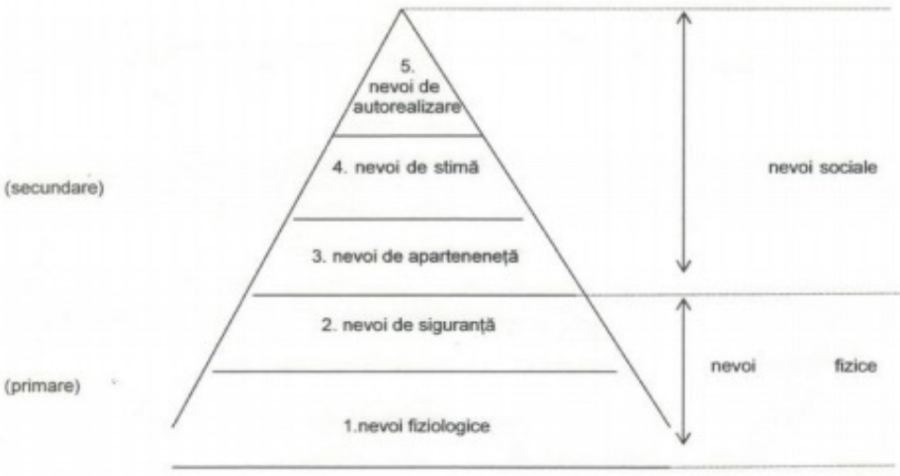

- Categoriile 1 şi 2 formează grupa nevoilor primare în timp ce categoriile 3,4,5 formează grupa nevoilor sociale, a nevoilor superioare.
- Potrivit lui Maslow, doar după satisfacerea nevoilor primare, se poate trece la satisfacerea celor superioare.
- Managerii trebuie să ofere garanţia că necesităţile primare vor fi satisfăcute o perioadă mai îndelungată. Momentul de atingere al unui grad înalt de satisfacere şi al unei perioade de o durată convenabilă este greu de stabilit. El este final diferit chiar de la un individ la altul.
- Momentul în care un manager apreciază că anumite nevoi au fost satisfăcute este foarte important, deoarece după acest moment el trebuie să aplice modalităţi de satisfacere ale unor nevoi superioare.
- În esenţă, o nevoie satisfăcută nu mai reprezintă un factor de motivaţie. Maslow consideră că singura excepţie o constituie nevoile de autorealizare. El afirmă că acestea sunt nevoi de dezvoltare şi devin din ce în ce mai puternice pe măsură ce sunt satisfăcute. Persoanele ce se află la baza piramidei nevoilor a lui Maslow sunt sensibili la motivarea extrinsecă. Pe măsură ce persoanele urcă treptele piramidei, aceştia devin sensibili la motivarea intrinsecă. Pentru aceştia managerii trebuie să stabilească sarcini de muncă care să îi automotiveze.

2) **Teoria ERG a lui Alderfer** - existenţă (existence), relaţii (Relatedness) şi dezvoltare (Growth)
- Cele cinci categorii de nevoi stabilite de Maslow sunt regrupate de Alderfer în trei:
    - **nevoi existenţiale**: securitatea muncii, condiţiile de muncă, plata adecvată a salariilor şi beneficiilor etc. Acestea corespund primelor două categorii de nevoi din piramida lui Maslow şi trebuie satisfăcute înainte ca individul să ajungă la nevoile superioare;
    - **nevoi relaţionale**: implică relații de prietenie cu familia, colegii, şefii, subordonaţii şi alţii; corespund categoriilor 3 şi 4 din piramida lui Maslow; satisfacerea lor depinde în mod esenţial de raportul cu ceilalţi;
    - **nevoi de dezvoltare**: împlinire – sunt nevoile ce fac ca eforturile să devină creative, stimulative pentru sine; corespund ultimei categorii de nevoi din piramida lui Maslow; satisfacerea acestor nevoi este expresia modului de realizare al capacităţilor şi talentelor personale şi presupune implicare puternică la locul de muncă
- Teoria ERG/ERD susţine următoarele:
    - cu cât mai mult sunt satisfăcute nevoile de nivel inferior, cu atât mai mult este dorită satisfacerea necesităţilor de rang superior;
    - cu cât mai puţin sunt satisfăcute nevoile de nivel superior, cu atât mai mult este dorită satisfacerea necesităţilor de inferioare;
    - Alderfer consideră că toate cele trei categorii de nevoi pot fi operaţionale in acelaşi timp şi că o necesitate aparent satisfăcută poate acţiona ca factor motivator, substituindu-se altei nevoi nesatisfăcute. Motivaţiile extrinseci satisfac în special necesităţile existenţiale şi relaţionale, în timp ce motivaţiile intrinseci satisfac în special nevoi de dezvoltare.

3) **Teoria necesităţilor lui McClelland** - nevoile reflectă caracteristicile pe care o persoană le dobândeşte prin experienţa de viaţă într-un anumit mediu social, iar angajaţii vor fi motivaţi dacă posturile pe care le ocupă se potrivesc nevoilor lor.
Interesul lui McClelland s-a manifestat în studiul consecinţelor comportamentale specifice ale necesităţilor. Grupele de nevoi studiate de către acesta sunt: nevoile de realizare, nevoile de afiliere, nevoile de putere.
    - **Nevoile de realizare** - Angajații care au o mai mare nevoie de realizare, au o dorinţă puternică de a executa bine sarcini provocatoare. Aceştia se pot caracteriza prin următoarele: preferința pentru situaţiile care le permit asumarea de responsabilităţi pentru rezultatele obţinute; stabilirea obiectivelor de dificultate medie care corespunde unor riscuri medii; interesul pentru obţinerea continuă de date şi informaţii cu privire la rezultatele obţinute. Angajații cu mari nevoi de realizare sunt interesați de depășirea propriilor recorduri, precum şi ale celorlalți angajaţi, sunt inovatori şi se implică în obiective pe termen lung. Toate aceste acţiuni le oferă motivaţia intrinsecă.
    - **Nevoile de afiliere** - Angajații care au o mai mare nevoie de afiliere îşi doresc să stabilească şi să mențină relații personale amicale cu ceilalți angajați. Aceștia au abilităţi în comunicare şi evită cu constanţă conflictele şi competiţia.
    - **Nevoile de putere** - Angajații care au o mai mare nevoie de putere îşi doresc să-i poată influenţa cât mai mult pe cei din jurul lor. Aceştia sunt foarte preocupaţi de prestigiul personal, iar când se află în grupuri mici de persoane se comportă astfel încât să fie in centrul atenţiei.

McClelland afirmă că nu există o corespondenţă perfectă între structura de nevoi a unei persoane şi comportamentul său. Nevoile sunt numai unul dintre determinanţii comportamentului, care mai este influenţat şi de valori personale, obiceiuri, abilităţi la fel ca şi de particularităţile mediului ambiant.

**Teoriile procesuale ale motivaţiei muncii** se concentrează pe cum apare motivaţia.
1) **Teoria aşteptărilor**
    - Conform teoriei aşteptărilor motivaţia este determinată de rezultatele pe care angajaţii le aşteaptă să apară în urma muncii depuse, ca efect al acțiunilor lor la locul de muncă.
    - Oamenii aleg mai degrabă în mod raţional comportamente pe care le estimează ca fiind cele mai potrivite pentru a atinge obiectivele lor, în funcţie de efortul depus, utilitate şi valoarea percepută a comportamentului.
    - Modelul propus de Vroom considera forța motivațională ca fiind o rezultană complexă care apare din combinarea a trei factori: AȘTEPTARE, INSTRUMENTALITATE, VALENȚĂ
        1) **Aşteptarea** - se referă la evaluarea de către angajaţi a şansei de a atinge performanţe prin munca depusă, se bazează pe relația efort – performanță.
        2) **Instrumentalitatea** – reprezintă probabilitatea ca un rezultat de ordiunul întâi (de ex. productivitatea) să conducă la un rezultat de ordinul doi (de ex. salariu mai mare). Dacă probabilitatea este mare, iar valența atribuită rezultatului de ordinul doi este ridicată. Prin urmare, instrumentalitatea reprezintă relația dintre performanță și rezultat. Această relaţie indică că angajaţii aşteaptă ca performanţele înalte să ducă la recompensele dorite.
        3) **Valenţa** - este valoarea rezultatelor (pozitivă/negativă) atribuită de angajat diferitelor rezultate așteptate de la munca sa. Acestea pot fi: **externe** (salariu, promovare, pensii) şi **interne** (valoarea dată de asumarea responsabilităţii).
    - Lipsa unui element (oricare dintre cele trei) va determina lipsa motivaţiei. Cu alte cuvinte, pentru a fi motivat să desfăşoare o anumită activitate, omul trebuie să valorizezere recompensa asociată, să creadă că poate îndeplini respectiva activitate şi să dispună de indiciile potrivit cărora performanţa sa în activitate va fi răsplătită.

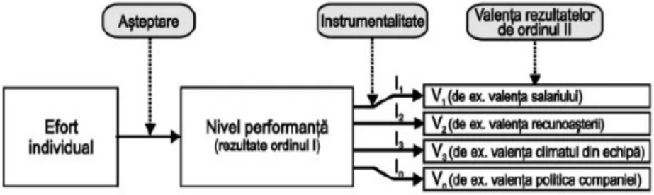

2) **Teoria echităţii** – elaborată de Stancey Adams - susţine că angajaţii compară eforturile depuse la locul de muncă şi recompensele pe care le obţin cu eforturile şi recompensele unor alţi angajaţi.
    - Atunci când cei ce au făcut comparaţia identifică un raport corect între aceste mărimi, se poate afirma că aceştia sunt satisfăcuţi.
    - Când lucrurile nu stau aşa, când ei percep că la eforturi egale depuse, recompensele sunt diferite, va apărea cu siguranţă un sentiment de insatisfacţie. Desigur, acest lucru se întâmplă atunci când se presupune că alţi angajaţi obţin recompense mai mari, la acelaşi volum de efort depus.
    - Teoria echităţii este o teorie motivaţională, deoarece angajaţii sunt motivaţi să menţină o relaţie de schimb echitabilă.
    - Teoria susţine că atunci când angajaţii percep o relaţie de schimb inechitabilă, pentru a reduce tensiunea care generează această inechitate, pot alege între 6 direcţii de acţiune - tactici de restabilire ale echităţii, angajatul fiind motivat să întreprindă un anumit comportament (Gordon, 1987; Saal, Knight, 1988):
        - modifică efortul depus (de exemplu: depun mai puţin/mult efort, realizează mai puţine/multe produse, absenteism/ore suplimentare);
        - modifică recompensele obţinute (pretenţii de schimbare la nivelul salariului, a condiţiilor de muncă, statut, recunoaştere) fără a modifica efortul depus;
        - distorsiune cognitivă asupra efortului şi recompenselor. Persoana îşi distorsionează percepția asupra propriilor eforturi şi recompense - "Credeam că lucrez în ritm normal, dar realizez că muncesc mai mult decât toţi.";
        - părăsește relația de schimb (de exemplu: absenteism, transfer, demisie).
        - acționează asupra altora, prin utilizarea a mai multor modalități: persoana poate încerca să producă schimbări de comportament altor persoane (de exemplu: celelalte persoane să-şi micșoreze efortul sau să ceară recompense mai mari); distorsionează percepția asupra eforturilor şi recompenselor altora (persoanei/grupului cu care se compară) - "Postul lui X nu este așa interesant pe cât credeam înainte"; poate forța ca celelalte persoane să părăsească relația.
        - alege o altă persoană/grup pentru comparație (de exemplu: "Poate că nu câștig așa mult ca X, dar mă descurc mai bine decât se descurca Z atunci când era de vârsta mea").

Teoria echității atrage atenția managerilor asupra faptului că pot fi evitate problemele apărute din inechitate, prin încercarea de a distribui recompensele în funcție de performanță, dar și prin încercarea de a determina pe fiecare să înțeleagă clar care este baza salariului pe care îl primește.

### Relația motivație şi performanţă (sursa: Micle, M.I., 2009)
- Motivația muncii implică un set de procese care determină perseverența unei persoane de a aloca resurse personale într-o serie de posibile acțiuni cu impact asupra realizărilor organizaționale (Kanfer şi colab., 2008), precum şi intenția angajaților de a-şi îndrepta eforturile spre realizarea obiectivelor organizaționale şi satisfacerea nevoilor individuale.
- Motivarea angajaților la locul de muncă poate fi evaluată prin investigarea atitudinilor sau a comportamentului şi prin evaluarea performanței acestora.
- Performanța în muncă reprezintă calitatea şi cantitatea contribuției unei persoane sau a unui grup ce desfășoară o anumită activitate profesională.
- Performanța reprezintă, astfel, o consecință a motivației: cu cât persoana este mai motivată, cu atât performanța va fi mai bună. Relația dintre motivație și performanță nu trebuie privită însă unilateral, performanța influențând motivația.
- Zlate (2007) a identificat 3 categorii de factori care influențează performanța:
    1) **factori organizaționali** (condiții de muncă, munca în sine);
    2) **factori de grup** (coeziunea, moralul grupului, relațiile de muncă cu șefii şi colegii);
    3) **factori personali** (rasă, sex, naționalitate, experiență, școlarizare, personalitate).

### Evaluarea performanțelor profesionale (sursa: Micle, M.I., 2009)
- Un rol important îl au criteriile de măsurare utilizate.
- Cele mai frecvent utilizate criterii de măsurare ale performanței sunt:
    - Calitatea muncii prestate, cantitatea de muncă depusă, înțelegerea cerințelor postului, prezența/motivarea/atașamentul, inițiativa, cooperarea, gradul de încredere şi nevoia de supraveghere.
- Performanța în muncă poate fi surprinsă prin trei măsurători ce conțin:
    - **Date obiective ale producției**. Utilizarea acestor date, ca indicator al performanței în muncă a salariatului, este limitată în frecvență şi valoarea sa. Alegerea sistemului de evaluare organizațională trebuie să țină seama de diferențele dintre activități, deoarece în cazul anumitor posturi de muncă datele obiective ale producției sunt măsurători parțial relevante ale succesului.
    - **Datele de la serviciul personal**. Aceste date conțin informații ce privesc absenteismul şi fluctuația personalului, dar şi o serie de înregistrări utile cum ar fi accidentele, reclamațiile şi întârzierile.
    - **Date ale evaluatorilor**. Validitatea acestor date se referă la măsura în care datele observate de evaluatori sunt măsurători precise ale variabilei "adevărate", adică aceea care trebuie măsurată.
    - **Autoevaluări**. Prin această tehnică fiecare salariat îşi apreciază propriile performanțe, de regulă pe o scală de evaluare. Studiile au arătat că există o tendință de supraapreciere a propriilor rezultate.
    - **Evaluările colegilor**. Prin această metodă membrii unui grup evaluează performanțele colegilor. Fidelitatea acestei metode este influențată de gradul de acord între clasificatori.

Informațiile care se obțin în urma evaluării performanțelor pot fi ierarhizate după scopuri, în ordinea importanței pentru organizație:

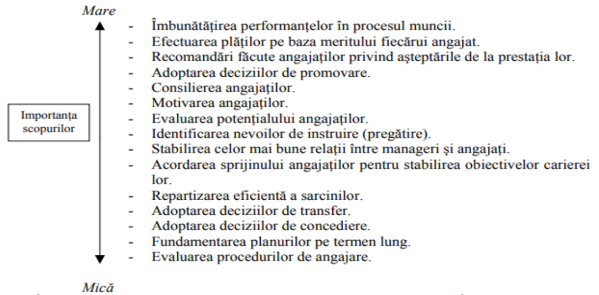

#### Metode de evaluare ale performanței profesionale
1. **Evaluarea cu surse multiple (feedback 360°)** – recomandată în medii de lucru colaborative
    - Reprezintă un proces circular, în centrul acțiunii găsindu-se persoana evaluată care primește feedback-ul superiorilor, colegilor, beneficiarilor, iar în final se autoevaluează
    - Feedback-ul primit de cel evaluat, de la manager, colegi, clienți, persoane cu care se află în raporturi directe favorizează analiza şi autoanaliza competenței în anumite domenii de activitate.
    - În urma analizei datelor, echipa de evaluatori, intrând în posesia rezultatelor evaluării îşi formează o imagine de ansamblu asupra performanțelor angajaților. Rezultatele pot fi folosite la luarea unor decizii de: îmbunătățire ale strategiilor de comunicare; ale condițiilor de mediu; de proiectare ale unui plan de dezvoltare al carierei; ale necesității reactualizării sau îmbogățirii cunoștințelor profesionale etc.
    - Metoda 360° oferă o percepție pozitivă asupra corectitudinii sistemului de evaluare, deoarece diminuează riscul de favoritism și oferă o imagine mai completă și mai echilibrată. De asemenea, contribuie la creșterea satisfacției în muncă ca urmare a participării angajaților la procesul de evaluare al performanței (Giles, şi Mossholder, 1990) ce poate influența variabile precum productivitatea, motivația şi implicarea în organizație (Pearce, şi Porter, 1986).
    - Limitări: poate fi influențată de relațiile interpersonale sau de teama de represalii → se poate manifesta teama de a oferi feedback sincer.

2. **Evaluarea pe bază de obiective (Managementul prin obiective – MBO)** – recomandată în medii orientate spre rezultate (vânzări, servicii etc.)
    - Dezvoltată de Peter Drucker, pornește de la ideea că performanța angajatului trebuie analizată în funcție de rezultatele măsurabile pe care le obține. La începutul perioadei de evaluare, se stabilesc obiective SMART (specifice, măsurabile, realizabile, relevante, încadrate în timp) într-o discuție între superior și subordonat. Pe parcursul perioadei de evaluare, are loc o monitorizare a progreselor, iar la final se compară rezultatele reale cu cele planificate.
    - Este o metodă de evaluare care oferă claritate și direcție angajatului. Totodată, stimulează implicarea și responsabilitatea personală și leagă performanța individuală de obiectivele strategice ale organizației.
    - Limitări: poate ignora aspecte calitative precum spiritul de echipă sau creativitatea iar, în unele cazuri, poate genera stres dacă obiectivele sunt prea ambițioase ori nerealiste.

3. **Evaluarea pe bază de competențe** – recomandată în medii care investesc în dezvoltarea competențelor (IT, educație, etc.)
    - Reprezintă o metodă care nu se limitează la rezultate, ci analizează capacitățile profesionale și comportamentele care duc la obținerea performanței.
    - Evaluatorii folosesc grile de competențe (ex: leadership, comunicare, gândire analitică, adaptabilitate, inițiativă, rezolvare de probleme, colaborare în echipă, etc.) și acordă scoruri fiecărei competențe în funcție de observațiile făcute pe parcursul activității sau prin instrumente (chestionare, observație directă).
    - Permite identificarea nevoilor de formare profesională și se concentrează pe dezvoltarea pe termen lung, nu doar pe performanțele imediate.
    - Limitări: evaluarea poate fi subiectivă dacă nu există criterii clar definite ori dacă evaluatorul nu este instruit corespunzător.

4. **Evaluarea pe bază de bază de indicatori de performanță (KPI)** – recomandată în medii orientate spre rezultate concrete (IT, producție, vânzări etc.)
    - Evaluarea se bazează pe stabilirea unor indicatori de performanță clar definiți, măsurabili numeric (ex: productivitate, calitate, costuri, termene de livrare), iar rezultatele sunt comparate periodic cu țintele stabilite.
    - Acest tip de evaluare poate oferi claritate și obiectivitate ridicată, deoarece permite măsurarea precisă a performanței.
    - Limitări: poate încuraja competiția excesivă și poate ignora aspecte precum creativitatea sau colaborarea.
5. **Autoevaluarea** - recomandată în medii orientate către dialog și dezvoltare individuală
    - Angajatul își analizează propriile performanțe, stabilindu-și punctele forte, dificultățile întâmpinate și direcțiile de îmbunătățire. Poate fi folosită ca etapă pregătitoare înainte de interviul de evaluare oficial.
    - Reprezintă o metodă care stimulează responsabilitatea și autocunoașterea și care contribuie la un dialog constructiv între angajat și evaluator.
    - Limitări: poate interveni subiectivismul, în unele cazuri angajații își supraestimează sau subestimează performanțele.
6. **Interviul de evaluare**
    - Reprezintă o discuție individuală între angajat și evaluator (de regulă superiorul direct). Metoda are ca scop analiza performanței, discutarea problemelor întâlnite, clarificarea așteptărilor și stabilirea obiectivelor viitoare. Interviul poate fi structurat (bazat pe fișe de evaluare) sau nestructurat (informal).
    - Reprezintă o metodă de evaluare care permite feedback constructiv, direct și clar ce poate ajuta la consolidarea relației dintre manager și angajat.
    - Limitări: dacă feedback-ul este oferit greșit, poate demotiva ori, în unele situații, feedback-ul poate fi influențat de subiectivitatea evaluatorului. Se recomandă utilizarea acestuia combinate cu o altă metodă de evaluare.

### Evaluarea performanțelor profesionale (sursa: Novac, C., 2014)
Surse de erori în procesul de evaluare:
- **Folosirea de standarde variabile** de la un salariat la altul. În procesul de evaluare trebuie să se evite folosirea unor standarde diferite pentru persoane cu funcții similare, iar evaluatorul trebuie să aibă suficiente argumente pentru a-şi aproba corectitudinea evaluării.
- **Influența timpului**. Informațiile obținute în procesul evaluării sunt dependente de timp. În acest sens, trebuie să se realizeze un echilibru în ceea ce privește ponderea cu care sunt considerate evenimentele recente şi cele mai vechi. Este recomandat să se ţină seama de faptul că atunci când se apropie perioada acordării calificativelor, salariații devin mai conștiincioși.
- **Subiectivismul evaluatorului**. Acest tip de erori se datorează sistemului de valori şi de prejudecăți ale celui care evaluează. Vârsta, sexul, etnia, vechimea, religia, aspectul, relația sau alte elemente arbitrare pot fi cauze ale unor evaluări deformate. Se recomandă controlul evaluatorilor de către superiori pentru a elimina această deficiență.
- **Efectul de halou (eroare de atribuire)**. Este utilizat pentru a descrie efectul global al personalității plăcute sau a oricărei alte trăsături dezirabile, în crearea erorilor de raționament. De exemplu, evaluatorul tinde să aprecieze performanța unui angajat care lucrează cu entuziasm prin prisma acestei trăsături singulare. Angajatul respectiv poate nu produce rezultate, însă superiorul trece cu vederea toate celelalte amănunte legate de activitatea angajatului. Specificarea cât mai corectă a criteriilor de evaluare și respectarea lor poate diminua efectul de halou.
- **Eroarea de contrast**. Această eroare poate apărea atunci când se compară persoanele între ele şi nu se ţine cont de standardele de performanță. Rezultatele evaluării persoanelor din mai multe grupuri nu sunt comparabile. Persoanele cele mai slab cotate într-un grup bun pot fi mai performante decât cele mai bune dintr-un grup slab.

**Aici ar trebui sa fie studiul ala de caz, dar nu stiu cat de mult avem nevoie de el**

# Curs 8 - Brandul de carieră. Brandul personal, e-reputația

## Imaginea de sine, cunoaşterea de sine, stima de sine, percepţia socială (Ilieș, V., 2017)
Brandul personal este influențat de imaginea de sine, cunoașterea de sine, stima de sine și percepţia socială.

### 1. Imaginea de sine
- Imaginea de sine sau modul "cum ne vedem", se referă la modul în care ne percepem propriile noastre caracteristici fizice, emoționale, cognitive, sociale și spirituale.
- Imaginea de sine depinde de gradul de autostimă (autoapreciere, autorespect, autoacceptare) pe care îl avem. Astfel, dacă ne acceptăm pe noi înșine, dacă ne apreciem pentru ceea ce facem bine - aceasta contribuie la autorespectul și încrederea în sine - dacă acceptăm că avem și slăbiciuni fără sa ne criticăm în permanență pentru ele - aceasta constituie baza toleranței față de sine și, implicit, față de alții - putem trăi confortabil, echilibrat emoțional.
- Este bine să existe mereu un echilibru între autoapreciere și autocritică, niciuna din cele două extreme nefiind eficientă.
- Imaginea de sine poate îmbrăca trei forme:
    - **Sinele pretins**: cine pretinzi că ești? Sinele pretins reprezintă imaginea pe care o arăți lumii. De multe ori, această imagine se bazează mai puțin pe cine ești tu în realitate şi mai mult pe mascarea celui care ţi-e frică că eşti.
    - **Imaginea negativă de sine** (cine ţi-e teamă că ești): trăsăturile negative pe care individul le are; se materializează în temeri cu privire la felul în care ești perceput. Psihologia spune că cele mai multe percepții sunt, de fapt, proiecții: cel mai mult urâm la ceilalți trăsăturile pe care ne temem că le-am putea poseda noi înșine.
    - **Sinele autentic**: cine ești tu în realitate. Vorbește despre individul care se cunoaște cel mai bine pe sine; este reprezentat de ceea ce știe individul că este în realitate şi se formează prin găsirea echilibrului dintre eul fizic, eul social şi eul spiritual.

Formarea imaginii de sine parcurge trei etape:
1. **Construirea eului**, a imaginii subiective despre propria persoană, cu ceea ce considerăm că ne este caracteristic. Are loc aprecierea proprie asupra imaginii de sine (ne place / nu ne place ceea ce credem despre noi înșine că suntem).
2. **CELĂLALT** - conștientizarea judecăților făcute de celălalt asupra propriei persoane. -> pot sau nu să coincidă cu imaginea construită de noi înșine. Aceste judecăți pot influența imaginea de sine în mod pozitiv sau negativ
3. **Raportarea imaginii proprii la judecata celuilalt** -> poate determina sentimente pozitive sau negative, de mulțumire sau nemulțumire. -> este influențată de grupurile în care trăim: grupuri primare (familie, colegi, prieteni) sau secundare (elevii din același liceu, studenții din aceeași facultate, angajații aceleași firme).

Cele două tipuri de grupuri influențează diferit formarea imaginii de sine. Acestea contribuie la socializarea individului. Socializarea este responsabilă pentru construcția imaginii de sine, fiind procesul prin care individul devine ființă socială.

Socializarea are la bază două tipuri de evaluări: **reflectată** şi **comparativă**.
1) **Evaluarea reflectată**:
    - **directă** (când individul cere altora să-şi spună părerile despre el)
    - **indirectă** (când individul interpretează spusele, reacțiile celorlalți cu privire la propria persoană).
2) **Evaluarea comparativă** - se realizează prin comparația propriilor reușite şi atitudini cu cele ale altora. În urma acestui proces, rezultă că imaginea de sine contribuie la evaluarea realității și îmbracă două forme:
    - **Imagine de sine bună**, pozitivă: "pot să fac acest lucru sau măcar pot încerca",
    - **Imagine de sine negativă**: "nu pot să fac acest lucru, este prea greu, nu voi fi în stare".

### 2. Stima de sine (Ilieș, V., 2017)
- Stima de sine reprezintă încrederea pe care o persoană şi-o formează în legătură cu propriile calități şi resurse
- Conceptul de sine se studiază însă nu doar prin prisma cogniției, ci şi a afectivității – componenta stimei de sine (self–esteem).
- Cuvântul stimă provine din latinescul ”aestimare”, având sensul de apreciere. Astfel, conceptul stimei de sine se referă la aprecierile pozitive sau negative pe care le fac oamenii despre ei înșiși.
- Are două componente importante:
    - **Eficacitatea personală/încredere în sine**: încrederea în propriile capacități de a face ceea ce-ţi propui în viață
    - **Respectul de sine/iubirea de sine**: simțirea meritului de a avea fericire, împlinire şi iubire față de propria persoană Morris Rosenberg (1979) spune că stima de sine este o sinteză cognitivă şi afectivă complexă, considerând că stima de sine dictează atitudinea mai mult sau mai puţin bună a individului faţă de propria persoană.
- Baumeister (1998) spune că stima de sine este sinonimă cu: mândrie, egoism, aroganță, narcisism, un fel de superioritate.
- Branden Nathaniel, psiholog umanist, susține că stima de sine este "capacitatea de a înfrunta dificultățile fundamentale ale vieții, fără a pierde speranța".
- La baza formării stimei de sine stau patru componente principale:
    - sentimentul de siguranță
    - cunoașterea de sine
    - sentimentul de apartenență (la o familie, la un grup, la o categorie socio-profesională etc.)
    - sentimentul de competenţă

Literatura de specialitate a definit cinci subdimensiuni ale stimei de sine, care contribuie la valorificarea sau nevalorificarea acesteia.
- **Sinele emoțional** – felul în care individul percepe gradul de control pe care îl are asupra emoțiilor sale şi asupra impulsivității. Este imaginea pe care o are persoana cu privire la gradul său de stăpânire de sine, ce va influența viața şi deciziile individului.
- **Sinele social** – felul în care individul interacționează cu ceilalți.
- **Sinele profesional** – se referă la comportamentele şi performanța la locul de muncă ale individului.
- **Sinele fizic** – imaginea pe care individul o are despre propriul corp, percepția pe care şi-o face cu privire la părerea celor din jur față de aspectul fizic al individului
- **Sinele anticipativ** – așteptările şi viziunile asupra viitorului pe care individul și le face, precum şi atitudinea pe care acesta o are asupra viitorului.

### 3. Cunoașterea de sine
- Reprezintă identificarea, conștientizarea şi materializarea, într-o manieră echilibrată, a tuturor caracteristicilor EU-lui.
- Se realizează prin introspecţie personală, dar şi prin raportarea la ceilalți şi la percepția socială a fiecăruia.
- Fereastra lui Johari - Johari atrage atenția asupra existenței în spațiul personal a patru zone diferite, în continuă schimbare, în care stocăm informația despre noi (“**sine**”) şi despre cei din jur (“**alții**”) și care, prin interacțiune cu ceilalți, putem să descoperim lucruri despre sinele nostru.
- Fiecare dintre noi are o zonă supusă controlului conștient și o zonă de umbră la care avem acces cu ajutorul semenilor noștri, dacă reușim să comunicăm eficient.(Dinu M., 2000)
- Fiecare individ posedă tot atâtea ferestre câte legături comunicaționale are cu alți oameni.
- Poate fi folosită pentru a îmbunătăți relațiile unui grup cu un alt grup, dar și în comunicarea diadică. În anumite contexte, acest termen poate fi folosit drept un furnizor de feedback, dar și o bună unealtă informațională.

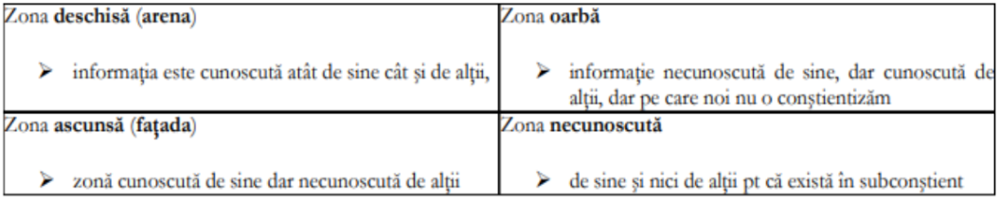

### 4. Percepția socială (Ilieș, V., 2017)
- Individul se formează prin apartenența la un grup social, prin compararea cu alții, imaginea sa despre sine fiind influențată de situațiile sociale pe care le trăiește.
- Percepția socială reprezintă ceea ce gândesc ceilalți despre noi, despre modul în care arătăm, cum ne purtăm, despre cine suntem şi cum suntem.
- Percepția socială se materializează prin evaluarea personală (estetică, globală şi a capacităților), este dominată de imaginea de sine şi de stima de sine concretizată în eficacitatea personală/încredere în sine şi respectul de sine/iubirea de sine.
- Percepția socială trebuie analizată din două perspective:
    - **a celuilalt despre mine**
    - **a eului/a mea despre părerea celuilalt**
- Percepția socială este dominată de imaginea de sine, dar și de nevoia individului de a avea validare socială.
Validarea socială reprezintă tendința oamenilor, de a cataloga ca fiind corect, ceea ce alții consideră a fi așa. Neîncrederea, lipsa siguranței în ceea ce privește capacitatea noastră decizională, constituie principalul motiv pentru care, de multe ori, acceptăm să urmăm calea altora. Multe dintre acțiunile oamenilor provin din nevoia de recunoaștere, de confirmare a valorii pe care o au, dar de care de cele mai multe ori, nu sunt conștienți.

## Conceptul de branding (sursa: Ilieș, V., 2017)
**Personal branding** – puncte istorice de referință:
- **1937**: Napoleon Hill introduce pentru prima dată conceptul în cartea motivațională Think and Grow Rich. Cartea oferea o filozofie de viață ce putea ajuta individul să aibă succes atât în viața personală, cât şi în cea profesională.
- **1981**: reabordarea ideii de personal branding: În cartea "Positioning: The Battle for Your Mind", de Al Ries şi Jack Trout, în capitolul intitulat "Positioning Yourself and Your Career" - "You can benefit by using positioning strategy to advance your own career."
- **1997**: Tom Peter, popularizarea ideii în “The brand called you”: fiecare dintre noi are un brand personal sau "un semn distinctiv", o propunere unică de prezentare care dacă nu este clar conturată, exprimată şi susţinută va crea confuzie în jurul acelei persoane.
- **2001**: dezvoltarea fenomenului de personal branding în USA prin intermediul lui William Arruda, considerat "guru" personal branding-ului.
- **2002**: prima metodă concretă de creare a unui brand personal, expusă de Peter Montoya în cărţile "The Brand called you" şi "The personal branding phenomenon"
- **Prezent** - dezvoltarea internetului și a rețelor sociale a condus la valorizarea conceptului de marketing al carierei. Asistăm la dezvoltarea instrumentelor de Marketing al carierei în care putem include și branding-ul personal sau cel de carieră.

### Conceptul de brand
- American marketing association (AMA): Brand = "un nume, semn, simbol, sau design, sau o combinaţie a acestora, care intenționează să ajute la identificarea bunurilor şi serviciilor unui vânzător sau grup de vânzători şi să-i diferențieze de concurență" (Ilieș, V., 2017)
- Etimologic, cuvântul brand provine de pe tărâmul Scandinaviei (brandr) unde avea semnificația de a arde. Reprezenta modalitatea prin care crescătorii de animale îşi marcau animalele (cu fir înroşit) pentru a putea face diferențierea lor de cele ale altor crescători.
- Brand-ul reprezintă acel ceva care a creat un grad ridicat de cunoaștere asupra sa, a creat reputație şi s-a diferențiat de bunuri/persoane similare.
- Jeff Bezos: “Your brand is what other people say about you when you are not in the room.”
- Rolul brandului este de a comunica, de a asigura valoare, garanta performanță, a construi încredere, a crea relații și vizibilitate.
- Un brand de carieră este alcătuit din percepția compentențelor și a capacităților persoanei în mintea celorlalți cu care interacționează (colegi, angajatori, clienți). Poate fi asociat cu reputația profesională sau imaginea profesională.

### Brand de carieră (sursa: Huștiu Bibire, A., 2017)
- Brandul de carieră caută să creeze un punct de diferențiere față de ceilalți pentru a putea fi asociat cu niște atribute.
- Cum funcționează brandul de carieră?
    - Brandul de carieră devine vocea interioară care va spune “persoana este potrivită pentru a fi angajată”.
    - De fapt, ”vocea” reprezintă un întreg proces de selecție, asemănător cu procesul de cumpărare al unui produs.

Astfel:
- mai întâi, este selectat un grup de aplicanți care să aibă caracteristicile/competențele necesare activității respective.
- apoi, din cei selectați ca fiind buni, cel care va face cea mai puternică impresie va fi ales.
- Scopul unui brand de carieră constă în creșterea carierei, un brand puternic fiind bazat pe un portofoliu puternic de competențe și împuternicit de o imagine personală bună.
- Dacă competențele sunt bune, dar nu foarte promovate, brandul va fi generic și nu va ajuta la creșterea carierei.
- Daca imaginea personală este foarte promovată, dar nu are rădăcini puternice (compentențe), acest brand va fi “umflat”, instabil și va dispărea rapid.

**Relația imagine personală – imagine profesională în construcția brandului de carieră**:
- Stratul fundamental este reprezentat de trăsăturile de personalitate și atribute personale care au rădăcină în valorile personale, credințele învățate și stilurile de învățare, cât și în identificarea culturală: acesta este **CORE SELF**(1) sau inima sinelui Tu, cel calificat. Aceste caracteristici esențiale susțin și ajută la dezvoltarea abilităților de a fi creativ, de a învăța rapid, de a lucra sub presiune. Acestea spun cine este persoana.
- Acestea trebuie ”împachetate” și prezentate ca parte a imaginii profesionale dorite în procesul creșterii profesionale, un individ dezvoltându-și sinele aducând un strat de competențe și abilități comercializabile. Astfel, se dezvoltă **SKILLED SELF** (2). Acestea transmit motivul pentru care ar fi angajată acea persoană.
- Procesul de ”împachetare” și prezentare necesită și utilizarea de artefacte: diplomele, certificările, dovezile/un obiect fizic, un document, o imagine, un testimonial/review, un portofoliu, etc. Toate acestea sunt dovezi și contribuie la construirea sinelui extins, **EXTENDED SELF**(3). Acestea conferă siguranță în angajarea respectivei persoane. În prezent, identitatea digitală aduce cu sine și artefacte digitale, cum ar fi cv electronice, Instagram/FB profiles și LinkedIn profiles, e-portofoliu, bloguri, etc.

### Conceptul de branding personal
- Brandul personal comunică în mod eficient valoarea distinctă a individului și îl deosebește de concurenții săi (Morton, 2012)
- Brandul personal reprezintă ”o formă de prezentare de sine concentrată în mod special pe atragerea atenției și dobândirea valorii sociale și monetare” (Hearn 2008).
- Brandul personal reprezintă sinteza tuturor așteptărilor, imaginii și percepțiilor care se creează în mintea celorlalți atunci când vă văd sau vă aud numele. (Rampersad, 2008).
- Brandul personal întruchipează o serie de elemente intangibile care includ **identitate** (elemente care fac o persoană recunoscută), **imagine** (percepția unei persoane de către ceilalți) și **reputație** - opinia propagată la nivel social și agregată unei persoane. (Williams, 2014).
- Montoya (2002) – una dintre regulile cheie ale personal branding-ului este aceea că acesta ar trebui să fie simplu,clar şi consistent. Montoya propune "Legea specializării" care vorbește despre nevoia indivizilor de a se focusa pe o singură abilitate şi a se realiza în viaţă în baza aceleia.
- În rezumat, brandul personal reprezintă o imagine clară, puternică şi convingătoare.
- Brandul personal nu vorbește despre cantitate (nu trebuie să te cunoască toată lumea), ci despre calitatea mesajelor pe care le transmiți despre tine. Mesajul trebuie să se axeze asupra acelor persoane care trebuie să te cunoască.
- Brandul personal nu reprezintă doar autopromovare, ci valoarea pe care o aduci celorlalți prin ceea ce faci. Se poate aplica regula lui Pareto: ”80% este despre ei, 20% despre tine”. Astfel, 80% din ceea ce spui pe Social Media trebuie să fie relevant pentru ceilalți (gânduri, idei noi, informații noi, soluții, analize etc., relevante pentru
ceilalți).

Scopul brandului personal:
- de a te face cunoscut și vizibil
- dorit de angajatori
- plăcut în grupul în care activezi
- de a crește stima de sine și de a ajuta la dezvoltarea profesională
- de a avea acces la oportunitățile pe care le cauți.

În organizație, scopul brandului personal este de a crește vizibilitatea în cadrul companiei prin evidențierea rezultatelor și performanțelor personale la nivel de departament, dar și în întreaga organizație. Dintre instrumentele care pot fi folosite:
- implicarea în proiecte transversale oferă șansa de a cunoaște activitatea altor colegi și oferă, în același timp, o imagine de ansamblu a felului în care interacționează funcțiuni diferite din aceeași organizație.
- realizarea de materiale/ articole în rețeaua intranet a organizației.
- implicarea în echipele de organizare ale evenimentelor destinate angajaților (seminarii de dezvoltare personală, petreceri, ieșiri cu colegii, evenimente sportive, redecorarea spațiului de lucru, etc).
- participarea în acțiuni de voluntariatul – ajută la a deveni cunoscuți în întreaga organizație. Se pot organiza campanii de donare de sânge sau de susținere a unor cauze caritabile (mai ales in preajma Crăciunului, a Paștelui sau a zilei de 1 Iunie).

Prin acțiunile pe care le întreprinde putem indica celorlalți că deținem: inițiativă, abilități de comunicare, relaționare, leadership, organizare și spirit de echipă.

#### Instrumente de construire a brandului personal (sursa: Figurska, I, 2016)
Pași pentru crearea brandului personal:
1. **Pregătirea** - se bazează pe autoanaliză – poate include răspunsuri la:
    - **Talente** – ce faci bine în mod natural?
    - **Pasiuni** – ce-ți palce să faci?
    - **Valori** – ce e important pentru tine?
    - **Motivații** – de ce faci ce faci?
    - **Public(uri) țintă** – cu cine vrei să lucrezi?
    - **Rezultate / realizări** – constructori de statut și expertiză
2. **Crearea brand-ului** - definirea a ceea ce face persoana unică, dezvoltarea de povești personale care separă o persoană de ceilalți, crearea unui discurs tip ”elevator pitch”, construirea de conținut pentru redarea propriei povești și evidențierea personalității proprii. Această etapă include:
    - **Diferențiere/crearea unicității** – cum poți și cu ce îți propui să fii diferit de ceilalți care fac ce faci și tu
    - **Poziționare** – care e zona pe care îți alegi să construiești
    - **Focusare / Nișare** – care este esența brandului tău
    - **Alegerea mixului de comunicare personală** – unde (te) comunici
3. **Canale de distribuție a mesajelor** - utilizarea unei combinații de instrumente tradiționale și online. CV-ul și biografia profesională sunt exemple de instrumente tradiționale care ar trebui să comunice cu precizie experiența, educația, realizările și afilierile profesionale ale persoanei. Mai important, fiecare ar trebui să reflecte brandul personal și să indice valoare pentru publicul său (Horton, 2011). De asemenea, pe internet, o persoană își poate modela imaginea și își poate direcționa propria identitate.
4. **Monitorizarea brandului** - controlul asupra propriului nume, folosirea instrumentelor care ajută persoana să-și monitorizeze brandul, gestionând elementele negative care pot apărea.

#### Planul de marketing al brandului personal (sursa: Huștiu Bibire, A., 2017)
În 1992, McCorkle, Alexander and Dinker au dezvoltat un concept de Self Marketing Plan pentru studenți. Acest plan includea:
1) **Strategii de poziționare** - reprezintă un proces de cercetare în piața unde persoana dorește să activeze, prin raportare la competitorii săi. Ideal ar fi să se înceapă prin realizarea unei analize SWOT (puncte forte, puncte slabe, amenințări, oportunități) și un portofoliu.
2) **Strategii de distribuire** – se referă la folosirea canalelor directe de distribuire. Cele tradiționale sunt cele față în față, iar cele digitale sunt cele din Social Media: Facebook, LinkedIn, Instagram, dar și blog-ul sau website-ul. O altă strategie este folosirea E-portfolio-ului (portofoliul online). Scopul acestor strategii este de a crește rețeaua de cunoștințe, dar și pentru a ajuta persoana în a-i informa pe ceilalți ce competențe și ce abilități are. În urma acestei strategii, pot apărea mentorii (de obicei sunt cei care dau sfaturi), sponsorii (cei care îți vor oferi contacte sau bani) sau oportunitățile de internship.
3) **Strategiile de contact reprezintă** identificarea oportunităților prin care se pot cunoaște oameni care pot ajuta în carieră (să te angajezi, să afli mai mult despre un domeniu etc.). Strategia poate include acțiuni pe Linkedin, participare la târgurile de joburi, activități sociale, evenimente sau voluntariat.
4) **PR Strategies sau Networking-ul** sunt acele strategii care pot fi folosite pentru a maximiza relațiile, după ce a fost realizată o strategie de contact. De obicei, se concretizează prin a face parte din asociații sau prin postarea pe Youtube de filmulețe sau a podcast-urilor.
5) **Strategiile de Advertising** sunt cele care ajută la a afla cum poți folosi abordări specifice, poți introduce link-uri în CV ale unui site, blog, etc., îți poți crea un portofoliu sau un e-portofoliu. Important e să cauți forme de a promova munca/rezultatele cât mai bine.

# Curs 9 - Promovarea brandului personal pe piața muncii
Promovarea brandului personal pe piața muncii se poate realiza prin:
- CV
- scrisoare de motivație/intenție
- prezentare la interviul de angajare.

## CV–ul (sursa: ghid realizat pentru POSDRU/161/2.1/G/137510)
- Reprezintă cel mai cunoscut instrument de marketing personal.
- Conține aspectele esențiale ale candidatului în relație directă cu postul pentru care candidează.
- CV-ul trebuie să fie scurt, clar și concis și să evidențieze punctele comune cu jobul dorit.
- Se vor evidenția informațiile invers cronologic și se va pune accent pe rezultate, competențe obținute în urma cursurilor ori experienței avute.
- Dacă experiența profesională este limitată, se poate începe cu studiile unde pot fi subliniate aspectele legate de reușita în această direcție (medii, burse, premii, cursuri relevante pentru post etc.) după care se prezintă experiența profesională.
- Se evidențiază punctele forte plecând de la nevoile firmei.
- Nu va conține experiențe de formare/în muncă irelevante pentru post, decât dacă experiența este limitată.
- CV-ul trebuie să fie exact, inteligent conceput şi să arate impecabil, astfel încât să îi demonstreze celui care angajează că este persoana potrivită pentru locul de muncă respectiv.
- CV–ul ar trebui să se încadreze în 2-3 pg. A4. Acesta se clasifică în:
    - **CV-ul cronologic** - reprezintă într-un mod secvențial cele mai recente activități și continuă cu cele mai îndepărtate în timp.
    - **CV-ul funcțional** - se bazează mai mult pe competențele candidatului (abilități cheie - hard și soft skills – abilități adiționale, educație) și mai puțin pe experiența profesională.
    - **CV-ul combinat** - permite să se reliefeze atât experiența profesională, cât și pe abilitățile dobândite, începe prin enumerarea abilităților și competențelor și continuă cu redarea cronologică a locurilor de munca ocupate.

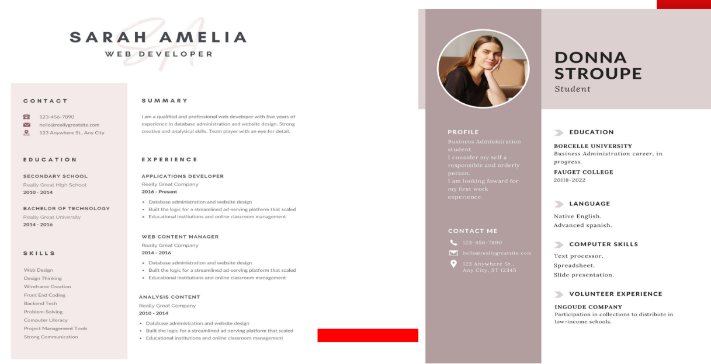

### Video CV
- Completează cv-ul scris, oferind informații suplimentare despre personalitatea, atitudinea, valorile proprii și motivația asupra jobului.
- Se construiește în jurul întrebării ”de ce ar trebui să vă angajeze o anumită companie?”
- Obiectivul principal este de a vă exprima beneficiile pe care le veți oferi companiei, precum și obiectivele, abilitățile și realizările proprii.
- Trebuie incluse elementele vizuale pentru a ilustra ceea ce spuneți la nivel de conținut, legat de talentele și abilitățile deținute.
- Durata unui cv video este de 45 și 90 secunde.

## Scrisoarea de intenție (sursa: ghid realizat pentru POSDRU/161/2.1/G/137510)
- Scrisoarea de intenție reprezintă modalitatea prin care angajatorul îşi formează prima impresie despre potențialul candidat, este o primă luare de contact.
- Un astfel de document are scopul de a convinge potențialul angajator de ce persoana respectivă este cea mai potrivită pentru postul pentru care candidează.
- Scrisoarea de intenție/motivație trebuie să fie cât mai personalizată și adaptată în funcție de compania/instituția şi postul pentru care dorește să candideze.
- Nu există un conținut standard de aceea este nevoie de abilități creative și de comunicare scrisă pentru a pune în valoare brandul personal prin exprimarea interesului de a candida pentru respectivul post. În acest context, scrisoarea de motivație este adresată unei persoane din departamentul HR (în cazul în care se cunoaște numele și funcția acesteia), iar dacă firma este mică directorului general sau președintelui acesteia.
- Realizarea unei scrisori de intenție necesită timp de pregătire ce constă în identificarea de informații care să susțină argumentele potrivirii cu postul respectiv.

Pregătirea unei scrisori de intenție:

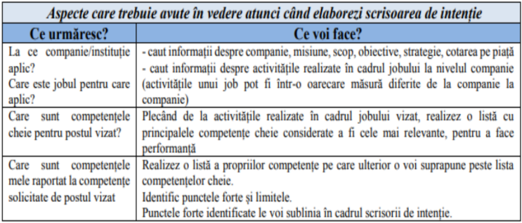{style="display:block; margin:0 auto;}

În conținutul scrisorii:
- Accentul trebuie să fie pe angajator – conținutul unei scrisori trebuie să evidențieze valoarea potențialului angajat, ce poate face pentru companie (nu ceea ce ar putea face compania pentru acesta); demonstrează cunoașterea priorităților și nevoilor acesteia, într-o formă succintă, ușor de înțeles.
- Dacă nu există informații exacte despre un anumit post (nu a fost anunțată o acțiune de selecție de personal), se va exprima opțiunea pentru un domeniu de activitate. Se recomandă evidențierea domeniului în care persoana s-a făcut remarcată până în prezent sau a avut performanțe deosebite.
- Folosirea cuvintelor cheie, pe care angajatorul le-a utilizat în anunțul de angajare, este utilă pentru a indica cunoașterea postului și potrivirea cu acesta.
- Se va evita folosirea de abrevieri, prescurtări, rezumarea CV-ului ori contrazicerea informațiilor prezentate în cadrul acestuia.
- Se poate atașa scrisorii de intenție şi o scrisoare de recomandare dacă aceasta există. Aceasta poate fi obținută în urma stagiilor de practică, acțiunilor de voluntariat sau locurilor de muncă avute. De asemenea, în anumite domenii, se poate atașa un portofoliu reprezentativ pentru activitatea sa.

## Elevator pitch (”discursul din lift”)
- Reprezintă un discurs de 30-60 secunde, o descrie concisă, persuasivă și memorabilă necesară pentru a capta atenția și a determina dorința interlocutorului de a dori să afle mai multe, într-o prezentare mai detaliată.
- Își are originea în munca agenților de vânzări care, în lupta pentru atragerea clienților, erau nevoiți să-și poată prezenta produsul sau compania în lift, în timp ce-și întâlneau clienții.
- Un elevator pitch nu trebuie să spună toată povestea, ci trebuie să includă aspecte esențiale despre persoană sau afacere și ce dorește să obțină/unde dorește să ajungă.
- Structura pregătirii unui elevator pitch:
    1. **Stabilirea obiectivului** – ce vreau să spun? În jurul obiectivului, vor fi incluse în prezentare doar părțile care sunt relevante pentru situația respectivă. De exemplu: "Dacă ai nevoie de un job, evidențiază aspectele personale care se potrivesc cu jobul și ce ar câștiga compania dacă te-ar alege (folosește exemple din trecut pentru a susține rezultatele)."
    2. **Documentarea despre interlocutor** – ajută la identificarea de informații relevante despre persoana/ele în fața căreia/rora se va susține prezentarea (utilizarea unui vocabular comun, nivel de cunoaștere, interese, realizări etc).
    3. **Crearea conținutului** – cu ce vreau să încep şi unde vreau să ajung. Se va aborda din perspectiva adaptării la obiectiv, oferind trimiteri asupra a ceea ce știe să facă persoana, evitând o descriere doar despre cine este persoana respectivă.
    4. **Aruncarea ”momelii” și așteptarea/ Apel la acțiune** – aruncarea câtorva semințe poate stârni interesul, iar dacă oamenii vor fi interesați, vor căuta să afle mai multe. Reacțiile interlocutorului/lor pot oferi indicii dacă sunt interesați, iar în cazul acesta se creează contextul, dincolo de conținutul elevator pitch-ului, pentru împărtășirea a mai multe informații.

Pentru a exersa structura unui elvator pitch, se poate utiliza și crearea unui conținut în baza următoarelor întrebări:
- **Ce?** Reprezintă obiectivul urmărit în urma prezentării.
- **Pentru cine?** Se referă identificarea interlocutorului (informații relevante) pentru a atrage interesul.
- **Despre ce?** Se vor evidenția beneficiile, nevoile satisfăcute, soluția oferită.
- **De ce?** Se referă la context, originea soluției oferite etc.
- **Cum?** Conține trimiteri la avantaje competitive, schița modului în care funcționează soluția etc.
- **Apel la acțiune!** Conține o întrebare sau o afirmație menită să implice interlocutorul, să determine o acțiune.

**Elevator pitch-ul pentru obținerea unui job de ”Consultant recrutare”**: Sunt un recrutor bine conectat în domeniu, cu o experiență de peste zece ani în recrutarea rolurilor de vânzări, marketing, resurse umane și comunicații pentru cele mai mari companii din Australia. Am recrutat cu succes peste 200 de roluri în cariera mea până în prezent, sunt specialist în achiziționarea talentelor și am abilitățile necesare să abordez cele mai dificile misiuni folosind instrumente moderne, precum: interviuri video, campanii de recrutare de marcă și cartografiere a pieței. În prezent, sunt în căutarea unui nou rol care să-mi ofere utilizarea cât mai bună a abilităților și a experienței pentru a–mi conduce cariera la nivelul următor.

**Elevator pitch pentru afaceri**: Mă numesc Sara și conduc o companie auto. Este o afacere de familie pe care o conducem potrivit credinței că contactul personal are o mare importanță pentru clienții noștri. Nu numai că garantăm livrarea la timp, dar tatăl meu și cu mine răspundem personal la telefoane, fără a utiliza un sistem automat.

## Interviul de angajare (sursa: Ghid proiect SMIS nr. 22857)
- Interviul reprezintă o conversație structurată, orientată către un scop, în care atât intervievatorul, cât şi candidatul schimbă informații.
- Scopul interviului de selecție este de a obține și de a evalua acele informații despre un candidat care pot permite ca să se facă o predicție validă în legătură cu performanța sa profesională viitoare pe post, în comparație cu predicțiile făcute pentru oricare dintre ceilalți candidați. Intervievarea presupune prelucrarea şi evaluarea dovezilor despre capabilitățile unui candidat, în raport cu specificația de personal a postului pentru care candidează.
- Interviurile de selecție încearcă să ofere răspuns pentru:
    - Poate candidatul să se achite de sarcinile postului (este el competent)?
    - Va vrea candidatul să se achite de sarcinile postului (este el bine motivat)?
    - Cum se va integra candidatul în organizație?
- Întrebările din cadrul interviului sunt axate pe conținutul experienței în activitate, realizări înregistrate, motivație şi acumulările rezultate din experiență. Ceea ce va face o persoană în viitor poate fi pronosticat prin prisma a ceea ce a realizat în trecut, dar nu poate fi garantat, de aceea identificarea aspectelor motivaționale este extrem de importantă în această etapă.
- Totodată, majoritatea organizațiilor, indiferent de dimensiuni, folosesc interviul ca metodă de selecție pe care îl văd ca pe un schimb de idei, impresii, puncte de vedere între un posibil manager și un posibil angajat, având în vedere acceptarea sau respingerea reciprocă.

Tipuri de interviuri:
- interviuri structurate;
- interviuri semistructurate;
- interviuri nestructurate;
- interviuri stresante.

### Interviul structurat
În cazul acestui tip de interviu, intervievatorul folosește un set de întrebări standardizate care sunt puse tuturor candidaților ce concurează pentru un anumit post. În general, acest tip de interviu are un grad mai mare de siguranță pentru că se obțin date similare de la toți candidații şi evaluarea lor se poate face cât mai corect. Principalul dezavantaj al acestui tip de interviu este faptul că este restrictiv, de aceea unele informații importante şi relevante nu pot fi discutate.

### Interviul semistructurat:
Într-un interviu semistructurat doar întrebările de bază sunt pregătite dinainte şi sunt notate într-o formă standard. Acest tip de interviu implică o oarecare planificare din partea intervievatorilor, dar permite flexibilitate privind întrebările şi felul în care acestea sunt puse. Deşi gradul de siguranță al informațiilor nu este atât de mare ca şi în cazul interviului structurat, informațiile sunt mai bogate şi mai relevante.

### Interviul nestructurat
Aceste interviuri variază foarte mult de la un intervievator la altul. Intervievatorul va pune întrebări generale pentru a stimula candidatul să discute despre el însuși, apoi va alege o idee din răspunsurile candidatului pentru a formula următoarea întrebare. Interviurile nestructurate au un grad redus de siguranță, iar informațiile sunt rareori considerate drept valide sau utile pentru că, în general, nu se obțin date comparabile pentru toţi candidații. De aceea, interviul nestructurat nu este recomandat ca metodă de selecție.

### Interviul stresant
Acesta este un tip special de interviu considerat util în cazul titularilor posturilor care se vor confrunta cu situații cu un înalt grad de stres. Într-un astfel de interviu, persoana care conduce interviul ia o atitudine agresivă cu scopul de a produce anxietate şi presiune asupra candidatului pentru a vedea cum reacționează. Acest tip de interviu trebuie folosit numai în situații cu totul speciale, deoarece poate genera o imagine foarte proastă asupra organizației, asupra celui care conduce interviul şi poate provoca rezistență din partea candidatului asupra postului oferit.

### Tipuri de abordări în modul de derulare al interviului
1. **Interviul biografic**. Tradiționalul interviu biografic fie începe cu începutul (studiile candidatului) şi merge progresiv până la sfârșit (postul ocupat în prezent sau postul cel mai recent şi cea mai recentă experiență educațională), fie se derulează din direcţia opusă, adică începe cu slujba curentă şi merge înapoi până la primul post deținut şi studiile sau formarea profesională a candidatului. Mulţi intervievatori preferă să “deruleze filmul înapoi” cu candidaţii care au experiență, alocând cea mai mare parte din timp postului curent sau celor recente şi acordând din ce în ce mai puţină atenţie experienţelor din trecutul mai îndepărtat, şi atingând doar în treacăt chestiunea studiilor.
2. **Interviul planificat prin referire la o specificație de personal**. Specificația de personal (sau profilul candidatului ideal), asigură o bază solidă pentru un interviu structurat. Scopul constă în a obţine informaţii la fiecare din principalele capitole ale specificației de personal pentru a vedea în ce masură candidatul corespunde postului.
3. **Interviuri structurate orientate situaţional**. În cadrul interviului orientat situaţional concentrarea se face pe o serie de situaţii sau incidente în care comportamentul poate fi considerat deosebit de relevant ca indiciu al performanţei ulterioare. Se descrie o situaţie reprezentativă, iar candidaţii sunt întrebaţi cum ar proceda ca să-i facă faţă cu succes. Se adresează întrebări de verificare, pentru explorarea mai amănunţită a modului de reacţie, obţinându-se astfel o cunoaştere mai bună a modului în care ar proceda candidatul în rezolvarea unor probleme asemanătoare. Dat fiind că sunt ipotetice şi nu au cum să acopere decât un număr restrâns de domenii, nu se pot utiliza numai ele, ca unic mod de abordare al interviului. Ele ar putea să denote capacitatea candidatului de a înţelege cum trebuie să gestioneze un anumit tip de situaţie, în teorie, dar nu demonstrează capacitatea efectivă a candidatului de a gestiona şi în practică situaţii identice sau asemănătoare.
4. **Interviuri structurate orientate spre competenţe comportamentale**. În cadrul unui interviu orientat spre competenţe comportamentale (denumit uneori şi interviu raportat la criterii), intervievatorul parcurge progresiv o serie de întrebări, fiecare având la bază un anumit criteriu, care ar putea fi o competenţă comportamentală sau o competenţă de resort (cerinţă de competenţă), sub forma unei aptitudini, capabilităţi sau însuşiri personale fundamentale, necesară pentru atingerea unui nivel acceptabil de performanţă pe post. Exemple de întrebări pentru un interviu orientat comportamental:
    - Povestiţi-mi despre o ocazie în care aţi apelat la experienţa din trecut pentru a rezolva o problemă nouă pentru dumneavoastră.
    - Detaliaţi-mi un moment în care aţi făcut să funcţioneze un aparat sau un sistem nou de lucru, atunci când toţi ceilalţi se luptau cu el şi nu ştiau ce să-i facă.
    - Vi s-a întâmplat să descoperiţi un mod complet nou de utilizare pentru un echipament, un instrument sau o unealtă? Daţi-mi amănunte.

Aspectele pe care le probează un interviu sunt: factorii intelectuali, motivaționali, de personalitate, experiență, cunoaștere pe post.
Subiectele tipice incluse în interviu sunt:
- **Experiența profesională a candidatului**. Intervievatorul trebuie să exploreze cunoștințele, deprinderile, abilitățile şi gradul de asumare al responsabilității candidatului;
- **Realizările academice**. Dacă persoana intervievată nu are o experiență profesională semnificativă, abordarea performanțelor academice/școlare este foarte importantă;
- **Aptitudinile de relaționare interpersonală**. Actualmente, munca în echipă este adeseori vitală într-o organizaţie. De aceea, pe lângă deținerea unor abilități profesionale, o persoană trebuie, de cele mai multe ori, să aibă capacitatea de a lucra foarte bine şi cu alţii;
- **Calitățile personale**. Pe durata interviului, intervievatorul trebuie să observe calităţile fizice, abilităţile de comunicare, vocabularul, echilibrul, adaptabilitatea candidatului. Aceste atribute sunt urmărite în măsura în care sunt esenţiale în satisfacerea cerinţelor postului;
- **Adecvarea la cultura organizaţională** se referă la conformitatea dintre valorile candidatului şi cultura organizaţiei. Acest lucru este important întrucât, în cazul unei nepotriviri, organizaţia investeşte suplimentar timp şi bani;
- **Obiectivele candidaţilor**. Trebuie reamintit faptul că şi solicitanţii îşi fixează anumite obiective în vederea susţinerii unui interviu. Obiectivele pot fi: să fie ascultaţi şi înţeleşi, să aibă ocazia să-şi prezinte abilităţile, să fie trataţi corect şi respectuos, să primească informaţii despre post şi organizaţie.

În cadrul interviului, se recomandă adresare de întrebări de către candidat pentru că altfel se poate înțelege că nu ai fi interesat de post sau companie. Întrebări care pot fi adresate echipei de recrutare de către candidat, câteva exemple:
- Îmi puteți descrie o zi obișnuită a unui angajat pe acest post?
- Care sunt responsabilitățile zilnice?
- Care sunt criteriile / standardele de evaluare ale personalului?
- Care sunt valorile companiei?
- Compania asigură training pentru a menține specialiștii la curent cu ultimele modificări?

# Curs 10 - Comunicare și relaționare în organizație
## - Influența leadership-ului din perspectiva caracteristicilor stilului paracticat -
## - Elementele comunicării persuasive -

### Leadership versus management (sursa: Popescu O.-R., 2017)
- Managerii stabilesc programe, creează rețele și acționează asupra acestora cu scopul de a-și îndeplini programele.
- Liderii stabilesc direcția schimbării impuse de mediul extern, prin formularea unor programe asupra a ceea doresc să îndeplinească pentru organizații. (Zlate, 2007)
- Managerii caută să controleze complexitatea și să reducă incertitudinea generată de aceasta.
- Leadership-ul încearcă să aducă schimbări utile în organizație (identifică oportunitățile și comunică viziunea pentru a-i inspira pe alții).
- În general, managerii se orientează spre aspecte neînsuflețite ale activității: bugete, situații financiare, structuri organizaționale, previziuni ale rezultatelor muncii, rapoarte de productivitate etc.
- Liderii sunt orientați mai mult spre oameni și urmăresc să-i stimuleze, încurajeze, motiveze, inspire, dezvolte, evalueze și recompenseze. (Catană, 2007)
- Liderii sunt cei care modelează organizațiile, creând cultura organizațională.
- Managerii au grijă ca procedurile să funcționeze și fac organizația să evalueze lin prin decizii care rezolvă sarcini/probleme. (Bennis, 1984)

### Stiluri de leadership 
- Leadership-ul este influențat de o mare diversitate de factori, precum personalitatea liderului, caracteristicile susținătorilor săi, dar şi de specificitatea contextului în care acesta evoluează.
- Interacțiunea dintre toate aceste elemente a dat naștere, de-a lungul timpului, mai multor clasificări ale leadership-ului.
- Potrivit unui studiu publicat în Leadership Quarterly
(https://www.ncbi.nlm.nih.gov/pmc/articles/PMC3583370/), în 2013, se afirmă că există o secvență ADN în corpul uman care, dacă este prezentă, ”trădează” predispoziția către ”șefie”. Gena cu denumirea Rs4950, care se moștenește din tată în fiu, este gena oamenilor care își asumă responsabilități, care nu se simt confortabil în postura de subalterni și care iau decizii rapide și sigure. Studiul a fost realizat pe baza analizării mostrelor de ADN de la aprox. 4.000 de persoane pe care le-au chestionat cu privire la cariera profesională pe care acestea o au în desfășurare.
- Un lider nu se va supune unui singur mod de a conduce. Aproape întotdeauna este o combinație de stiluri, influențate nu doar de trăsăturile personale, de personalitatea individului și de propriile preferințe sau opinii, dar și de nevoile oamenilor aflați în subordine, de evoluția evenimentelor, scopul urmărit și situația concretă din respectivul moment.

#### Leadership caristmatic (sursa: Năstase, 2006)
- Leadership-ul carismatic se întâlnește la persoanele considerate carismatice, care au un talent nativ deosebit în a-i influența într-o manieră profundă pe cei din jur.
- Dacă calitățile native sunt șlefuite prin educație, prin diferite experiențe, liderul poate deveni o personalitate marcantă a comunității în care îşi desfășoară activitatea.
- Stilul de conducere carismatic este o formă de conducere pozitivă.
- lmplică un consum mare de timp și energie, nu duce mereu la rezultate eficiente și nu este alegerea cea mai bună pentru organizațiile care activează sub presiune ridicată sau care sunt orientate strict spre obținerea unui obiectiv.
- Potrivit lui Năstase (2006) un lider carismatic prezintă o serie de calități evidențiate în trei categorii:
    1) **capacitatea de a crea o viziune** ce este de natură să evidențieze un viitor dorit, strălucitor pentru susținătorii săi. Această capacitate are în vedere următoarele elemente:
        - articularea unei viziuni convingătoare;
        - stabilirea unor așteptări înalte;
        - modelarea unor comportamente competitive.
    2) **capacitatea de a energiza**, în special printr-o implicare personală ridicată. Liderul carismatic conduce prin propriul său exemplu, el nu cere altora să facă ceea ce el însuși nu face. Capacitatea de energizare cuprinde următoarele aspecte:
        - evidențierea propriului angajament;
        - exprimarea încrederii personale;
        - obținerea şi utilizarea succesului.
    3) **capacitatea de a dezvolta şi utiliza potențialul susținătorilor săi** în concretizarea viziunii organizaționale pe care a transmis-o acestora. Obținerea implicării raționale şi afective a susținătorilor săi este un proces important pentru oficializarea şi amplificarea puterii unui lider. În acest sens, se au în vedere următoarele:
        - exprimarea sprijinului personal;
        - manifestarea empatică;
        - exprimarea încrederii în oameni.

#### Leadership tranzacţional (sursa: Năstase, 2006)
- Se bazează în mare parte pe capacitatea liderului de a negocia pentru a obţine implicarea personalului şi a-l atrage de partea sa. El promite o serie de recompense în schimbul adoptării anumitor decizii şi comportamente.
- Pentru a direcționa energia susținătorilor săi, el trebuie să-şi dezvolte în permanență abilitățile de negociator şi să fie empatic cu ei, astfel încât să reușească să înțeleagă pe deplin factorii ce-i motivează pe aceștia.
- Succesul liderului tranzacțional îl reprezintă accesibilitatea sa la resursele organizației, care se poate dovedi un factor critic pentru acesta.
- Dacă liderul promite anumite recompense în schimbul anumitor decizii, comportamente, performanțe ce-i sunt satisfăcute, dar el nu reușește să ofere într-un timp rezonabil recompensele promise, se poate ajunge la pierderea credibilității acestuia în fața susținătorilor.
- Recâștigarea credibilității este un proces dificil și se poate ajunge la o amplificare a influenţei unui rival, a unui nou lider, ce va dori să-şi extindă şi să-şi oficializeze puterea.  

#### Leadership autocratic (autoritar)
- Stil centrat pe lider, deciziile fiind luate doar de acesta, echipa doar execută ordinele sale (ce, cum și când trebuie să facă).
- Păstrează relația cu subordonații la nivel strict profesional.
- Stilul este caracterizat printr-o supraveghere strictă, fluxuri informaționale direcționate preponderent de sus în jos, fără interes asupra feedback-ului.
- Pot apărea sentimente de frică şi frustrare (frica acționând ca o modalitate de control), se pot rata oportunități noi, comunicarea este defectuoasă sau se poate ajunge la paralizie organizațională atunci când liderul va lipsi, sau va pleca.
- Poate genera o formă birocratică de funcționare, valorizează foarte puternic sistemul și inteligența sistemică a procedurilor și politicilor bine stabilite
- Poate fi și benefic atunci când sunt situații urgente când trebuie luate decizii rapid, iar consultarea cu ceilalți angajați nu ar face decât să pericliteze situația companiei. De asemenea, în situații în care membrii echipei sunt neexperimentați și/sau necalificați.

#### Leadership democratic (participativ) (sursa: Roman, D., 2020)
- Include echipa în procesul de luare al deciziilor, deciziile sunt adoptate colectiv și democratic (contează ce cred ceilalți și fiecare persoană contează), schimbarea este negociată (iese din zona de confort).
- Conducerea democratică încurajează creativitatea, discuțiile libere, schimbul de idei şi soluții.
- Rolul liderului democratic este să ghideze, să ofere suport, să susțină generarea de idei şi să conchidă asupra soluției finale.
- Se creează un climat pozitiv de lucru, oamenii se simt valorizați, se pot crea echipe de înaltă performanță, care sunt încurajate să rezolve probleme şi să găsească soluții de rezolvare.
- Calități ale liderului – abordabil, bun comunicator, grijuliu, minte deschisă, oferă putere (empowering).
- Dezavantajele acestui stil de conducere constau în luarea lentă a deciziilor, mai ales într-o situație de criză când este nevoie de toată echipa, deoarece liderul depinde de deciziile echipei şi se poate pierde timp prin consultarea tuturor membrilor din echipă sau pot să apară conflicte pentru neconcordanță asupra unor decizii.

#### Leadership transformaţional (sursa: Năstase, 2006)
- Leadership-ul transformațional îi inspiră pe alții să creeze schimbări pozitive în viața lor, în organizațiile lor și în comunitățile lor.
- Leadership-ul transformațional caracterizează liderii ce reușesc să perceapă nevoia de schimbare, să proiecteze şi să conducă în mod eficace schimbări organizaționale majore.
- Este axat pe schimbarea sistemelor și proceselor care nu funcționează.
- Au nevoie de un set de abilități, de o serie de calități care să-i ofere unei persoane capacitatea de a lucra într-un mediu turbulent, de a fi deschisă provocărilor venite atât din mediul intern, cât şi din mediul extern.
- Liderii transformaționali reușesc asemenea liderilor carismatici să creeze o viziune atractivă, să-i inspire în deciziile şi comportamentele lor pe cei cu care vin în contact.
- Se concentrează pe “transformarea” celorlalți pentru a se ajuta între ei, pentru a se susține reciproc, să creeze un grup în care domină încurajările, armonia relațională și susținerea organizației ca întreg.
- Liderul dezvoltă motivații, moralul și performanța grupului pe care îl coordonează.
- Articularea unei viziuni inspiraționale și aprecierea pentru individualitatea și contribuția fiecărui angajat sunt tot dimensiuni ale leadership-ului transformațional.
- Motivarea persoanelor nu se realizează prin oferirea anumitor beneficii materiale, ci prin simplul fapt că au adus o contribuție la îndeplinirea unui obiectiv al organizației.
- Bass (1985) abordarea integrată a leadership-ului transformațional și a celui tranzacțional prezice pozitiv o varietate mai mare de implicații asupra performanței.
- Potrivit Forbes (2019) este nevoie de o serie de soft skills pentru cei care aplică un astfel de stil. Dintre acestea se remarcă:
    - **Capacitatea de a încuraja participarea echipei/ participarea activă în misiunea organizației**; arată transparență și păstrează canale deschise de comunicare;
    - **Carisma** – necesară pentru a aduna membrii echipei în jurul unei viziuni comune privind un viitor mai bun. Un lider carismatic va ști să asculte, să își laude echipa atunci când a obținut rezultate bune, dar și să își asume responsabilitatea pentru lucrurile care nu decurg conform planului. Acesta nu se va feri să ofere echipei sale o critică constructivă dacă situația o necesită.
    - **Self-management** - trebuie să arate dedicare scopului organizației și să își îndeplinească la timp fiecare sarcină astfel încât să fie un exemplu pentru echipa lor.

#### Leadership adaptiv (sursa: Indeed Editorial Team, 2019)
- Leadership-ul adaptiv reprezintă un cadru practic care ajută indivizii și organizațiile să se adapteze și să prospere în medii provocatoare.
- Nu este de ajuns ca un lider sa vadă o problemă sau să observe o provocare, ci trebuie sa aibă o mentalitate de experimentator: să riște încercând lucruri noi, să vadă ce se întâmplă și apoi să facă schimbările necesare.
- Contextul adaptiv este definit ca "o situație care necesită un răspuns în afara setului de instrumente sau repertoriului tău actual; constă într-un decalaj între aspirații și capacitatea operațională care nu poate fi acoperit de expertiza și procedurile existente în prezent." (R. Heifetz, 2009). Prin urmare, "o provocare adaptivă este una pentru care nu există încă cunoștințele necesare pentru a rezolva problema. Este nevoie de crearea cunoștințelor și a instrumentelor pentru a rezolva problema în acțiunea de a lucra la ea."
- Autorii Ronald Heifetz, Alexander Grashow și Marty Linsky (2009) au inclus trei activități cheie pentru procesul de leadership adaptiv: "**observarea evenimentelor și tiparelor**, **interpretarea informațiilor reieșite din observare** și **proiectarea intervențiilor bazate pe observațiile pentru a aborda provocarea adaptivă pe care a identificat-o**".
- Leadership-ul adaptiv atrage creativitatea întregii organizații pentru a aborda provocările.
- Un lider adaptiv ajutată oamenii să navigheze într-o perioadă de perturbări, în care ei au de cernut lucrurile pentru a le putea alege pe cele esențiale de cele ce pot fi abandonate și să încerce diferite soluții la provocările adaptive cu care se confruntă.
- Un astfel de lider trebuie să dea dovadă de flexibilitate și curaj.
    - Flexibilitatea înseamnă capacitatea de adaptabilitate, de depășire a rutinelor sau a normelor prestabilite, care sunt considerate ca fiind ”sacre” în lumea afacerilor.
    - curajul înseamnă parcurgerea celor trei etape caracteristice acestui proces (*observarea evenimentelor și tiparelor din jur; interpretarea lucrurilor observate prin formularea mai multor ipoteze; stabilirea unor modalități de intervenție*).
- **Orientat către obiective**: leagă schimbarea sistematică de obiectivele organizaționale pe termen lung și acționează cu un rezultat specific în minte.
- **Deschis la minte**: creează un mediu progresiv în care să lucreze, iar greșelile sunt acceptate ca parte a procesului.
- **Apreciază provocările**: liderii înțeleg și apreciază provocările, înțeleg că ajungerea la o soluție pe termen lung poate necesita mai multe încercări. Își pregătesc membrii echipei pentru rezolvarea problemelor.
- **Angajament**: știu că schimbarea necesită timp și sunt gata să aloce timpul necesar pentru a crea o organizație mai bună.
- **Proactiv**: adoptă o abordare proactivă identificând provocările și investind orice resurse sunt necesare din timp pentru a le rezolva.
- **Îmbrățișează necunoscutul**: ei știu că a nu avea un răspuns imediat la o problemă face parte din procesul de schimbare pozitivă.
- **Experimentează**: înțeleg că abordarea unor probleme vagi și complexe necesită încercări și erori.
- **Conștienți emoțional**: sunt la fel de preocupați de relații pe cât sunt de profituri. Această înțelegere îi ajută să se asigure că membrii organizației și alte părți interesate susțin orice schimbare pe termen lung.

#### Leadership adaptiv versus transformațional
- **Concentrare**: leadership-ul adaptiv se concentrează pe navigarea schimbărilor și adaptarea la nevoile în schimbare ale unei situații, în timp ce leadership-ul transformațional se concentrează pe inspirarea și motivarea indivizilor pentru a obține o viziune comună.
- **Abordare**: liderii adaptivi adoptă o abordare de rezolvare a problemelor, concentrându-se pe găsirea de soluții la provocările actuale. Liderii transformaționali, pe de altă parte, adoptă o abordare mai vizionară, concentrându-se pe viitor și încurajând indivizii să vadă imaginea de ansamblu.
- **Managementul schimbării**: liderii adaptivi sunt calificați în gestionarea schimbării, deoarece sunt capabili să răspundă rapid și eficient la circumstanțe în schimbare. Liderii transformaționali se concentrează pe crearea schimbării prin inspirarea și motivarea indivizilor să lucreze spre un obiectiv comun.
- **Dezvoltarea leadership-ului**: leadership-ul adaptiv se concentrează pe dezvoltarea abilităților de conducere ale indivizilor pentru a gestiona mai bine schimbarea, în timp ce leadership-ul transformațional se concentrează pe dezvoltarea potențialului indivizilor de a deveni ei înșiși lideri.
- **Impact**: Leadership-ul adaptiv are un impact mai imediat, deoarece abordează provocările și nevoile imediate. Leadership-ul transformațional are un impact pe termen lung, deoarece îi inspiră pe indivizi să își atingă întregul potențial și să contribuie la o viziune comună.

#### Leadership delegativ/ tip ”laissez–faire” (sursa: Năstase, 2006)
- Este specific liderilor care preferă să creeze un cadru general de referință, să construiască o viziune şi să stabilească obiective, după care să lase susținătorilor săi deplină libertate asupra modalităților de realizare a acestora.
- În cazul acesta, liderul se implică doar la partea de concepție, la partea macro şi nu intervine la nivel micro, în zona operațională.
- Nu oferă prea multe instrucțiuni sau îndrumări. Se aplică în echipe cu membri înalt calificați.
- Permit angajaților să-și folosească creativitatea, resursele și experiența pentru a-i ajuta să-și atingă obiectivele.
- Susținătorii liderului îşi stabilesc propria strategie, îşi definesc şi împart rolurile, adoptă decizii şi acționează, fără ca în aceste alegeri să intervină liderul lor (poate fi întâlnit în domeniile creative, cum ar fi agențiile de publicitate sau startup-urile).
- În multe cazuri, membrii echipei vor avea un nivel de calificare mai ridicat decât liderul sau chiar vor fi calificați într-un domeniu în care liderul nu este complet familiarizat.
- Liderul oferă îndrumări și își asumă responsabilitatea acolo unde este nevoie, dar acest stil de conducere înseamnă că subordonații și membrii echipei au adevăratul lider.

#### Leadership exemple:
- Jeff Bezos, Elon Musk: transformațional și autocratic
- Warren Buffet și Richard Branson: laissez-faire
- Bill Gates, Steve Jobs: tranzacțional și autocratic
- Donald Trump: autocratic și tranzacțional
- Brarack Obama – transformațional și carismatic
- Kiichiro Toyoda, fost CEO al Toyota - democratic

### Comunicarea persuasivă a liderilor
Pentru a fi urmați, liderii apelează la strategii de comunicare bazate pe tehnici persuasive. Persuasiunea reprezintă "o activitate de influențare a atitudinilor și comportamentelor unor persoane, în vederea producerii acelor schimbări care sunt concordante cu scopurile sau interesele agentului inițiator (persoană, grup, instituție, organizație) și se realizează în condițiile în care se ține cont de caracteristicile de receptivitate și reactivitate ale persoanelor influențate" (sursa: Țarnă, E, 2018).

Strategiile utilizate în persuasiune se bazează pe construirea de argumente ce pot include:
1. **Elemente din triunghiul retoric** (Aristotel)
    - **Apelul la emoții (Pathos)** - mesajul poate include elemente emoționale (ex. povestiri, exemple personale) pentru a stabili o legătură cu publicul. Emoțiile precum speranța, frica, entuziasmul sau compasiunea pot amplifica impactul mesajului.
    - **Argumentare logică (Logos)** - se bazează pe fapte, statistici, date concrete și exemple care susțin ideea principală.
    - **Credibilitate (Ethos)** - expeditorul mesajului trebuie să fie perceput ca fiind competent, onest și de încredere. Reputația, autoritatea sau experiența expeditorului consolidează mesajul persuasiv.
2. **Folosirea celor 6 legi ale persuasiunii** (Cialdini): reciprocitate, conformitate/ dovada socială, autoritate, raritate, consistență, simpatie.
3. **Relevanță și specificitate** - se concentrează pe un subiect important pentru public, se folosesc de exemple concrete și relevante pentru a susține ideile.
4. **Claritate și structurare logică** - mesajul trebuie să fie ușor de înțeles și bine structurat. De ex., poate include o introducere puternică, un corp clar definit cu argumente susținute de dovezi și o concluzie convingătoare.
5. **Orientarea către public** – mesajul este adaptat la nevoilor, valorilor, emoțiilor și așteptărilor publicului țintă. Mesajul trebuie să folosească un limbaj accesibil și relevant pentru audiență.
6. **Apelul la beneficii** - arată valoarea sau rezolvarea unei probleme specifice.
7. **Repetiția și clarificarea ideilor principale** - ideile principale sunt repetate pentru a fi mai ușor memorate. În plus, punctele cheie sunt explicate din mai multe perspective pentru a se asigura înțelegerea.
8. **Elementele vizuale și stilistice** - se recomandă utilizarea imaginilor, diagramelor, culorilor sau fonturilor atractive poate amplifica impactul mesajului. Stilul mesajului (tonul, umorul, formalitatea) trebuie să fie adecvat contextului.

# Curs 11 - Comunicarea și relaționare în organizație
## - Primirea și oferirea de feedback -

### Feedback-ul ca modalitate de control a informației(sursa: Păuș, V., curs ID)
- Bine folosit, feedback-ul este o formă de comunicare ce poate îmbunătăți mult climatul de lucru şi coeziunea echipei. Din contră, o folosire defectuoasă a acestuia, poate crea disensiuni şi frustrări, ce pot distruge coeziunea echipei.
- Pentru a fi eficace, feedback-ul trebuie să ţină cont de o serie de exigenţe ce afectează ambii poli ai comunicării:
    - **să fie oferit imediat după comportamentul observat**. Amânarea sa face ca efectele constructive să se diminueze, existența distanţei dintre cauză şi efect prea mare anulează raportul care le unește. Dacă este amânat, poate provoca şi proteste din partea receptorului.
    - **persoana căreia îi este adresat feedback-ul să fie în acel moment dispusă să îl primească**. Dacă apar factori precum oboseala, stresul, graba, etc., feedback-ul va fi perceput preponderent în latura sa negativă şi nu va trezi dorinţa unei schimbări de comportament sau de atitudine. De asemenea, dacă se doreşte o reacţie din partea receptorului sub forma unei acţiuni sau schimbări, feedback-ul trebuie să pună accent pe aspectele observabile ale comportamentului/acţiunii şi să permită celui vizat să reflecteze şi să găsească singur sau împreună cu persoana care i-a dat feedback-ul modalităţile de soluţionare a problemei.
    - **trebuie solicitat și validat**. Feedback-ul trebuie să exprime în principal reacțiile emițătorului față de comportamentul persoanei căreia se adresează. Feedback-ul trebuie să fie perceput ca o modalitate de ajutor, oferit în respectul valorilor celuilalt şi fără tendinţe de impunere sau dominare.
    - **să nu se ofere un sfat, feedback-ul nu este un sfat** - întrucât nu reprezintă o reacție care să ajute la reglarea şi echilibrul sistemului. Feedback-ul presupune o descriere a părerii despre acel lucru, a ceea ce simte persoana care oferă feedback în legătură cu acel lucru. Dacă persoana respectivă va cere un sfat sau va întreba cum ar proceda în locul său, doar atunci i se poate spune acest lucru.
    - **trebuie să fie răspuns la un comportament, nu la persoană**. Feedback-ul îi permite celuilalt să primească un răspuns vizavi de acțiunea lui. Feedback-ul este constructiv când face referire numai la acțiunea în sine şi nimic altceva.
- Feedback-ul comunică exact ceea ce ne deranjează, în ce mod ne afectează sau cum s-ar putea îmbunătăți acțiunea celuilalt.

În mod ideal, caracteristicile unui feedback eficient includ următoarele aspecte:
- Feedback-ul trebuie să fie descriptiv, nu evaluativ.
- Feedback-ul trebuie să fie concret, direct, clar și specific.
- Feedback-ul trebuie oferit la momentul potrivit, în momentul în care receptorul este pregătit să-l primească;
- Feedback-ul trebuie să fie util; să fie centrat pe o problemă;
- Feedback-ul trebuie să fie aplicabil și realist;
- Feedback-ul trebuie să fie asumat. Persoana care oferă feedback trebuie să își asume responsabilitatea în ceea ce privește conținutul feedback-ului.

În mod eficient, feedback-ul poate fi construit prin:
- **Observarea** a ceea ce persoana spune și face (am observat că...)
- **Descrierea fără a judeca**, a ceea ce persoana a văzut (am văzut că, A, B, C, ...)
- **Descrierea sentimentelor/gândurilor** legate de comportamentul observat (am simțit...)
- **Descrierea impactului asupra persoanei** (mi-a plăcut, nu mi-a plăcut, m-a demotivat, nu m-a demotivat)

SITUAȚIA: Când cineva vorbește pe un ton ridicat
RĂSPUNS GREŞIT: Ești imatur, nu te interesează ce spun şi ceilalți!
Feedback: Atunci când vorbești pe un ton ridicat, nu reușesc să mai înțeleg nimic!

Forme de feedback:
- **Feedback-ul constructiv** este cel ce încurajează exprimarea opiniilor şi dezvoltă o atmosferă de deschidere, de corectitudine şi de creativitate.
    - Favorizează schimbarea pozitivă, cu un minimum de atitudini defensive, prin crearea unui context pozitiv, descrierea situației și oferirea de sprijin.
    - În practicarea acestui feedback, este bine să se utilizeze în comunicare termeni descriptivi, clari şi preciși şi să se evite etichetele (eşti imatur, gestul tău este iresponsabil, etc.). Se vor evita termeni ca: trebuie, întotdeauna, niciodată, rău, mai rău, etc.
    - Cel ce transmite feedback este bine să vorbească în nume propriu, fără a sugera că exprimă părerea unui grup sau a unor persoane absente sau anonime (ex.: se spune că..., am auzit că..., toată echipa consideră..., etc.). Dacă emițătorul nu îşi asumă responsabilitatea celor afirmate, receptorul va adopta o atitudine defensivă, de neîncredere, el fiind pus în situația de a nu putea să se apere sau să se justifice.
    - Feedback-ul este constructiv atunci când este formulat la persoana I (Cred/am impresia că întârziați la program în fiecare zi). Folosirea persoanei a II-a (Dumneavoastră întârziaţi în fiecare zi la program) provoacă o reacţie defensivă din partea receptorului şi creează un raport de dominare.
    - Feedback-ul constructiv este valoros pentru corectare și progres.
    - Scopul: să ajute persoana să îmbunătățească o anumită acțiune/comportament;
    - Conținutul: se concentrează pe ceea ce trebuie corectat sau îmbunătățit;
    - Structura: clar, specific, cu sugestii de îmbunătățire;
    - Ton: respectuos, dar poate fi mai orientat spre corectarea unei acțiuni sau comportament.
- **Feedback-ul echilibrat** - subliniază aspectele pozitive ale unei idei, opinii sau acțiuni ale celui ce primeşte feedback-ul.
    - Emițătorul trebuie să precizeze în acelaşi timp ce aspecte ar dori să modifice prin acest feedback.
    - Precizând întâi aspectele valabile ale acțiunii, receptorul feedback-ului va fi motivat să-şi ajusteze acţiunea în conformitate cu acţiunile emiţătorului.
    - Feedback-ul va conţine elemente de încurajare şi va arăta că demersul propus a fost atent evaluat şi apreciat în elementele sale pozitive.
    - Într-o astfel de comunicare, partea de exprimare a laturii pozitive a acţiunii trebuie să fie distinctă de partea de sugestii şi rezerve.
    - Cele două părţi nu vor fi legate prin cuvinte de legătură, cum ar fi: dar, totuşi, deşi, din nefericire, cu toate acestea, etc. Ex.: Aţi lucrat bine partea de obiective. Ceea ce ar mai trebui îmbunătățit, este aspectul metodologic. Formularea aceluiași mesaj sub forma "Deşi aţi lucrat bine partea de obiective, ceea ce mă preocupă sunt aspectele metodologice", reduce aprecierea aspectelor valabile la un simplu preambul pentru un feedback negativ, persoana în cauză sesizând în primul rând critica, ceea ce-i va induce o atitudine defensivă.
    - Este valoros pentru menținerea motivației și pentru construirea încrederii, oferind o imagine completă.
    - Scopul: să ofere o perspectivă completă: atât aspectele bune, cât și cele care pot fi îmbunătățite;
    - Conținutul: include atât aprecieri, cât și aspecte ce trebuie îmbunătățite;
    - Structura: echilibrat între pozitiv și negativ, fără a înclina prea mult într-o direcție;
    - Ton: calm, empatic, susținător, păstrează un ton motivant, combinând aprecierile cu sugestiile de îmbunătățire.
- **Feedback ponderat** – este folosit atunci când emiţătorul feedback-ului doreşte ca persoana care primeşte feedback-ul să înţeleagă consecinţele sau impactul pe care acţiunile sau comportamentele sale le au asupra celorlalţi(descrie sentimentele şi reacţiile pe care acţiunile sau comportamentul receptorului le trezeşte emițătorului).
    - Descrierea comportamentului trebuie realizată fără ca emițătorul să folosească judecăți de valoare, etichete sau să atribuie el însuși o motivație acțiunii persoanei respective.
    - În pasul întâi, emițătorul va explica efectele pe care le are comportamentul celeilalte persoane asupra lui, încercând să stabilească o legătură cauză-efect (ex.: Când mă întrerupi, am impresia că ceea ce spun nu este interesant.)
    - Este necesar ca persoana căreia i se adresează mesajul să aibă ocazia de a răspunde imediat pentru a se evita situațiile defensive ce ar putea bloca comunicarea.
    - În pasul al doilea, emițătorul va exprima sugestii de schimbare ale atitudinii sau comportamentului care l-au deranjat, explicând de ce consideră că ar fi o sugestie bună și solicită opinia interlocutorului. Ex.: Mi-ar plăcea să mă lași să termin întâi ce am de spus. Astfel, ideile mele vor fi mai coerente şi tu ai putea înțelege ceea ce vreau să spun și sigur colaborarea noastră ar fi mai bună. Ce părere ai?
    - Acest feedback cuprinde multe elemente de negociere interpersonală prin posibilitatea oferită ambelor părți de a reflecta asupra tuturor aspectelor problemei și de a găsi o cale de rezolvare a tensiunii acumulate de către protagoniști.
    - Ține cont de context și oferă o reacție matură, asumată.
    - Scopul: oferirea unui feedback atent analizat, fără exagerări, ținând cont de context, utilizat (adeseori) în situații tensionate;
    - Conținutul: calm, rațional, echilibrat, fără impulsivitate sau judecăți emoționale;
    - Structura: axat pe obiectivitate și relevanță, adaptat situației, implică interlocutorul în găsirea unei căi de rezolvare;
    - Ton: dozaj atent al observațiilor, se evită exagerarea atât în bine, cât și în rău.
- **Auto-feedback-ul** - atunci când transmitem feedback unei persoane, acest mesaj este auzit simultan de această persoană dar şi de noi înşine; în acest mod, primim feedback de la propriul mesaj, acest feedback interior funcționând eficient în corelație cu mesajele pe care le primim de la ceilalți (DeVito,1988, p.8)
    - Mihai Dinu (1997, p. 83) numește acest tip de retroacțiune caracteristică comunicării interpersonale
    "auto-feedback". Faptul că, atunci când vorbim, ne auzim vorbind, iar când scriem, avem în fața ochilor rândurile redactate anterior creează condiții pentru ajustarea pe parcurs a diverșilor parametri ai comunicării, de la cei vocali (tonul, volumul, înălțimea vocii, ritmul vorbirii, acuratețea pronunțării, etc.) sau vizuali (caligrafie, ortografie), până la aspecte de conținut (claritatea ideilor, logica argumentării, etc).
    - ne ajută să operăm ajustări în propriul discurs pentru a transmite un mesaj cât mai apropiat de așteptările receptorului, atât din punct de vedere al înțelegerii, cât şi al reacției pe care vrem să o inducem.

### Utilizarea comunicării asertive în oferirea de feedback(sursa:Jitaru O.G., 2015)
- Comportamentul asertiv se concretizează în capacitatea şi abilitatea de exprimare a opiniilor personale, în puterea de convingere, dar şi în capacitatea de a-ți face respectate drepturile.
- Aserțiunea permite exprimarea sentimentelor şi a nevoilor personale într-o manieră constructivă, ducând la o mai mare eficiență în muncă şi în relaţiile cu ceilalţi.
- Asertivitatea exprimată prin aserţiunea "Eu" contribuie la menţinerea poziţiei şi a propriului punct de vedere fără a ataca cealaltă persoană (Cornelius H. și Faire S., 1996, 93-104). Aserţiunea "Eu" presupune o clarificare şi este un început al conversației, nu o concluzie.
- Este un deschizător al comunicării ce permite exprimarea sentimentelor în legătură cu un eveniment, fără a blama şi fără a cere celeilalte persoane să se schimbe.
- Asertivitatea se opune agresivităţii, dar şi comportamentului pasiv.
- Asertivitatea nu înseamnă renunţare şi nici lipsă de combativitate. Răspunsul asertiv presupune alegere conştientă, decizie clară, flexibilitate, curaj şi încredere în procesul comunicării.
-  Paralela de mai jos între comportamentele non-asertive realizată de James Fleming (1997/1998) dă posibilitatea evidenţierii celei de-a treia opţiuni. Astfel, asertivitatea nu presupune:
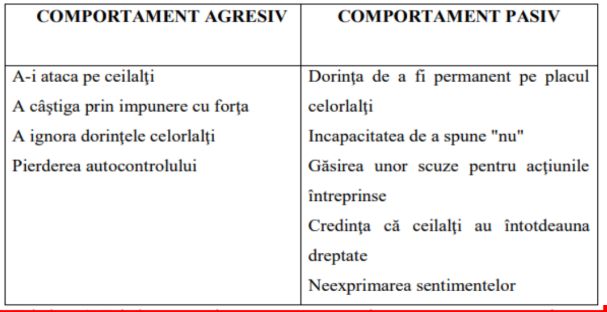
- Opțiunea individului pentru asertivitate se situează în cadrul influenței sociale în zona rezistenței la influență, între independență și sfidare.
- Indivizii se pot conforma sau pot fi independenți unii față de alții, pot fi concilianți cu anumite cereri, solicitări sau pot răspunde asertiv și se pot supune autorității sau se pot opune acesteia într-o
activitate de sfidare.

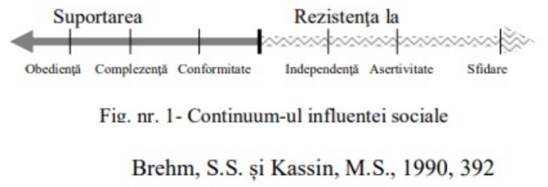

Ca strategie a asertivităţii sociale, se recomandă utilizarea comunicării suportive care are ca scop crearea relației pozitive de comunicare, ca o condiție necesară a eficienței şi eficacității sociale. (Cândea, R.M. și Cândea, D., 1998). Printre instrumentele comunicării suportive se regăsesc:
- "atacarea" problemei, nu a persoanei;
- exprimarea descriptivă şi evaluativă;
- referire la specific, concret şi nu la global, general;
- validarea interlocutorului - recunoașterea importanței lui ca individ, indiferent de opiniile pe care le exprimă sau de sistemul său de valori;
- congruența în comportamentele de comunicare (armonia dintre formele comunicării);
- asigurarea continuității în procesul de comunicare, asumarea răspunderii pentru afirmațiile făcute, pentru părerile, ideile exprimate;
- ascultare suportivă - trebuie să sugereze interesul pentru interlocutor, convingerea că ceea ce simte şi crede este important, că îi sunt respectate sentimentele, emoțiile şi gândurile chiar în cazul dezacordului cu punctul său de vedere.

#### Pașii strategiei de construire ai asertivității (sursa: Center for career development)
1) **Frază de deschidere a conversației** - se stabilește tonul discuției. Exemplu: Aș dori să vorbim despre... / M-am gândit că ar fi în interesul meu și al tău să îți spun ceva despre situația...
2) **Descrierea situației** - conține concizie și claritate asupra descrierii situației, incluzând elemente despre unde și când a avut loc interacțiunea. Exemplu: Atunci când spui că... / Când îmi dai sfaturi și arăți cu degetul spre mine...
3) **Descrierea sentimentelor** - impactului emoțional produs. Exemplu: Mă simt înjosit... /Mă enervează... / Mă descurajează...
4) **Descrierea reacției** - explică reacția comportamentală a emoției, se face referire la consecințele emoției resimțite. Exemplu: ...și de aceea mă face să fiu agitat / ...mă face să nu mă mai implic.
5) **Testează nivelul de preocupare prin propunerea unei soluții ori solicitarea unei păreri referitoare la subiect**. Exemplu: ...așa că m-am gândit să te rog să încetezi .. / .... tu ce crezi că ai putea proceda pentru a...
6) **Implicare** - indică dorința de implicare împreună cu celălalt pentru a putea schimba comportamentul. Exemplu: ...cum aș putea să te ajut să.. /Ai nevoie de sprijinul meu pentru a putea să nu mai faci asta?
7) **Valorizare** - indică dorința de a recunoaște importanța relației și a efortului depus. Exemplu: Mă bucur că am putut discuta pe tema aceasta. / Îți mulțumesc că m-ai ascultat.

Instrumentele propuse de Charly Cungi (1996/1999) pentru a deveni asertiv le include pe cele prezentate anterior, adăugându-se şi alte tehnici ale căror utilizare trebuie învățată și antrenată. Acestea sunt:
- **Tehnica "discului zgâriat"** care se folosește frecvent în afirmarea de sine și constă în repetarea unei acțiuni ori de câte ori este necesar, dar devenind de fiecare dată mai amabili, și mai politicoși. Această tehnică se pliază situațiilor în care este nevoie de repetarea mesajului impunându-se insistarea.
- **Tehnica normandului** constă în evitarea unei discuții într-un asemenea mod încât interlocutorul să nu fie jignit. Neajungându-se într-o discuție nedorită sau nerăspunzând la o întrebare neconvenabilă nu se realizează decât impunerea propriei persoane.
- **Sprijinul acordat în găsirea unei alternative**. Propunerea unei alternative la solicitarea celuilalt este benefică atunci când situația impune să refuzăm, dar dorim să acordăm sprijinul în rezolvarea problemei solicitantului.
- **Exprimarea pozitivă a părerilor**, de stingere a conflictelor şi de reluare, de adresare a întrebărilor, sau chiar de retragere dintr-o situație fără ieșire (refuzul de a asculta).
- **Perdeaua de fum** constă în a da celuilalt sentimentul de acceptare a unor critici, fără a renunța însă la punctul propriu de vedere. Tehnica este utilizată pentru a preveni manifestări de furie sau critică virulentă prin acceptarea unor eventuale critici, descurajând interlocutorul care nu întâmpină nicio rezistență concretă.
- **Aserțiunea "Eu"** presupune o clarificare şi este un început al conversației ce permite exprimarea sentimentelor în legătură cu un eveniment, într-o manieră constructivă, fără a blama şi fără a cere celeilalte persoane să se schimbe.

# Curs 12 - Construirea de relații în cadrul echipei și comunicarea eficientă

## Constituirea și evoluția echipei
### Etape în dezvoltarea echipei (Țerbea, O., 2013)
O echipă este formată din totalitatea persoanelor care conlucrează pentru o anumită perioadă de timp în vederea atingerii unui rezultat. (Țerbea, O., 2013). 

Bruce W. Tuckman a evidențiat cinci etape ale existenței echipei: formarea, agitația, normarea, funcționarea şi încetarea activității (Țerbea, O., 2013): formarea, etapa dezacordurilor, normarea, funcționarea, întreruperea activității.
1) **Formarea**:
    - Există o atmosferă pozitivă și politicoasă. Este nevoie de îndrumare puternică din partea liderului, deoarece sarcinile grupului nu sunt încă clar definite.
    - În această etapă, este necesar oferirea de timp pentru cunoașterea membrilor. Jocurile pot fi folosite pentru a facilita deschiderea și cunoașterea membrilor.
    - Dezvoltarea sentimentului de apartenență la echipă este un alt obiectiv al primei etape. Liderul echipei trebuie să evidențieze scopul echipei, să menționeze de ce a fost ales fiecare membru în echipă, ce se așteaptă de la el pe parcurs şi care sunt motivele pentru care multe persoane și-ar dori să facă parte din echipa lor. Astfel, se poate stimula sentimentul apartenenței la respectiva echipă.
    - Liderul va arăta încredere şi va oferi suport pentru a demonstra aportul la rezultatele echipei, angajamentul față de obiective şi față de echipă are potențial de creștere.
2) **Agitația reprezintă etapa dezacordurilor**:
    - După ce membrii echipei au timp să analizeze aspectele proiectului, rolurile şi sarcinile fiecărui membru, poate
    părea sentimentul de îndoială asupra viabilității proiectului, asupra capacității coordonatorului şi mai mult decât atât, poate apărea refuzul îndeplinirii sarcinilor atribuite pe motiv că nu posedă aptitudinile necesare îndeplinirii lor sau că nu sunt recompensați proporțional cu efortul depus. De asemenea, frustrarea față de lipsa de progres este frecventă, precum și lupta pentru influență și statut.
    - Cu cât liderul a stabilit mai clar obiectivele în etapa de formare, respectiv responsabilitățile fiecăruia şi modalitățile de recompensare, cu atât mai puține conflicte pot apărea pe parcursul desfășurării activității.
    - Lipsa informațiilor este un declanșator al frustrărilor, așadar, cu cât atitudinea liderului este mai deschisă, cu atât mai puține dezacorduri pot apărea. Dacă apar conflicte, acestea trebuie identificate, analizate şi rezolvate.
    - În funcție de elementul declanșator se poate aborda o redefinire a sarcinilor. După o analiză detaliată a sarcinii, se poate concluziona că e nevoie de mai multe resurse pentru a o îndeplini decât cele planificate.
    - Pentru a nu-şi pierde autoritatea în fața grupului, liderul trebuie să convoace o ședință pentru reanalizarea sarcinilor, redefinirea așteptărilor şi propunerea unei modalități de monitorizare permanentă.
    - Etapa dezacordurilor este una crucială în desfășurarea activității echipei, dacă liderul nu poate gestiona această fază, munca în grup poate deveni ineficientă şi astfel se poate ajunge chiar la destrămarea echipei. Liderul trebuie să fie capabil să aplaneze conflictele pentru a realinia membrii la obiectivele comune, să aprecieze punctele forte ale fiecăruia şi să creeze oportunități pentru îmbunătățirea punctelor slabe.
3) **Normarea reprezintă etapa coeziunii de grup**.
    - Odată cu rezolvarea conflictelor într-un mod constructiv se instaurează un climat de colaborare (Rujoiu, 2013). Această etapă se caracterizează prin:
        - Comunicarea deschisă;
        - Recunoașterea şi aprecierea contribuțiilor celorlalți membri;
        - Focalizarea pe rezultat şi pe obiectivele de îndeplinit;
        - Sentimentul de apartenență la grup;
        - Crearea identității comune și a respectului pentru autoritatea liderului;
        - Angajamentul față de sarcinile de îndeplinit şi asumarea responsabilităților;
        - Respectarea rolurilor în echipă;
        - Respectarea regulilor;
        - Ascultarea activă şi sprijinul reciproc;
        - Feedback-ul constant;
        - Viziune şi creativitate;
        - Creșterea productivității.
    - În această etapă poate apărea un moment de cumpănă în momentul în care, pentru a nu deteriora starea de echilibru şi armonie din cadrul echipei, unii membri își inhibă nelămuririle, nerealizând că astfel se întorc la starea de neîncredere şi lipsă de deschidere în abordarea dezacordurilor. Se poate retrograda la etapa de agitație, iar rolul liderului este acela de a găsi soluții de restabilire ale colaborării.
    - Pentru a crește gradul de coeziune al echipei, în această etapă se poate apela la traineri specializați în team building-uri pentru organizarea unor activități sociale.
4) **Funcționarea** este etapa muncii eficiente în echipă, etapa maturizării.
    - Membrii recunosc şi apreciază realizările individuale şi de grup, conștientizează cât de indispensabil este aportul adus de ceilalți membri, interdependența dintre ei.
    - Se caracterizează prin calitate, dinamism, loialitate, abordare deschisă şi constructivă a conflictelor, focalizare atât pe rezultat cât şi pe oameni.
    - În această etapă colaborarea între membri este mai relaxată, se poate pune mai mult accent pe asumarea responsabilităților şi pe dezvoltarea continuă individuală şi la nivel de echipă.
    - Membri acordă importanță atât feedback-ului intern în realizarea cu succes a obiectivelor, cât și feedback-ului din exteriorul echipei necesar pentru dezvoltare continuă.
    - Pentru a putea mulțumi mai multe persoane, liderul trebuie să identifice permanent cum percepe fiecare munca şi rolul lui în echipă şi prin ce mijloace poate fi responsabilizat şi ataşat de scopul comun.
5) **Întreruperea activității** reprezintă ultima etapă.
    - Dacă este planificată are un impact mai mic asupra membrilor, iar dacă este neplanificată impactul poate fi mai mare.
    - Cauzele întreruperii activității din motive neplanificate pot proveni din cauza unor evenimente interne sau externe care determină întreruperea activității (reogranizare, schimbarea strategiei de afaceri, lipsa finanțării, faliment etc.), părăsirea organizației de către membri cheie ori situația de nedepăşire a etapei de agitație.
    - În cazul încheierii activității neplanificate, anumiți membri ai echipei pot simți un sentiment de pierdere, o totală lipsă de interes față de ei ca indivizi şi pot să îşi piardă încrederea în munca în echipă.
    - În acest caz liderul trebuie să poarte discuții particulare cu fiecare membru în parte, să îi explice care sunt motivele obiective pentru care activitatea trebuie să fie întreruptă şi să îi acorde tot sprijinul necesar pentru a se reintegra în alt grup.
    - Totodată, liderul trebuie să ofere o recunoaștere a contribuției fiecărui membru și să faciliteze tranziția.

### Factorii care influențează eficacitatea echipelor de lucru (sursa: Neamțu, S. 2007):
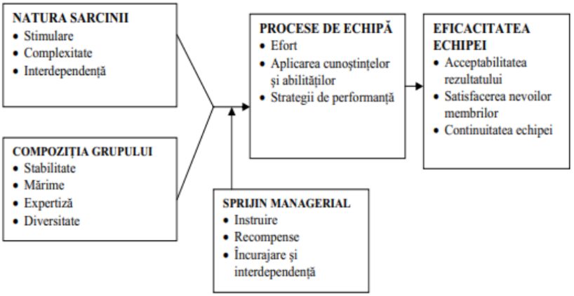

### Organizarea echipelor în organizațiile digitalizate
#### Adaptarea comunicării pentru munca la distanță include (sursa: Răfoi A., 2020, bitsoftware.eu):
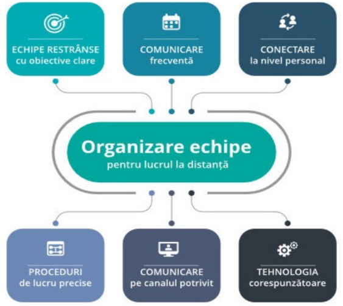

## Cooperare și competiție în cadrul grupului/ echipei(Pânișoară, I. O., 2008)
- Atunci când trebuie să realizeze o activitate, membrii unui grup se pot încadra în una dintre următoarele două tendinţe:
    - **atmosferă de cooperare** - când părțile implicate își văd scopurile congruente ori acestea coincid,
    - **atmosferă de competiție** - când părțile implicate își văd în mod reciproc scopurile ca fiind contradictorii.
- În cazul cooperării, membrii grupului lucrează împreună pentru a-şi atinge obiectivele şi scopul fiecărui membru este compatibil ori complementar cu scopurile celorlalți membri.
- În cazul competiției, membri nu-şi împart resursele, în eforturile lor nu există coordonare şi - în mod conștient sau nu - încearcă să se stânjenească reciproc pentru a-şi atinge obiectivele propuse. Persoanele care au o orientare competitivă cred că pot să-şi atingă scopurile doar dacă alți membri eșuează în acest efort.
- Ponderea spre una sau alta dintre cele două variabile poate fi dată de anumiţi factori; printre cei ce au influenţă directă asupra comportamentului competitiv sunt influențați de un număr de ”recompense”:
    - recompensele materiale produse de către rolul de învingător;
    - recompensele de status în grupul respectiv;
    - imaginea de sine;
    - comunicarea etc.
- Factorii care pot avea și o incidentă competițională şi care conduc totuși la unificarea, la coeziunea grupului, pot fi regăsiți în:
    - amenințarea externă;
    - scopuri supraordonate - distragerea atenției de la scopul personal la focalizarea atenției spre scopurile comune. Scopul personal este făcut să pară nesemnificativ în comparație cu aceste scopuri mai importante;
    - învăţarea cooperativă etc

## Cooperare și competiție în cadrul echipei (Țerbea, O., 2013)
- Jocul poate fi un instrument care permite creșterea gradului de coeziune al echipei - în etapa de învățare trebuie să se pună accent nu pe jocuri de competiție, ci pe acele jocuri care încurajează formarea echipelor, construirea strategiilor de acțiune, relațiile dintre jucători.
- Comunicarea poate ajuta la crearea unui mediu de lucru cooperant prin crearea unui flux informațional bidirecțional, de la nivelurile superioare către cele inferioare, pentru furnizarea informațiilor necesare îndeplinirii sarcinilor și invers, pentru comunicarea nevoilor, necesităților, problemelor întâmpinate şi a feedback-ului pe care liderul trebuie să îl ceară și ofere în timp util.
- Încurajarea și oferirea feedback-ului, raportări la viața de zi cu zi, create prin intermediul discuțiilor interactive.
- Pentru a îmbunătăți comunicarea la nivel de grup, membrii își pot asuma mai multe roluri pe rând în cadrul echipei, astfel va empatiza cu ceilalți, totodată, ajută la crearea percepției lor asupra obiectivelor şi a sarcinilor de îndeplinit, cât și a barierelor care stau în calea atingerii obiectivelor.
- Liderului echipei poate stimula creșterea cooperării prin înțelegerea motivației pe care indivizii o au în legătură cu echipa şi cum apartenența la echipă îi poate ajuta să își îndeplinească țintele personale şi de grup pe termen lung.
- Liderul trebuie să insufle membrilor direcția echipei şi să îi motiveze să depună efort pentru îndeplinirea sarcinilor, explicându-le care este impactul realizărilor echipei asupra întregii organizații, dar și a aportului fiecăruia.

## Stiluri de abordare ale conflictelor în cadrul echipă (Tripon C., Dodu , M. și Penciu G., 2018)
- În unele etape ale afirmării și evoluției echipei pot apărea o serie de tensiuni care se pot transforma în conflict.
- Robert Blake şi Jane Mouton au identificat cinci stiluri de abordare ale conflictului, determinate de două dimensiuni fundamentale: preocuparea pentru sine și preocuparea pentru celălalt / cealaltă parte sau pentru relația cu acesta/aceasta.
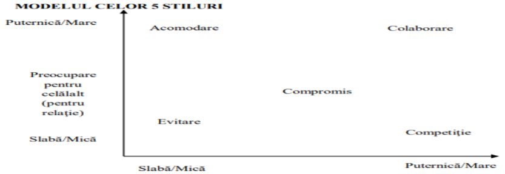

1) **Evitarea**: tendință de a nu aborda şi accepta conflictele;
    - există la indivizi conștiința posibilelor rezultate pozitive sau câștiguri din participarea la un conflict, dar nu există preocupare suficientă sau interes suficient pentru aceste rezultate sau câștiguri potențiale;
    - caracteristică importantă / relevantă: nu le pasă de relație;
    - invocă respectarea unor reguli sau proceduri stricte pentru a ocoli situațiile conflictuale: "Îmi pare rău, eu nu îmi fac decât datoria / meseria";
    - stilul include retragerile / sustragerile, absenteismul, evitarea problemelor critice şi persistența în a rămâne tăcut.
    - Caracteristicile stilului:
        - evitarea contactului cu negociatori dificili;
        - evitarea controversei;
        - evitarea situațiilor ce pot crea tensiuni;
        - evitare discuțiilor deschise.
    - Oportunități pentru evitare (stil non-asertiv şi necooperant):
        - problema în cauză e minoră ca importanță sau e pasageră (temporară, trecătoare);
        - insuficientă informație pentru abordarea eficientă a conflictului / negocierii;
        - puterea deținută e inferioară partenerului;
        - altcineva poate rezolva mai eficient problema.

2) **Acomodarea**: tendință spre atenuarea conflictelor, însă poate fi un stil dezechilibrat de tip pierdere / câștig;
    - Indică interes mare pentru celălalt şi mai puțin pentru problemele în discuție;
    - preferință pentru menținerea iluziei de armonie între părți - amânarea rezolvării problemelor pentru a nu se crea resentimente între părți;
    - “nu face valuri” - renunțarea la propriile nevoi, interese şi scopuri în favoarea celuilalt;
    - Caracteristici ale stilului:
        - concentrarea asupra intereselor celeilalte părți mai degrabă decât asupra propriilor interese;
        - acceptarea sugestiilor celeilalte părți;
        - încercarea de a ajuta cealaltă parte chiar dacă aceasta înseamnă renunțarea la propriile interese;
        - încercarea de a conserva relația cu orice preț;
    - Oportunități pentru Acomodare (stil non-asertiv şi cooperant):
        - nevoia de a dispersa / dezamorsa o situație conflictuală cu potențial de explozie emoțională (irațională);
        - nevoi pe termen scurt de a păstra armonia şi a evita sincopele în relații;
        - conflictul se bazează în primul rând pe personalitate şi nu poate fi controlat ușor.

3) **Competiția**: tendința de a se impune cu forța în fața celuilalt;
    - acordă mai mare importanță propriilor interese sau atingerii unor scopuri;
    - în situații de criză e un stil cu rezultate bune; pe termen lung, nu;
    - practică ceea ce se numește “joc de sumă nulă” adică cu cât câștigă mai mult un partener cu atât îi rămâne mai puțin
    să câștige celuilalt (posibilitățile de câștig sunt văzute ca fiind comune şi limitate);
    - comportament egoist, argumentativ, certăreț;
    - folosește metode coercitive, de constrângere, mergând până la a trișa sau a “fura” de la partener.
    - Caracteristici ale stilului:
        - perseverența în a obține ceea ce dorește;
        - angajarea într-o relație concurențială pentru a-şi atinge propriile interese şi obiective;
        - încearcă să fie mai deștept şi mai abil în dialogul cu celălalt;
        - folosește întreaga sa capacitate de a influența rezultatele;
        - încearcă să convingă cealaltă parte de superioritatea punctului său de vedere;
        - ascunde informația care i-ar putea aduce celeilalte părți un avantaj;
        - exploatează punctele slabe ale celuilalt în negocieri.
    - Oportunități pentru Competiție / Confruntare (stil asertiv şi necooperant):
        - situații de criză care cer acțiune imediată/rapidă;
        - acțiuni nepopulare care trebuie întreprinse pentru supraviețuirea/eficientizarea; organizației pe termen lung;
        - situaţia cere acţiuni de auto-protejare (ex. un caz de forţă majoră solicită auto-apărare).

4) **Compromisul**: reprezintă o propunere de parțial câștig, dar şi de parțială pierdere, se obține o parte din ceea ce se dorește, dar nu totul, la fel întâmplându-se şi cu cealaltă parte.
    - rezultate pozitive într-un conflict în care e foarte clar că cele două părţi nu pot obține exact ceea ce doresc sau tot ce doresc fiecare;
    - rezultate negative dacă părțile ies din situația conflictuală cu o stare accentuată de nemulțumire față de ceea ce au obținut;
    - “cedează şi primește” – abordare realistă a unei soluții acceptabile, dar nu preferate în care sunt implicate atât câștiguri cât şi pierderi pentru fiecare din părți;
    - fiecare parte pierde ceva din obiectivele stabilite inițial.
    - Caracteristici ale stilului:
        - încercarea de atenuare a diferențelor;
        - tendința de reducere a pretențiilor;
        - renunțarea la ceva în schimbul obținerii a altceva;
        - căutarea unei poziții intermediare, la egală distanță de interesele ambelor părţi.
    - Oportunități pentru Compromis (stil asertiv de nivel mediu şi cooperant de nivel mediu):
        - permite tuturor părților implicate să iasă mai bine (sau mai puţin rău) din situație decât dacă nu s-ar fi ajuns / recurs la o înțelegere;
        - ajungerea la o înțelegere totală de tip “Câştig-Câştig” (Win-Win) nu este posibilă.

5) **Colaborare**: presupune identificarea şi studierea intereselor mutuale (nedeclarate sau invocate întotdeauna în mod explicit) şi individuale în intenția de a atinge în cea mai mare măsură posibilă obiectivele tuturor părților implicate.
    - preferată în rezolvarea problemelor şi obținerea unor înțelegeri / acorduri mutuale satisfăcătoare pentru ambele părți;
    - câștig / câștig = bazat pe respectul pentru propriile interese dar şi pentru celălalt şi pentru interesele sale;
    - implică o atitudine orientată spre rezolvarea problemei şi pe încurajarea dezvăluirilor în şi dinspre ambele părți ale informației deținute.
    - Caracteristici ale stilului:
        - încercarea de a discuta în mod deschis, de a scoate “la lumină” / “la vedere” toate problemele;
        - încercarea de a trata problemele care sunt importante pentru ambele părți;
        - căutarea de soluții creative care să facă ambele părți să câștige;
        - ascultarea părerii celeilalte părți înaintea exprimării propriei păreri;
        - încercarea de a realiza o încredere reciprocă;
        - încercarea de satisfacere a nevoilor ambelor părți;
        - realizare unui schimb deschis, liber, degajat de idei şi informații.
    - Oportunități pentru Colaborare (stil asertiv şi cooperant):
        - este nevoie de un înalt nivel de cooperare;
        - există un echilibru de forțe între părțile implicate;
        - obținerea unor câștiguri pe termen lung prin înțelegeri mutuale.

## Transfomarea unui conflict distructiv într-unul constructiv (Țerbea, O., 2013)
- În abordarea interacționistă este recunoscută importanța conflictelor funcționale în cadrul echipelor pentru a favoriza inovația şi perfecționarea continuă.
- Ca soluție, nu se propune eliminarea cauzelor conflictelor sau ignorarea lor atunci când apar, ci gestionarea constructivă a lor pentru stimularea contribuțiilor tuturor membrilor.
- Încă din etapa de formare a echipei, odată cu stabilirea regulilor de desfășurare ale activității se pot stabili şi modalitățile de gestionare ale neînțelegerilor.
- Pentru a nu crea sentimente de frustrare prin anumite comportamente de genul: nerespectarea termenelor limită, neatenția şi lipsa de respect în fața intervențiilor celorlalți membri, prezența ideilor preconcepute şi a lipsei de deschidere, neaducerea niciunui aport la îndeplinirea sarcinilor, liderul trebuie să sesizeze şi să aducă în discuție toate situațiile problematice într-un timp cât mai scurt pentru ca divergența să nu evolueze negativ.
- De exemplu, pentru neîndeplinirea sarcinilor, liderul poate apela la aducerea de noi persoane în echipă, reorientarea unor membri spre alte roluri, standardizarea anumitor proceduri care să suplinească rolurile neatribuite etc.
- Persoanele critice nu trebuie discreditate şi izolate pentru a nu mai puncta defectele echipei, ci trebuie ascultate şi apreciate de fiecare dată când au o contribuție valoroasă pentru a-i motiva şi pe ceilalți să scoată la suprafață conflictele care lor li se par minore, dar care pot avea repercusiuni negative asupra scopului comun.
- Când devin obsedate de a critica, aceste persoane trebuie ajutate să se concentreze pe sarcina de îndeplinit, reamintindu-li-se în permanență care sunt așteptările de la ei și termenul limită până la care se așteaptă rezultatul dorit.
- Evitarea conflictului, acomodarea cu acesta sau forțarea pentru a câștiga cu orice preț în detrimentul respectării nevoilor şi așteptărilor membrilor nu trebuie considerate modalități de a trece peste situațiile conflictuale dacă se are în vedere o relație pe termen lung.
- Soluția optimă este colaborarea cu scopul de a găsi rezolvarea creativă care să mulțumească toate părțile implicate în conflict.
- Dacă nu se poate ajunge la identificarea unei soluții care să mulțumească toți membrii echipei, se poate apela la o situație de compromis în vederea diminuării impactului negativ asupra rezultatului final şi minimizarea efectelor negative asupra interrelaționării şi coeziunii echipei.

